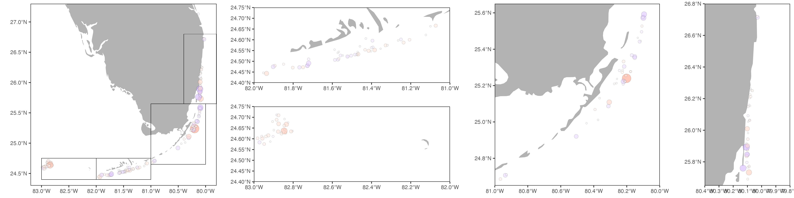

```{r setup, include=FALSE}
knitr::opts_chunk$set(echo = FALSE, message = FALSE, warning = FALSE, cache = F)
```

```{r}
library(sf)
library(rnaturalearth)
library(rnaturalearthdata)
library(lme4)
library(emmeans)
library(ggridges)
library(gamm4)
library(MASS)
library(tidyverse)
```

# Import data

### DRM data
```{r import_drm}
# Import DRM data
df <- read_csv("data/drm/export.csv") %>%
  mutate(across(where(is.character), as_factor),
         Date = as_date(as.character(Date), format = "%m/%d/%Y"))

# Get day of the year number, week, and month for some model fitting
df <- df %>%
  mutate(Day = yday(Date),
         Week = factor(week(Date)),
         Month = factor(month(Date)))

# Subset just 2015 surveys
df14 <- filter(df, year(Date) == "2014")

# Change Deerfield to either Broward or South Palm Beach based on Lat = 26.32825
df14[df14$Subregion == "Deerfield" & df14$Latitude > 26.32825, "Subregion"] <- "South Palm Beach"
df14[df14$Subregion == "Deerfield" & df14$Latitude < 26.32825, "Subregion"] <- "Broward-Miami"

# Order Subregions from south to north
df14 <- df14 %>%
  mutate(Subregion = fct_relevel(Subregion, c("Tortugas--Dry Tortugas NP", "Marquesas", "Lower Keys", 
                                              "Middle Keys", "Mid-Upper Keys Transition", "Upper Keys",
                                              "Biscayne", "Broward-Miami", "South Palm Beach", 
                                              "North Palm Beach", "Martin")))

# Order Species alphabetically
df14 <- df14 %>%
  mutate(Species = factor(Species, levels = sort(levels(df$Species))))

# Are there any dead corals?
# dead <- df14 %>% filter(Old + Recent >= 100)
# There are recently dead corals that do not have the TRS code -- assume these ARE dead from thermal stress and add TRS code
df14[(df14$Old + df14$Recent) >= 100 & !grepl("TRS", df14$`Other Conditions`), "Other Conditions"] <- "TRS"

# Create ordinal variables and factors for bleaching severity
df14 <- df14 %>%
  mutate(Bleaching2 = case_when((is.na(Bleaching) & !grepl("TRS", `Other Conditions`)) ~ 0,
                                Bleaching == "P" ~ 1,
                                Bleaching == "PB" ~ 2,
                                Bleaching == "BL" ~ 3,
                                ((Old + Recent) >= 100 & grepl("TRS", `Other Conditions`)) ~ 4),
         Bleaching3 = factor(case_match(Bleaching2, 
                                 0 ~ "Healthy",
                                 1 ~ "Pale",
                                 2 ~ "Partially Bleached",
                                 3 ~ "Bleached",
                                 4 ~ "Dead"),
                             levels = c("Healthy", "Pale", "Partially Bleached", "Bleached", "Dead")))
```

### DHW data

```{r import_dhw}
# Import 2014 DHW data
dhw <- read_csv("data/dhw/2014/2014_dhw_processed.csv") %>%
  mutate(across(where(is.character), as_factor)) %>%
  rename(Date = date) %>%
  dplyr::select(Site, Date, dhw)

# Get DHW values for each DRM survey site on the date surveyed -- join with DRM data
df14 <- left_join(df14, dhw, by = c("Site", "Date"))

# Create binned DHW variable
df14 <- df14 %>%
  mutate(dhw.bin = cut(dhw, breaks = c(0,2,4,6,8,10)))
```

```{r}
save(df14, file = "output/2014.RData")
```

# DRM dataset summary

### Number of corals surveyed
```{r drm_summary_corals}
# Total number of colonies of each species surveyed
sppcounts <- df14 %>%
  count(Species) %>%
  arrange(-n) 

knitr::kable(tibble(`Total number of corals surveyed:` = sum(sppcounts$n)), align = 'l')

# Print table by species (split into multiple tables for display purposes)
knitr::kable(list(sppcounts[1:10, 1:2],
             sppcounts[11:20, 1:2],
             sppcounts[21:30, 1:2],
             sppcounts[31:40, 1:2], 
             sppcounts[41:50, 1:2]),
             label = "tables", booktabs = TRUE)
```

### Number of sites surveyed
```{r drm_summary_surveys}
# Total number of surveys conducted
surveys <- df14 %>%
  distinct(Subregion, Date, Site, dhw)

knitr::kable(tibble(`Total number of sites surveyed:` = n_distinct(surveys$Site)), align = 'l')


# # Number of sites and reef zones surveyed per Subregion
df14 %>%
  distinct(Subregion, Site, Zone) %>%
  group_by(Subregion) %>%
  ggplot(aes(x = Subregion, fill = Zone)) +
  geom_bar(position = "stack") +
  scale_y_continuous(breaks = seq(0, 100, 10)) +
  labs(x = "", y = "Number of sites surveyed") +
  theme(axis.text.x = element_text(angle = 45, hjust = 1))

# Only 2 sites in Martin, 2 sites in North Palm Beach, and 4 sites in South Palm Beach.
# Remove...
df14 <- df14 %>% filter(!Subregion %in% c("South Palm Beach", "North Palm Beach", "Martin"))

surveys <- df14 %>%
  distinct(Subregion, Date, Site, dhw)
```

```{r subset_drm}
# Create subsets of DRM data for downstream analyses
### Subset just Subregions in the keys down
keys <- c("Upper Keys", "Mid-Upper Keys Transition", "Middle Keys", 
          "Lower Keys", "Marquesas", "Tortugas--Dry Tortugas NP")
### Subset just abundant species
sppcounts <- df14 %>%
  count(Species) %>%
  arrange(-n)
abund.spp <- sppcounts %>% filter(n > 100) %>% pull(Species)
### Create subsets
df14.keys <- df14 %>% filter(Subregion %in% keys)
df14.abund <- df14 %>% filter(Species %in% abund.spp)
df14.keys.abund <- df14 %>% filter(Subregion %in% keys, Species %in% abund.spp)
df14.abund.nopfursint <- df14.abund %>% filter(!Species %in% c("PFUR", "SINT"))
```

### How surveys were spread over time, and over the heatwave
```{r survey_distribution}
# How were 2023 surveys distributed across time and space?
surveys_by_date <- ggplot(surveys, aes(x = Date, y = Subregion, fill = Subregion)) +
  geom_density_ridges(alpha = 0.6, stat = "binline", bins = 20) +
  labs(x = "Date", y = "") +
  theme(legend.position = "none")

# How were surveys distributed across DHW accumulation?
surveys_by_dhw <- ggplot(surveys, aes(x = dhw, y = Subregion, fill = Subregion)) +
  geom_density_ridges(alpha = 0.6, stat = "binline", bins = 20) +
  theme(legend.position = "none") +
  theme(axis.text.y = element_blank()) +
  labs(x = "Degree Heating Weeks", y = "") +
  xlim(0, 10)

cowplot::plot_grid(surveys_by_date, surveys_by_dhw, ncol = 2, rel_widths = c(0.62, 0.38))
```


# Bleaching event summary

### DHWs by subregion
```{r dhw_summary}
# Calculate mean DHW for all survey sites in each Subregion, by date
meanDHW <- dhw %>%
  left_join(distinct(df14, Site, Subregion)) %>%
  group_by(Subregion, Date) %>%
  drop_na(Subregion) %>%
  summarize(meanDHW = mean(dhw))
# Plot mean DHW over time for each Subregion
ggplot(meanDHW, aes(x = Date, y = meanDHW, color = Subregion, group = Subregion)) +
  geom_line() +
  scale_x_date(breaks = "months", date_labels = "%b") +
  labs(y = "Mean DHW of all sites surveyed in Subregion")

# Get maxdhw experienced in each Subregion
maxmeanDHW <- meanDHW %>%
  group_by(Subregion) %>%
  summarize(maxmeanDHW = max(meanDHW))
```

DHWs in DRTO reached ~3.5.
DHWs in the Lower Keys reach ~6.5
DHWs in the Middle Keys reached ~6.5
DHWs in the Upper Keys reached ~4.5.
DHWs in Biscayne reach 2.5.
DHWs in Miami and Broward were <1

### Bleaching prevalence by subregion over time, and overall
```{r bleaching_summary_subregion_time}
# Model probability of all corals being at least Partially bleached by Week and Subregion
mod <- glm((Bleaching2 > 1) ~ Week:Subregion, family = "binomial", data = df14)
### Try "Week:Subregion" for estimates only when surveys were conducted, or "Week + Subregion" to estimate across all weeks for each region
res <- as.tibble(emmeans(mod, specs = c("Week", "Subregion"), type = "response")) %>% 
  drop_na() %>%
  mutate(Date = as.Date("2014-01-01") + ((as.numeric(as.character(Week)) - 1) * 7))
ggplot(res, aes(x = Date, y = response, color = Subregion, group = Subregion)) +
  geom_point() + 
  geom_line() +
  labs(y = "Percent of surveyed colonies with at least partial bleaching")

blsite <- df14 %>%
  group_by(Site, Subregion) %>%
  summarize(meandhw = mean(dhw),
              pctbl = sum(Bleaching2 > 1) / n())

ggplot(blsite, aes(x = meandhw, y = pctbl)) +
  geom_point(aes(color = Subregion)) +
  geom_smooth(method = "gam")

blbrow <- df14 %>%
  filter(Subregion == "Broward-Miami", Site %in% (filter(blsite, pctbl > 0.75) %>% pull(Site)))
#. abunch of BL PPOR in Broward with 1-1.5 DHW? sus....
```


```{r bleaching_summary_overall_subregion}
# Count number of bleached and unbleached colonies of each species at each site
summ <- df14.abund %>%
  group_by(Site, Species, Subregion, Week) %>%
  summarize(bl = sum(Bleaching2 > 1),
            nb = sum(Bleaching2 <= 1),
            dhw = mean(dhw))

# Plot raw proportion of bleached colonies surveyed in each subregion
summ %>%
  group_by(Subregion) %>%
  summarize(pctbl = sum(bl) / (sum(bl) + sum(nb)),
            dhw = mean(dhw)) %>%
  mutate(group = "allcorals") %>%
  ggplot(aes(y = Subregion)) +
  geom_point(aes(x = pctbl)) +
  geom_path(aes(x = pctbl, group = group)) +
  geom_point(aes(x = dhw / 10), color = "red") +
  geom_path(aes(x = dhw / 10, group = group), color = "red") +
  scale_x_continuous(limits = c(0, 1), expand = c(0, 0), breaks = seq(0, 1, 0.1),
                     name = "% of all corals PB or worse when surveyed",
                     sec.axis = sec_axis(~.*10, name = "Mean DHWs when surveyed")) +
  theme(axis.text.x.top = element_text(color = "red"),
        axis.title.x.top = element_text(color = "red")) +
  labs(y = "")


# Model proportion of bleached colonies in each subregion, controlling for species and week of survey
mod <- glmer(cbind(bl, nb) ~ Subregion + (Subregion|Week) + (1|Species), family = "binomial", data = summ)
res <- emmeans(mod, specs = c("Subregion"), type = "response")
regional14 <- as.tibble(res) %>% full_join(maxmeanDHW) %>%
  mutate(group = "allcorals")

ggplot(regional14, aes(y = Subregion)) +
  geom_point(aes(x = prob)) +
  geom_path(aes(x = prob, group = group)) +
  geom_point(aes(x = maxmeanDHW / 10), color = "red") +
  geom_path(aes(x = maxmeanDHW / 10, group = group), color = "red") +
  scale_x_continuous(limits = c(0, 1), expand = c(0, 0), breaks = seq(0, 1, 0.1),
                     name = "Predicted % of 'avg coral' PB or worse on 9/1",
                     sec.axis = sec_axis(~.*10, name = "Mean DHWs on 9/1")) +
  theme(axis.text.x.top = element_text(color = "red"),
        axis.title.x.top = element_text(color = "red")) +
  labs(y = "")

save(regional14, file = "output/regional14.RData")
```


### Levels of bleaching observed with increasing DHWs
```{r bleaching_vs_dhw}
# Ordinal regression: Probability of each bleaching level with increasing DHW
m <- polr(Bleaching3 ~ dhw * Depth * Species, data = df14.abund, Hess = TRUE, model = TRUE)

# Model includes Depth and Species, and predicts probability of each bleaching level 
# for the average coral species at the average depth (we choose 23 ft as median depth of all corals obs.)
res <- emmeans(m, specs = c("dhw", "Bleaching3"), 
               at = list(dhw = seq(0, 10, 1),
                         Depth = 23), 
               mode = "prob")
as.tibble(res) %>%
  ggplot(aes(x = dhw, y = prob, color = Bleaching3)) +
  geom_line() +
  labs(x = "Degree Heating Weeks", y = "Predicted probability")
```


# Coral species differences in bleaching

### Bleaching prevalence by species in each subregion
```{r bleaching_by_species_and_region}
# Model probability of being at least Partially bleached by Species and Subregion (controlling for Week)
### Subset: only include species observed at least 3 times in a Subregion...
df14.abund.ss <- df14.abund %>%
  count(Species, Subregion) %>%
  filter(n >=3) %>%
  left_join(df14.abund)
# Fit model
### Debating whether week should be included here or not? has a big effect on overall bleaching levels
mod <- glmer((Bleaching2 > 1) ~ Subregion * Species + (Subregion|Week), 
             family = "binomial", data = df14.abund.ss,
             nAGQ = 0, control = glmerControl(optimizer = "nloptwrap"))
anova(mod)
res <- as.tibble(emmeans(mod, specs = c("Species", "Subregion"), 
                         at = list(Week = factor(35)), type = "response")) %>% drop_na()
# Plot
ggplot(res, aes(y = Subregion, x = response, color = Species, group = Species)) +
  geom_point() + 
  #geom_line() +
  geom_path() +
  facet_wrap(~Species, ncol = 7) +
  theme(axis.text.x = element_text(angle = 45, hjust = 1),
        legend.position = "none") +
  labs(y = "", x = "Predicted % of colonies PB or worse")

# Actual proportions rather than statistically modeled as a doublecheck
# df14.abund.ss %>%
#   group_by(Subregion, Species) %>%
#   summarize(pctbl = sum(Bleaching2 > 1) / n()) %>%
#   ggplot(aes(y = Subregion, x = pctbl, color = Species, group = Species)) +
#   geom_point() +
#   #geom_line() +
#   geom_path() +
#   facet_wrap(~Species, ncol = 7) +
#   theme(axis.text.x = element_text(angle = 45, hjust = 1),
#         legend.position = "none") +
#   labs(y = "", x = "Actual % of colonies PB or worse")
```


### Species differences in bleaching with increasing DHWs
```{r bleaching_by_species}
df14.abund %>%
  ggplot(aes(x = dhw.bin, fill = Bleaching2 > 1)) +
  geom_bar(position = "fill") +
  facet_wrap(~Species, scales = "free_y")

# Probability of each bleaching level by species as a function of DHW (ordinal regression)
#https://tdunn.ca/posts/2020-03-15-ordinal-regression-in-r-part-1/

# Fit ordinal regression model for each species as a function of DHW
m <- MASS::polr(Bleaching3 ~ Species * dhw, data = df14.abund, Hess = TRUE)
## Does this need random factors? Cannot get clmm to work...

# Get fitted values
res <- emmeans(m, specs = c("dhw", "Bleaching3"), by = "Species", mode = "prob", 
               at = list(dhw = seq(0, 10, 1)))

# Get thresholds where >50% of colonies are PB or worse, and B or worse
thresh <- as.tibble(res) %>%
  group_by(Species, dhw) %>%
  summarize(PBup = sum(prob[Bleaching3 %in% c("Partially Bleached", "Bleached", "Dead")]),
             Bup = sum(prob[Bleaching3 %in% c("Bleached", "Dead")]))

# Rank corals based on PB or B threshold from above
ranks <- thresh %>%
  group_by(Species) %>%
  summarize(thresh0.5 = min(dhw[PBup > 0.5]),
            thresh0.25 = min(dhw[PBup > 0.25]),
            thresh0.75 = min(dhw[PBup > 0.75])) %>%
  mutate(Species = fct_reorder(Species, thresh0.5))

# Plot all bleaching levels as function of DHW for each species
as.tibble(res) %>%
  mutate(Species = factor(Species, levels = levels(ranks$Species))) %>%
  ggplot(aes(x = dhw, y = prob, color = Bleaching3)) +
  geom_line() + 
  facet_wrap(~Species) +
  geom_vline(data = ranks, aes(xintercept = thresh0.5), lty = 2, lwd = 0.25)

# Plot heatmap of proportion of colonies partially bleached or worse for each species
thresh %>%
  mutate(Species = factor(Species, levels = levels(ranks$Species))) %>%
  ggplot(aes(x = dhw, y = Species)) +
  geom_tile(aes(fill = PBup)) +
  scale_fill_gradient2(low = "#91cf60", mid = "#ffffbf", high = "#fc8d59", 
                       limits = c(0, 1), midpoint = 0.5) +
  geom_point(data = ranks, aes(x = thresh0.5), pch = 5) +
  geom_segment(data = ranks, aes(yend = Species, x = thresh0.5, xend = thresh0.25)) +
  geom_segment(data = ranks, aes(yend = Species, x = thresh0.5, xend = thresh0.75)) +
  labs(x = "Degree Heating Weeks", y = "", fill = "Proportion\nof colonies\nPB or worse")
```


# Coral size class differences in bleaching severity

### Are juveniles doing better (less bleaching) than larger adult colonies?
```{r size_effects}
# Model bleaching severity by Width, species, and dhw. 
# Only include surveys with dhw>10.
mod <- glmer((Bleaching2 > 1) ~ log(Width) * Species * dhw + (1|Site) + (1|Week), 
             family = "binomial", data = filter(df14.abund, dhw > 4), 
             nAGQ = 0, control = glmerControl(optimizer = "nloptwrap"))
#plot(mod, which = 1)

res <- emtrends(mod, specs = c("Width", "dhw"), var = "Width", by = "Species", 
                at = list(dhw = 6))

sig <- as.tibble(res) %>%
  filter(asymp.LCL > 0)

pred <- as.tibble(emmeans(mod, specs = c("Width", "dhw"), by = "Species", 
                          at = list(Width = seq(5, 500, 10), dhw = 6), 
                          type = "response")) %>%
  filter(Species %in% sig$Species) %>%
  left_join(select(sig, dhw, Species, asymp.LCL), by = c("dhw", "Species"))
actual <- filter(df14.abund, dhw > 4) %>%
  group_by(Species) %>%
  summarize(min = min(Width), max = max(Width)) %>%
  mutate(ad = map(max, ~expand_grid(Width = seq(5, ., 10)))) %>%
  unnest(ad)
pred2 <- pred %>%
  semi_join(actual, by = c("Species", "Width"))
  

ggplot(pred2, aes(x = Width, y = response, color = factor(dhw), group = dhw, linetype = is.na(asymp.LCL.y))) +
  facet_wrap(~Species, scales = "free") +
  geom_line() +
  #geom_errorbar(aes(ymin = response - SE, ymax = response + SE)) +
  ylim(0, 1) +
  labs(x = "Colony width", y = "Proportion of colonies PB or worse")


# Plot actual proportions binned by size class
filter(df14.abund, dhw > 4) %>%
  filter(Species %in% sig$Species) %>%
  group_by(Species) %>%
  mutate(Width.bin = cut(log(Width), breaks = 5)) %>%
  ggplot(aes(x = Width.bin, fill = Bleaching2 > 1)) +
  geom_bar(position = "fill") +
  facet_wrap(~Species, scales = "free")
```


# Mapping bleaching anomalies: exploring deviations from expected severity

### Which sites bleached more or less than predicted based on DHW, depth, and species composition?
```{r bleach_resid_sites}
# Model bleaching outlier locations with group-level data (groups = each species at each site)
# Following: https://library.virginia.edu/data/articles/understanding-deviance-residuals
# Get subset of data
dfdf <- df14 %>%
  group_by(Species, Site, dhw, Depth, Week, Longitude, Latitude, Subregion) %>%
  summarize(BL = sum(Bleaching2 > 2),   # BL is fully bleached or dead
            NB = sum(Bleaching2 <= 2)) %>% # NB is healthy, pale, or partially bleached
  ungroup() %>%
  filter(BL + NB >=3)  # only keep groups (species at sites) with at least 3 individuals observed

# Is size a factor? if all the corals in Miami-Broward are smaller and thats why they dont bleach as much?
# ggplot(df14.abund, aes(y = Subregion, x = log(Width))) +
#   geom_boxplot() +
#   facet_wrap(~Species)
# mod <- lm(log(Width) ~ Subregion * Species, data = df14.abund)
# anova(mod)
# emmeans(mod, specs = "Subregion", by = "Species")
# Size might be a factor, e.g. Mcavs in Miami are smaller than Lower Keys


# Fit model
mod <- glmer(cbind(BL, NB) ~ dhw + Depth + (dhw|Species) + (1|Week), 
             family = "binomial", data = dfdf,
             nAGQ = 0, control = glmerControl(optimizer = "nloptwrap"))
#plot(mod, which = 1)

# Get residuals (raw residuals = difference between observed and predicted bleaching probability)
res <- tibble(dfdf, .resid = residuals(mod, type = "response"))
# res$.fitted <- predict(mod, newdata = dfdf, type = "response")
# res$.pearson <- residuals(mod, type = "pearson")
# ggplot(res, aes(x = .fitted, y = .pearson, color = Subregion)) +
#   geom_point()

# res2 <- emmeans(mod, specs = "dhw", at = list(dhw = seq(0,22,2)), type = "response")
# res2
# as.tibble(res2) %>%
#   ggplot(aes(x = dhw, y = prob)) + geom_line()
# Plot residuals for each species at each site
## (Where did each coral species do better or worse than expected?)
# ggplot(res, aes(x = Longitude, y = Latitude, color = .resid)) +
#   geom_point() +
#   facet_wrap(~Species) +
#   scale_color_gradient2(low = "red", mid = NA, high = "blue")

# miami <- filter(df14, Subregion == "Broward-Miami")

# Get mean site residuals across species, 
# and keep only sites where more than one species occurred (with at least 3 ind. each)
site.resid <- res %>%
  group_by(Site, Longitude, Latitude) %>%
  filter(n() > 1) %>%
  summarize(meanResid = mean(.resid))
# 
# test <- site.resid %>% left_join(sites) %>%
#   filter(Dist65 <10000, Dist65 > 10) %>%
#   filter(Subregion != "Marquesas")
# 
# ggplot(test, aes(x = Dist65, y = meanResid)) +
#   geom_point(aes(color = Subregion)) +
#   geom_smooth(method = "lm")
# 
# mod <- lm(meanResid ~ Dist65, data = test)
# anova(mod)

# hist(site.resid$meanResid)

# Plot on map
# Download satellite map for Florida
world <- ne_countries(scale = "large", returnclass = "sf")
# Plot basemap
basemap <- #ggmap(map_fl, extent = "panel") +
  ggplot(data = world) +
  geom_sf(lwd = 0, fill = "gray70") +
  coord_sf(xlim = c(-83.2, -79.8), ylim = c(24.3, 27.3), expand = FALSE) +
  geom_point(data = site.resid, aes(x = Longitude, y = Latitude, fill = meanResid,
                            size = meanResid^2), alpha = 0.5, stroke = 0.1, pch = 21) +
  scale_fill_gradient2(low = "red", mid = NA, high = "blue", midpoint = 0,
                       limits = c(-1, 1)) +
  theme(legend.position = "none") +
  theme(text = element_text(size = 10),
        axis.title = element_blank(),
        panel.background = element_blank(),
        panel.border = element_rect(colour = "black", fill=NA))

# Get subsets of map range for multipanel plot
flmap <- basemap +
  geom_rect(aes(xmin = -83, xmax = -82, ymin = 24.4, ymax = 24.75), fill = NA, color = "black", lwd = 0.1) +
  geom_rect(aes(xmin = -82, xmax = -81, ymin = 24.4, ymax = 24.75), fill = NA, color = "black", lwd = 0.1) +
  geom_rect(aes(xmin = -81, xmax = -80, ymin = 24.65, ymax = 25.65), fill = NA, color = "black", lwd = 0.1) +
  geom_rect(aes(xmin = -80.4, xmax = -79.8, ymin = 25.65, ymax = 26.8), fill = NA, color = "black", lwd = 0.1)
dtmap <- basemap + coord_sf(xlim = c(-83, -82), ylim = c(24.4, 24.75), expand = FALSE)
lkmap <- basemap + coord_sf(xlim = c(-82, -81), ylim = c(24.4, 24.75), expand = FALSE)
ukmap <- basemap + coord_sf(xlim = c(-81, -80), ylim = c(24.65, 25.65), expand = FALSE)
semap <- basemap + coord_sf(xlim = c(-80.4, -79.8), ylim = c(25.65, 26.8), expand = FALSE)

# Create and save multipanel plot
maps_multipanel_grouplevel <- gridExtra::arrangeGrob(
  flmap, lkmap, dtmap, ukmap, semap, 
  layout_matrix = matrix(c(1,1,1,1,2,3,2,3,4,4,4,4,5,5), nrow=2))
ggsave(filename = "output/2014_maps_multipanel_grouplevel.png", 
       plot = maps_multipanel_grouplevel, width = 16, height = 4, unit = "in")

# Trying a different panel arrangement
# maps_multipanel2 <- gridExtra::grid.arrange(
#   flmap, lkmap, dtmap, ukmap, semap, 
#   layout_matrix = matrix(c(1,1,2,3,1,1,2,3,5,5,4,4,NA,NA,4,4), nrow=4))
# ggsave(filename = "output/maps_multipanel2.png", 
#        plot = maps_multipanel2, width = 12, height = 10, unit = "in")

# Print whole map
basemap + theme(legend.position = "right") +
  labs(fill = "Difference from predicted\nbleaching prevalence")

## A site at Molassess is the biggest outlier -- >100 PAST observed and most healthy?! is this legit??
# res %>% filter(Site == "Y3042")
# df14 %>% filter(Site == "Y3042", Species == "PAST") %>% print(n = nrow(.))

# Multipanel figure

```



```{r, eval = F}
# Try random forests to find outlier sites or individuals?
library(randomForest)
data <- df14.abund %>%
  #filter(Species %in% c("CNAT", "DLAB", "MCAV", "OANN", "OFAV", "PAST", "PSTR", "SSID")) %>%
  mutate(Bleaching4 = factor(case_when(Bleaching3 %in% c("Healthy", "Pale") ~ "Healthy",
                                Bleaching3 %in% c("Partially Bleached", "Bleached", "Dead") ~ "Bleached"))) %>%
  droplevels()

# Run random forest classification with species, depth, and dhw as predictors
rf <- randomForest(Bleaching4~Species+Depth+dhw, data = data, ntree = 10, do.trace = TRUE, proximity=TRUE)
print(rf)
rf$confusion

str(rf)

# Get rf model predictions for Bleaching4
data <- data %>%
  mutate(pred = rf$predicted)

# How accurate were predictions for each species?
data %>%
  drop_na(pred) %>%
  group_by(Species) %>%
  count(acc = pred == Bleaching4) %>%
  ggplot(aes(x = Species, y = n, fill = acc)) +
  geom_col(position= "fill")

# Can you get confidence?
str(rf)
score(rf)

data %>%
  drop_na(pred) %>%
  ggplot(aes(x = Species, fill = Bleaching4:pred)) +
  geom_bar(position = "fill")
  
  

# Which corals were predicted to be bleached, but were actually healthy?
outhealthy <- data %>%
  filter(pred == "Bleached", Bleaching4 == "Healthy") 

ggplot(outhealthy, aes(x = Longitude, y = Latitude)) +
  geom_point(color = "red", alpha = 0.005, pch = 20)

outhealthy %>%
  filter(Species == "OFAV") %>%
  ggplot(aes(x = Longitude, y = Latitude)) +
  geom_point(aes(color = Species))
```


  

```{r, eval = F}
# - [ ] Variability in bleaching among individuals within a species 
### which spp have the most variability among individuals?
## where do tol. and sens. individuals co-occur?

var <- df14.abund %>%
  group_by(Site, Latitude, Longitude, Species, Subregion, Zone) %>%
  summarize(n = n(),
            bleachvar = var(Bleaching2),
            max = max(Bleaching2))

ggplot(var, aes(x = Species, y = bleachvar)) +
  geom_violin(scale = "width", draw_quantiles = 0.5) +
  geom_jitter(aes(color = Subregion), width = 0.2)


var %>% filter(Species == "MCAV") %>%
  ggplot(aes(x = Longitude, y = Latitude)) +
  geom_point(aes(color = bleachvar))
```
  
