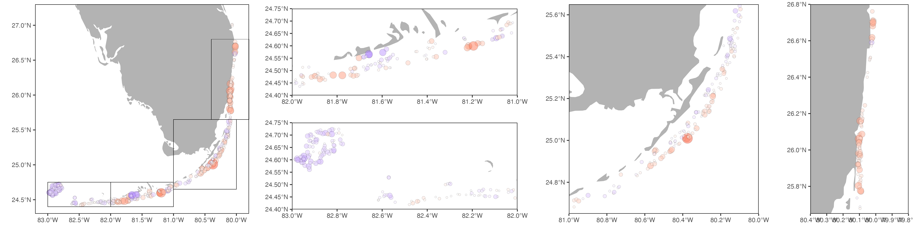

```{r setup, include=FALSE}
knitr::opts_chunk$set(echo = FALSE, message = FALSE, warning = FALSE, cache = TRUE)
```

```{r}
library(sf)
library(rnaturalearth)
library(rnaturalearthdata)
library(lme4)
library(emmeans)
library(ggridges)
library(gamm4)
library(MASS)
library(tidyverse)
```

# Import data

### DRM data
```{r import_drm}
# Import DRM data
df <- read_csv("data/drm/export.csv") %>%
  mutate(across(where(is.character), as_factor),
         Date = as_date(as.character(Date), format = "%m/%d/%Y"))

# Get day of the year number, week, and month for some model fitting
df <- df %>%
  mutate(Day = yday(Date),
         Week = factor(week(Date)),
         Month = factor(month(Date)))

# Subset just 2023 surveys
df23 <- filter(df, year(Date) == "2023")

# Order Subregions from south to north
df23 <- df23 %>%
  mutate(Subregion = fct_relevel(Subregion, c("Tortugas--Dry Tortugas NP", "Marquesas", "Lower Keys", 
                                              "Middle Keys", "Mid-Upper Keys Transition", "Upper Keys",
                                              "Biscayne", "Broward-Miami", "South Palm Beach", 
                                              "North Palm Beach", "Martin")))

# Order Species alphabetically
df23 <- df23 %>%
  mutate(Species = factor(Species, levels = sort(levels(df$Species))))

# Create ordinal variables and factors for bleaching severity
df23 <- df23 %>%
  mutate(Bleaching2 = case_when((is.na(Bleaching) & !grepl("TRS", `Other Conditions`)) ~ 0,
                                Bleaching == "P" ~ 1,
                                Bleaching == "PB" ~ 2,
                                Bleaching == "BL" ~ 3,
                                ((Old + Recent) >= 100 & grepl("TRS", `Other Conditions`)) ~ 4),
         Bleaching3 = factor(case_match(Bleaching2, 
                                 0 ~ "Healthy",
                                 1 ~ "Pale",
                                 2 ~ "Partially Bleached",
                                 3 ~ "Bleached",
                                 4 ~ "Dead"),
                             levels = c("Healthy", "Pale", "Partially Bleached", "Bleached", "Dead")))
```

```{r qc_drm, include = FALSE}
#### There are 45 corals listed with "TRS" but are blank for "Bleaching"... talk to Jennifer about these?
#### For now, remove these from analysis
df23 <- df23 %>%
  filter(!is.na(Bleaching2))

### There are 34 corals with Width < 4 ... keep? or errors?
df23 %>% filter(Width < 4)

# Filter out dead corals from causes OTHER than bleaching ("TRS") -- why are these in data?
df23 <- df23 %>%
  filter(((Old + Recent) < 100 | grepl("TRS", `Other Conditions`)))

# Get T3 and T4 data

# Get surveyor information
```

### DHW data

```{r import_dhw}
# Import 2023 DHW data
dhw <- read_csv("data/dhw/dhw_processed.csv") %>%
  mutate(across(where(is.character), as_factor)) %>%
  rename(Date = date) %>%
  dplyr::select(Site, Date, dhw)

# Get DHW values for each DRM survey site on the date surveyed -- join with DRM data
df23 <- left_join(df23, dhw, by = c("Site", "Date"))

# Create binned DHW variable
df23 <- df23 %>%
  mutate(dhw.bin = cut(dhw, breaks = c(0,4,8,12,16,20,24)))
```

```{r subset_drm}
# Create subsets of DRM data for downstream analyses
### Subset just Subregions in the keys down
keys <- c("Upper Keys", "Mid-Upper Keys Transition", "Middle Keys", 
          "Lower Keys", "Marquesas", "Tortugas--Dry Tortugas NP")
### Subset just abundant species
sppcounts <- df23 %>%
  count(Species) %>%
  arrange(-n)
abund.spp <- sppcounts %>% filter(n > 100) %>% pull(Species)
### Create subsets
df23.keys <- df23 %>% filter(Subregion %in% keys)
df23.abund <- df23 %>% filter(Species %in% abund.spp)
df23.keys.abund <- df23 %>% filter(Subregion %in% keys, Species %in% abund.spp)
df23.abund.nopfursint <- df23.abund %>% filter(!Species %in% c("PFUR", "SINT"))
```

# DRM dataset summary

### Number of corals surveyed
```{r drm_summary_corals}
# Total number of colonies of each species surveyed
sppcounts <- df23 %>%
  count(Species) %>%
  arrange(-n) 

knitr::kable(tibble(`Total number of corals surveyed:` = sum(sppcounts$n)), align = 'l')

# Print table by species (split into multiple tables for display purposes)
knitr::kable(list(sppcounts[1:10, 1:2],
             sppcounts[11:20, 1:2],
             sppcounts[21:30, 1:2],
             sppcounts[31:40, 1:2], 
             sppcounts[41:50, 1:2]),
             label = "tables", booktabs = TRUE)
```

### Number of sites surveyed
```{r drm_summary_surveys}
# Total number of surveys conducted
surveys <- df23 %>%
  distinct(Subregion, Date, Site, dhw)

knitr::kable(tibble(`Total number of sites surveyed:` = n_distinct(surveys$Site)), align = 'l')


# # Number of sites and reef zones surveyed per Subregion
# df23 %>%
#   distinct(Subregion, Site, Zone) %>%
#   group_by(Subregion) %>%
#   ggplot(aes(x = Subregion, fill = Zone)) +
#   geom_bar(position = "stack") +
#   scale_y_continuous(breaks = seq(0, 100, 10)) +
#   labs(x = "", y = "Number of sites surveyed") +
#   theme(axis.text.x = element_text(angle = 45, hjust = 1))
```

### How surveys were spread over time, and over the heatwave
```{r survey_distribution}
# How were 2023 surveys distributed across time and space?
surveys_by_date <- ggplot(surveys, aes(x = Date, y = Subregion, fill = Subregion)) +
  geom_density_ridges(alpha = 0.6, stat = "binline", bins = 20) +
  labs(x = "Date", y = "") +
  theme(legend.position = "none")

# How were surveys distributed across DHW accumulation?
surveys_by_dhw <- ggplot(surveys, aes(x = dhw, y = Subregion, fill = Subregion)) +
  geom_density_ridges(alpha = 0.6, stat = "binline", bins = 20) +
  theme(legend.position = "none") +
  theme(axis.text.y = element_blank()) +
  labs(x = "Degree Heating Weeks", y = "")

cowplot::plot_grid(surveys_by_date, surveys_by_dhw, ncol = 2, rel_widths = c(0.62, 0.38))
```

Surveys took place mostly in August and September, coinciding with the peak of the marine heatwave. Surveys went into October, by which point DHWs had begun decreasing. There is potential for some confounding effects between space, time, and degree of heating, so care must be taken in downstream analyses to account for this.

# Bleaching event summary

### DHWs by subregion
```{r dhw_summary}
# Calculate mean DHW for all survey sites in each Subregion, by date
meanDHW <- dhw %>%
  left_join(distinct(df23, Site, Subregion)) %>%
  group_by(Subregion, Date) %>%
  summarize(meanDHW = mean(dhw))
# Plot mean DHW over time for each Subregion
ggplot(meanDHW, aes(x = Date, y = meanDHW, color = Subregion, group = Subregion)) +
  geom_line() +
  scale_x_date(breaks = "months", date_labels = "%b") +
  labs(y = "Mean DHW of all sites surveyed in Subregion")
```

DHWs in DRTO reached ~15.
DHWs in the Lower, Middle, and Upper Keys reached ~20.
DHWs in Biscayne reach 14-15, similar to DRTO.
DHWs in Miami and Broward reached 10-11.
DHWs in South Palm Beach also reached 10-12, and North Palm Beach ~8.
DHWs in Martin County reached ~3.

### Bleaching prevalence by subregion over time, and overall
```{r bleaching_summary_subregion_time}
# Model probability of all corals being at least Partially bleached by Week and Subregion
mod <- glm((Bleaching2 > 1) ~ Week:Subregion, family = "binomial", data = df23)
### Try "Week:Subregion" for estimates only when surveys were conducted, or "Week + Subregion" to estimate across all weeks for each region
res <- as.tibble(emmeans(mod, specs = c("Week", "Subregion"), type = "response")) %>% 
  drop_na() %>%
  mutate(Date = as.Date("2023-01-01") + ((as.numeric(as.character(Week)) - 1) * 7))
ggplot(res, aes(x = Date, y = response, color = Subregion, group = Subregion)) +
  geom_point() + 
  geom_line() +
  labs(y = "Percent of surveyed colonies with at least partial bleaching")


df23 %>%
  group_by(Site, Subregion) %>%
  summarize(meandhw = mean(dhw),
              pctbl = sum(Bleaching2 > 1) / n()) %>%
  ggplot(aes(x = meandhw, y = pctbl)) +
  geom_point(aes(color = Subregion)) +
  geom_smooth(method = "gam")
```

Bleaching prevalence peaked in late August to early September, with ~70-100% of colonies bleached (≥PB) in the Keys and Tortugas. At the same time, bleaching prevalence in Miami and Broward was <25%. Bleaching prevalence decreases in late September and October surveys, which may be due to death of bleached corals leading to them not being recorded in surveys.

```{r bleaching_summary_overall_subregion}
# Mean percent of corals PB or worse and mean DHW at time of survey
# Average DHW by region also 
dhws_bl <- df23 %>%
  group_by(Subregion) %>%
  summarize(meandhw = mean(dhw),
              pctbl = sum(Bleaching2 > 1) / n()) %>%
  mutate(group = "allcorals")

ggplot(dhws_bl, aes(y = Subregion)) +
  geom_point(aes(x = pctbl)) +
  geom_path(aes(x = pctbl, group = group)) +
  geom_point(aes(x = meandhw / 25), color = "red") +
  geom_path(aes(x = meandhw / 25, group = group), color = "red") +
  scale_x_continuous(limits = c(0, 1), expand = c(0, 0), breaks = seq(0, 1, 0.1),
                     name = "% corals PB or worse when surveyed",
                     sec.axis = sec_axis(~.*25, name = "Mean DHWs when surveyed")) +
  theme(axis.text.x.top = element_text(color = "red"),
        axis.title.x.top = element_text(color = "red")) +
  labs(y = "")

# Now do again for DHW and predicted BL at peak = Sept. 1st
# Predicted probability of colonies being PB or worse during week 35 (Sept. 1st)
dhw91 <- dhw %>%
  left_join(distinct(df23, Site, Subregion)) %>%
  filter(Date == "2023-09-01") %>%
  group_by(Subregion) %>%
  summarize(dhw91 = mean(dhw)) %>%
  mutate(group = "allcorals")
### Decide whether Week should be included here.
mod <- glm((Bleaching2 > 1) ~ Subregion + Week, family = "binomial", data = df23)
res <- emmeans(mod, specs = "Subregion", at = list(Week = factor(35)), type = "response")
as.tibble(res) %>% full_join(dhw91) %>%
  ggplot(aes(y = Subregion, group = group)) +
  geom_point(aes(x = response)) +
  geom_path(aes(x = response)) +
  geom_point(aes(x = dhw91 / 25), color = "red") +
  geom_path(aes(x = dhw91 / 25), color = "red") +
  scale_x_continuous(limits = c(0, 1), expand = c(0, 0), breaks = seq(0, 1, 0.1),
                     name = "Predicted % corals PB or worse on 9/1",
                     sec.axis = sec_axis(~.*25, name = "Mean DHWs on 9/1")) +
  theme(axis.text.x.top = element_text(color = "red"),
        axis.title.x.top = element_text(color = "red")) +
  labs(y = "")


```

Overall bleaching prevalence (PB or worse) at the peak of the bleaching event was ~25% in Miami and Broward, and just 5-15% moving north. Moving south from Miami, however, there was a very sharp break in bleaching prevalence, shooting up to ~80% in Biscayne. Bleaching prevalence was ~80% throughout the Keys and Marquesas, and ~90% in the Dry Tortugas.

The sharp geographic break in bleaching prevalence could be explained by differing levels of DHW in Miami (peak DHW ~10-11) and Biscayne (peak DHW ~13-15). If so, this suggests a threshold with rapid transition to bleaching around 12 DHWs.

Next, let's look at how bleaching categories changes with increasing DHW.

### Levels of bleaching observed with increasing DHWs
```{r bleaching_vs_dhw}
# Ordinal regression: Probability of each bleaching level with increasing DHW
m <- polr(Bleaching3 ~ dhw * Depth * Species, data = df23.abund, Hess = TRUE, model = TRUE)

# Model includes Depth and Species, and predicts probability of each bleaching level 
# for the average coral species at the average depth (we choose 23 ft as median depth of all corals obs.)
res <- emmeans(m, specs = c("dhw", "Bleaching3"), 
               at = list(dhw = seq(0, 22, 1),
                         Depth = 23), 
               mode = "prob")
as.tibble(res) %>%
  ggplot(aes(x = dhw, y = prob, color = Bleaching3)) +
  geom_line() +
  labs(x = "Degree Heating Weeks", y = "Predicted probability")
```

-At  5 DHW: ~55% Healthy, 13% Pale, 13% Partially Bleached, 19% Bleached, 0% Dead.
-At 10 DHW: ~35% Healthy, 15% Pale, 18% Partially Bleached, 32% Bleached, 0% Dead.
-At 15 DHW: ~20% Healthy, 11% Pale, 16% Partially Bleached, 51% Bleached, 2% Dead.
-At 20 DHW: ~12% Healthy,  9% Pale, 14% Partially Bleached, 57% Bleached, 8% Dead.

This also shows an inflection point with rapid transition from healthy to bleached corals around 12 DHWs. Corals start dying from thermal stress at 15 DHW.

# Coral species differences in bleaching

### Bleaching prevalence by species in each subregion
```{r bleaching_by_species_and_region}
# Model probability of being at least Partially bleached by Species and Subregion (controlling for Week)
### Subset: only include species observed at least 3 times in a Subregion...
df23.abund.ss <- df23.abund %>%
  count(Species, Subregion) %>%
  filter(n >=3) %>%
  left_join(df23.abund)
# Fit model
### Debating whether week should be included here or not? has a big effect on overall bleaching levels
mod <- glm((Bleaching2 > 1) ~ Subregion * Species + Week, 
             family = "binomial", data = df23.abund.ss)#,
             #nAGQ = 0, control = glmerControl(optimizer = "nloptwrap"))
res <- as.tibble(emmeans(mod, specs = c("Species", "Subregion"), 
                         at = list(Week = factor(35)), type = "response")) %>% drop_na()
# Plot
ggplot(res, aes(y = Subregion, x = response, color = Species, group = Species)) +
  geom_point() + 
  #geom_line() +
  geom_path() +
  facet_wrap(~Species, ncol = 7) +
  theme(axis.text.x = element_text(angle = 45, hjust = 1),
        legend.position = "none") +
  labs(y = "", x = "Proportion of colonies PB or worse")
```

Different coral species showed different levels of bleaching prevalence across subregions. Some species showed nearly 100% bleaching from Biscayne south (Agaricia, Acropora, Porites spp.), while other species showed a more gradual increasing in bleaching prevalence, from ~50-60% bleaching in Biscayne, to ~75-100% further down in the Keys and into the Tortugas (CNAT, DLAB, MCAV, PSTR, SBOU, SINT, SRAD, SSID).

### Species differences in bleaching with increasing DHWs
```{r bleaching_by_species}
# Probability of each bleaching level by species as a function of DHW (ordinal regression)
#https://tdunn.ca/posts/2020-03-15-ordinal-regression-in-r-part-1/

# Fit ordinal regression model for each species as a function of DHW
m <- MASS::polr(Bleaching3 ~ Species * dhw, data = df23.abund, Hess = TRUE, model = TRUE)
## Does this need random factors? Cannot get clmm to work...

# Get fitted values
res <- emmeans(m, specs = c("dhw", "Bleaching3"), by = "Species", mode = "prob", at = list(dhw = seq(0, 23, 1)))

# Get thresholds where >50% of colonies are PB or worse, and B or worse
thresh <- as.tibble(res) %>%
  group_by(Species, dhw) %>%
  summarize(PBup = sum(prob[Bleaching3 %in% c("Partially Bleached", "Bleached", "Dead")]),
             Bup = sum(prob[Bleaching3 %in% c("Bleached", "Dead")]))

# Rank corals based on PB or B threshold from above
ranks <- thresh %>%
  group_by(Species) %>%
  summarize(thresh0.5 = min(dhw[PBup > 0.5]),
            thresh0.25 = min(dhw[PBup > 0.25]),
            thresh0.75 = min(dhw[PBup > 0.75])) %>%
  mutate(Species = fct_reorder(Species, thresh0.5))

# Plot all bleaching levels as function of DHW for each species
as.tibble(res) %>%
  mutate(Species = factor(Species, levels = levels(ranks$Species))) %>%
  ggplot(aes(x = dhw, y = prob, color = Bleaching3)) +
  geom_line() + 
  facet_wrap(~Species) +
  geom_vline(data = ranks, aes(xintercept = thresh0.5), lty = 2, lwd = 0.25)

# Plot heatmap of proportion of colonies partially bleached or worse for each species
thresh %>%
  mutate(Species = factor(Species, levels = levels(ranks$Species))) %>%
  ggplot(aes(x = dhw, y = Species)) +
  geom_tile(aes(fill = PBup)) +
  scale_fill_gradient2(low = "#91cf60", mid = "#ffffbf", high = "#fc8d59", 
                       limits = c(0, 1), midpoint = 0.5) +
  geom_point(data = ranks, aes(x = thresh0.5), pch = 5) +
  geom_segment(data = ranks, aes(yend = Species, x = thresh0.5, xend = thresh0.25)) +
  geom_segment(data = ranks, aes(yend = Species, x = thresh0.5, xend = thresh0.75)) +
  labs(x = "Degree Heating Weeks", y = "", fill = "Proportion\nof colonies\nPB or worse")
```

The heatmap above shows the proportion of colonies of each species that are partially bleached or worse at a given DHW. Diamonds indicate the DHW require to bleach 50% of colonies, and the black lines span the range of DHW required to bleach 25% to 75% percent of colonies.  

The amount of heat stress required to bleach 50% of colonies is lowest for AAGA and Orbicellas at 2-3 DHW. PFUR is nearly 100% bleached even at zero DHW, which may be due to it's naturally very pale color causing surveyors to record it as bleached. Other Porties species are 50% bleached at 8-10 DHW. ACER rapidly goes from almost no bleaching to almost 100% bleaching at 11 DHW. Other species increase more gradually in bleaching prevalence, like CNAT, which is 25% bleached at 2 DHW, 50% at 11 DHW, and 75% at 21 DHW. This could suggest more variation in bleaching tolerance for CNAT, potentially because different colonies have different symbiont types, including Durusdinium. Other species that show more gradual increase in prevalence are PSTR, OFAV, and SSID, which are also known to host different symbionts including Durusdinium. DLAB is the most bleaching tolerant -- 50% bleaching does not occur until 23 DHW! It can also host Durusdinium.

# Coral size class differences in bleaching severity

### Are juveniles doing better (less bleaching) than larger adult colonies?
```{r size_effects}
# Model bleaching severity by Width, species, and dhw. 
# Only include surveys with dhw>10.
mod <- glmer((Bleaching2 > 1) ~ log(Width) * Species * dhw + (1|Site) + (1|Week), 
             family = "binomial", data = filter(df23.abund, dhw > 10), 
             nAGQ = 0, control = glmerControl(optimizer = "nloptwrap"))
#plot(mod, which = 1)

res <- emtrends(mod, specs = c("Width", "dhw"), var = "Width", by = "Species", 
                at = list(dhw = c(5, 10, 15, 20)))

sig <- as.tibble(res) %>%
  filter(asymp.LCL > 0)

pred <- as.tibble(emmeans(mod, specs = c("Width", "dhw"), by = "Species", 
                          at = list(Width = seq(5, 500, 10), dhw = c(5, 10, 15, 20)), 
                          type = "response")) %>%
  filter(Species %in% sig$Species) %>%
  left_join(select(sig, dhw, Species, asymp.LCL), by = c("dhw", "Species"))
actual <- filter(df23.abund, dhw > 10) %>%
  group_by(Species) %>%
  summarize(min = min(Width), max = max(Width)) %>%
  mutate(ad = map(max, ~expand_grid(Width = seq(5, ., 10)))) %>%
  unnest(ad)
pred2 <- pred %>%
  semi_join(actual, by = c("Species", "Width"))
  

ggplot(pred2, aes(x = Width, y = response, color = factor(dhw), group = dhw, linetype = is.na(asymp.LCL.y))) +
  facet_wrap(~Species, scales = "free") +
  geom_line() +
  #geom_errorbar(aes(ymin = response - SE, ymax = response + SE)) +
  ylim(0, 1) +
  labs(x = "Colony width", y = "Proportion of colonies PB or worse")

```

Colony size is a significant predictor of bleaching for 10 different coral species. Solid lines indicate levels of DHW where the size effect is statistically significant, and dashed lines are for DHW levels where the relationship is NOT significant.

All significant relationships indicated that small corals are less likely to bleach than larger corals. This could indicate that selection for heat tolerance is taking place in smaller, newer recruits to the population. Alternatively, smaller, younger corals could be more likely to host more thermally tolerant symbionts. In either case, this is potentially evidence for some positive acclimatization and/or adaptation in these populations for greater heat tolerance.

To do: think about why these specific 10 species might be showing that smaller individuals are more heat-tolerant, while other species are not. Any interesting differences in life history or symbiosis ecology between the species that DO or DO NOT show a size effect?

```{r}
# more size analysis -- do we see size effects within a region?
# Only include surveys with dhw>10.
mod <- glm((Bleaching2 > 1) ~ Subregion * Width + dhw, 
             family = "binomial", data = filter(df23.abund, dhw > 10, Species == "MCAV"))
plot(mod, which = 1)
anova(mod)
res <- broom::augment(mod) %>%
  bind_cols(filter(df23.abund, dhw > 10, Species == "MCAV"))

emtrends(mod, specs = "Subregion", var = "Width")

df23 %>%
  filter(Species == "SSID", dhw > 10) %>%
  mutate(Width.bin = cut(log(Width), breaks = 10)) %>%
  ggplot(aes(x = Width.bin, fill = Bleaching2 > 2)) +
  geom_bar(position = "fill") +
  facet_wrap(~Subregion)
```

```{r size_sandbox, eval = F}
# Size of BL vs UNBL MCAV
mcav <- df23.abund %>% filter(Species == "DLAB")
mod <- glmer(Bleaching2 > 2 ~ log(Width) * dhw + (1|Site), family = "binomial", data = mcav)
res <- emmeans(mod, specs = c("Width", "dhw"), at = list(Width = seq(min(mcav$Width),max(mcav$Width),2), dhw = 15), type = "response")
res
ggplot(as.tibble(res), aes(x = Width, y = response)) +
  geom_line(aes(color = dhw, group = dhw)) +
  geom_ribbon(aes(ymin = asymp.LCL, ymax = asymp.UCL), alpha = 0.1)

ggplot(mcav, aes(x = Bleaching2 > 2, y = log(Width))) +
  geom_violin() +
  geom_jitter(width = 0.1)


ggplot(mcav, aes(x = cut(log(Width), 5), fill = Bleaching2 > 2)) +
  geom_bar(position = "stack")

hi <- df23 %>% filter(Species == "DLAB", Width < 7)

range(mcav$Width)


### all species?
df23ss3 <- filter(df23ss2, Species %in% sppcounts$Species[1:10])
mod <- glmer(BL ~ Species * Width + dhw + (1|Site), family = "binomial", data = df23ss3,
             nAGQ = 0, control = glmerControl(optimizer = "nloptwrap"))
anova(mod)
res <- emmeans(mod, specs = c("Width", "Species", "dhw"), 
               at = list(Width = seq(4,500,2), dhw = 15), type = "response")
sizeranges <- df23ss3 %>% group_by(Species) %>% summarize(min = min(Width), max = max(Width))
sizeranges
res
ggplot(as.tibble(res), aes(x = Width, y = prob)) +
  geom_line(aes(color = Species, group = Species)) +
  geom_ribbon(aes(ymin = asymp.LCL, ymax = asymp.UCL), alpha = 0.1)

df23ss3 %>% filter(Width < 4)
```
    


# Mapping bleaching anomalies: exploring deviations from expected severity

### Which sites bleached more or less than predicted based on DHW, depth, and species composition?
```{r bleach_resid_sites}
# Model bleaching outlier locations with group-level data (groups = each species at each site)
# Following: https://library.virginia.edu/data/articles/understanding-deviance-residuals
# Get subset of data
dfdf <- df23 %>%
  group_by(Species, Site, dhw, Depth, Week, Longitude, Latitude, Subregion) %>%
  summarize(BL = sum(Bleaching2 > 2),   # BL is fully bleached or dead
            NB = sum(Bleaching2 <= 2)) %>% # NB is healthy, pale, or partially bleached
  ungroup() %>%
  filter(BL + NB >=3)  # only keep groups (species at sites) with at least 3 individuals observed

# Is size a factor? if all the corals in Miami-Broward are smaller and thats why they dont bleach as much?
ggplot(df23.abund, aes(y = Subregion, x = log(Width))) +
  geom_boxplot() +
  facet_wrap(~Species)
mod <- lm(log(Width) ~ Subregion * Species, data = df23.abund)
anova(mod)
emmeans(mod, specs = "Subregion", by = "Species")
# Size might be a factor, e.g. Mcavs in Miami are smaller than Lower Keys


# Fit model
mod <- glmer(cbind(BL, NB) ~ dhw + Depth + (dhw|Species) + (1|Week), 
             family = "binomial", data = dfdf,
             nAGQ = 0, control = glmerControl(optimizer = "nloptwrap"))
#plot(mod, which = 1)

# Get residuals (raw residuals = difference between observed and predicted bleaching probability)
res <- tibble(dfdf, .resid = residuals(mod, type = "response"))
# res$.fitted <- predict(mod, newdata = dfdf, type = "response")
# res$.pearson <- residuals(mod, type = "pearson")
# ggplot(res, aes(x = .fitted, y = .pearson, color = Subregion)) +
#   geom_point()

# res2 <- emmeans(mod, specs = "dhw", at = list(dhw = seq(0,22,2)), type = "response")
# res2
# as.tibble(res2) %>%
#   ggplot(aes(x = dhw, y = prob)) + geom_line()
# Plot residuals for each species at each site
## (Where did each coral species do better or worse than expected?)
# ggplot(res, aes(x = Longitude, y = Latitude, color = .resid)) +
#   geom_point() +
#   facet_wrap(~Species) +
#   scale_color_gradient2(low = "red", mid = NA, high = "blue")

# miami <- filter(df23, Subregion == "Broward-Miami")

# Get mean site residuals across species, 
# and keep only sites where more than one species occurred (with at least 3 ind. each)
site.resid <- res %>%
  group_by(Site, Longitude, Latitude) %>%
  filter(n() > 1) %>%
  summarize(meanResid = mean(.resid)) 

# hist(site.resid$meanResid)

# Plot on map
# Download satellite map for Florida
world <- ne_countries(scale = "large", returnclass = "sf")
# Plot basemap
basemap <- #ggmap(map_fl, extent = "panel") +
  ggplot(data = world) +
  geom_sf(lwd = 0, fill = "gray70") +
  coord_sf(xlim = c(-83.2, -79.8), ylim = c(24.3, 27.3), expand = FALSE) +
  geom_point(data = site.resid, aes(x = Longitude, y = Latitude, fill = meanResid,
                            size = meanResid^2), alpha = 0.5, stroke = 0.1, pch = 21) +
  scale_fill_gradient2(low = "red", mid = NA, high = "blue", midpoint = 0,
                       limits = c(-1, 1)) +
  theme(legend.position = "none") +
  theme(text = element_text(size = 10),
        axis.title = element_blank(),
        panel.background = element_blank(),
        panel.border = element_rect(colour = "black", fill=NA))

# Get subsets of map range for multipanel plot
flmap <- basemap +
  geom_rect(aes(xmin = -83, xmax = -82, ymin = 24.4, ymax = 24.75), fill = NA, color = "black", lwd = 0.1) +
  geom_rect(aes(xmin = -82, xmax = -81, ymin = 24.4, ymax = 24.75), fill = NA, color = "black", lwd = 0.1) +
  geom_rect(aes(xmin = -81, xmax = -80, ymin = 24.65, ymax = 25.65), fill = NA, color = "black", lwd = 0.1) +
  geom_rect(aes(xmin = -80.4, xmax = -79.8, ymin = 25.65, ymax = 26.8), fill = NA, color = "black", lwd = 0.1)
dtmap <- basemap + coord_sf(xlim = c(-83, -82), ylim = c(24.4, 24.75), expand = FALSE)
lkmap <- basemap + coord_sf(xlim = c(-82, -81), ylim = c(24.4, 24.75), expand = FALSE)
ukmap <- basemap + coord_sf(xlim = c(-81, -80), ylim = c(24.65, 25.65), expand = FALSE)
semap <- basemap + coord_sf(xlim = c(-80.4, -79.8), ylim = c(25.65, 26.8), expand = FALSE)

# Create and save multipanel plot
maps_multipanel_grouplevel <- gridExtra::arrangeGrob(
  flmap, lkmap, dtmap, ukmap, semap, 
  layout_matrix = matrix(c(1,1,1,1,2,3,2,3,4,4,4,4,5,5), nrow=2))
ggsave(filename = "output/maps_multipanel_grouplevel.png", 
       plot = maps_multipanel_grouplevel, width = 16, height = 4, unit = "in")

# Trying a different panel arrangement
# maps_multipanel2 <- gridExtra::grid.arrange(
#   flmap, lkmap, dtmap, ukmap, semap, 
#   layout_matrix = matrix(c(1,1,2,3,1,1,2,3,5,5,4,4,NA,NA,4,4), nrow=4))
# ggsave(filename = "output/maps_multipanel2.png", 
#        plot = maps_multipanel2, width = 12, height = 10, unit = "in")

# Print whole map
basemap + theme(legend.position = "right") +
  labs(fill = "Difference from predicted\nbleaching prevalence")

## A site at Molassess is the biggest outlier -- >100 PAST observed and most healthy?! is this legit??
# res %>% filter(Site == "Y3042")
# df23 %>% filter(Site == "Y3042", Species == "PAST") %>% print(n = nrow(.))

# Multipanel figure


# Back to subject-level data model? so that WIDTH can be included? doesn't seem to change anything...
# Model probability of ≥BL as a function of dhw and depth, controlling for species and week surveyed
mod <- glmer(Bleaching2 > 2 ~ dhw * Depth + (dhw|Species) + (1|Week), 
             family = "binomial", data = df23.abund,
             nAGQ = 0, control = glmerControl(optimizer = "nloptwrap"))

# Get site-level mean residuals
site.resid <- tibble(df23.abund, .resid = residuals(mod, type = "response")) %>% 
  group_by(Site, Longitude, Latitude) %>%
  summarize(meanResid = mean(.resid)) %>%
  arrange(meanResid)
# negative values indicate less bleaching than predicted based on dhw, depth, and species...

# Plot on map
# Download satellite map for Florida
world <- ne_countries(scale = "large", returnclass = "sf")
# Plot basemap
basemap <- #ggmap(map_fl, extent = "panel") +
  ggplot(data = world) +
  geom_sf(lwd = 0, fill = "gray70") +
  coord_sf(xlim = c(-83.2, -79.8), ylim = c(24.3, 27.3), expand = FALSE) +
  geom_point(data = site.resid, aes(x = Longitude, y = Latitude, fill = sign(meanResid) * meanResid^2,
                            size = meanResid^2), alpha = 0.5, stroke = 0.1, pch = 21) +
  scale_fill_gradient2(low = "red", mid = NA, high = "blue") +
  theme(legend.position = "none") +
  theme(text = element_text(size = 10),
        axis.title = element_blank(),
        panel.background = element_blank(),
        panel.border = element_rect(colour = "black", fill=NA))

# Get subsets of map range for multipanel plot
flmap <- basemap +
  geom_rect(aes(xmin = -83, xmax = -82, ymin = 24.4, ymax = 24.75), fill = NA, color = "black", lwd = 0.1) +
  geom_rect(aes(xmin = -82, xmax = -81, ymin = 24.4, ymax = 24.75), fill = NA, color = "black", lwd = 0.1) +
  geom_rect(aes(xmin = -81, xmax = -80, ymin = 24.65, ymax = 25.65), fill = NA, color = "black", lwd = 0.1) +
  geom_rect(aes(xmin = -80.4, xmax = -79.8, ymin = 25.65, ymax = 26.8), fill = NA, color = "black", lwd = 0.1)
dtmap <- basemap + coord_sf(xlim = c(-83, -82), ylim = c(24.4, 24.75), expand = FALSE)
lkmap <- basemap + coord_sf(xlim = c(-82, -81), ylim = c(24.4, 24.75), expand = FALSE)
ukmap <- basemap + coord_sf(xlim = c(-81, -80), ylim = c(24.65, 25.65), expand = FALSE)
semap <- basemap + coord_sf(xlim = c(-80.4, -79.8), ylim = c(25.65, 26.8), expand = FALSE)# +
  #geom_hline(yintercept = c(25.7588, 26.0923, 26.257518, 26.54476, 26.77238)))
```


The maps above show the difference in ACTUAL - EXPECTED bleaching prevalence. Expected prevalence was modeled based on DHW, depth, species composition, and week surveyed. Sites with negative values plotted in RED are ones that bleached LESS than expected, while sites with positive values plotted in BLUE are sites that bleached MORE than expected.

Locations that did WORSE than expected: 

* All of the Dry Tortugas (why??).  
* Newfound Harbor (something about being so far inshore? but Cheeca and other inshore reefs did better...).  
* Biscayne (why??).  

Locations that did BETTER than expected:  

* Eastern Dry Rocks, Western Sambo off Key West. 
* Seven mile bridge area -- higher water flow?  
* Offshore reefs in the upper keys -- higher water flow? (although molassess could be an outlier). 
* All of urbanized SE Florida -- something about urban influence making these reefs hardier?  


```{r, eval = F}
# Try random forests to find outlier sites or individuals?
library(randomForest)
data <- df23.abund %>%
  #filter(Species %in% c("CNAT", "DLAB", "MCAV", "OANN", "OFAV", "PAST", "PSTR", "SSID")) %>%
  mutate(Bleaching4 = factor(case_when(Bleaching3 %in% c("Healthy", "Pale") ~ "Healthy",
                                Bleaching3 %in% c("Partially Bleached", "Bleached", "Dead") ~ "Bleached"))) %>%
  droplevels()

# Run random forest classification with species, depth, and dhw as predictors
rf <- randomForest(Bleaching4~Species+Depth+dhw, data = data, ntree = 10, do.trace = TRUE, proximity=TRUE)
print(rf)
rf$confusion

str(rf)

# Get rf model predictions for Bleaching4
data <- data %>%
  mutate(pred = rf$predicted)

# How accurate were predictions for each species?
data %>%
  drop_na(pred) %>%
  group_by(Species) %>%
  count(acc = pred == Bleaching4) %>%
  ggplot(aes(x = Species, y = n, fill = acc)) +
  geom_col(position= "fill")

# Can you get confidence?
str(rf)
score(rf)

data %>%
  drop_na(pred) %>%
  ggplot(aes(x = Species, fill = Bleaching4:pred)) +
  geom_bar(position = "fill")
  
  

# Which corals were predicted to be bleached, but were actually healthy?
outhealthy <- data %>%
  filter(pred == "Bleached", Bleaching4 == "Healthy") 

ggplot(outhealthy, aes(x = Longitude, y = Latitude)) +
  geom_point(color = "red", alpha = 0.005, pch = 20)

outhealthy %>%
  filter(Species == "OFAV") %>%
  ggplot(aes(x = Longitude, y = Latitude)) +
  geom_point(aes(color = Species))
```


  

```{r, eval = F}
# - [ ] Variability in bleaching among individuals within a species 
### which spp have the most variability among individuals?
## where do tol. and sens. individuals co-occur?

var <- df23.abund %>%
  group_by(Site, Latitude, Longitude, Species, Subregion, Zone) %>%
  summarize(n = n(),
            bleachvar = var(Bleaching2),
            max = max(Bleaching2))

ggplot(var, aes(x = Species, y = bleachvar)) +
  geom_violin(scale = "width", draw_quantiles = 0.5) +
  geom_jitter(aes(color = Subregion), width = 0.2)


var %>% filter(Species == "MCAV") %>%
  ggplot(aes(x = Longitude, y = Latitude)) +
  geom_point(aes(color = bleachvar))
```
  
