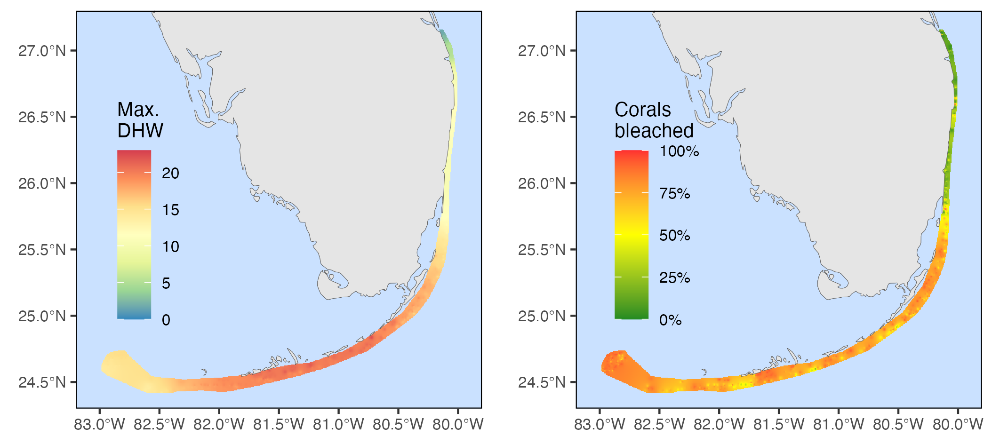

```{r setup, include=FALSE}
knitr::opts_chunk$set(echo = TRUE, message = FALSE, warning = FALSE, cache = TRUE)
```

```{r libraries}
# Load libraries
library(sf)
library(sp)
library(gstat)
library(lme4)
library(emmeans)
library(terra)
library(tidyterra)
library(drc)
library(tidyverse)
```

```{r labellers, include = FALSE}
# Create species labeller
species_names <- c(
  AAGA = "Agaricia agaricites",
  AFRA = "Agaricia fragilis",
  AGAR = "Agaricia sp.",
  AGRA = "Agaricia grahamae",
  AHUM = "Agaricia humilis",
  ALAM = "Agaricia lamarcki",
  ACER = "Acropora cervicornis",
  AGAR = "Agaricia sp.",
  APAL = "Acropora palmata",
  APRO = "Acropora prolifera",
  CNAT = "Colpophyllia natans",
  DCYL = "Dendrogyra cylindrus",
  DLAB = "Diploria labyrinthiformis",
  DSTO = "Dichocoenia stokesii",
  EFAS = "Eusmilia fastigiata",
  FFRA = "Favia fragum",
  HCUC = "Helioseris cucullata",
  ISIN = "Isophyllia sinuosa",
  IRIG = "Isophyllia rigida",
  ISOP = "Isophyllia sp.",
  MADR = "Madracis sp.",
  MANG = "Mussa angulosa",
  MARE = "Manicina areolata",
  MAUR = "Madriacis auretenra",
  MCAV = "Montastraea cavernosa",
  MDEC = "Madracis decactis",
  MFER = "Mycetophyllia ferox",
  MALI = "Mycetophyllia aliciae",
  MLAM = "Mycetophyllia lamarckiana",
  MFOR = "Madracis formosa",
  MJAC = "Meandrina jacksoni",
  MMEA = "Meandrina meandrites",
  MSEN = "Madracis senaria",
  MYCE = "Mycetophyllia sp.",
  OANN = "Orbicella annularis",
  OCUL = "Oculina sp.",
  ODIF = "Oculina diffusa",
  OFAV = "Orbicella faveolata",
  OFRA = "Orbicella franksi",
  ORBI = "Orbicella sp.",
  PAST = "Porites astreoides",
  PBRA = "Porites branneri",
  PCLI = "Pseudodiploria clivosa",
  PDIV = "Porites divaricata",
  PFUR = "Porites furcata",
  PORI = "Porites sp.",
  PPOR = "Porites porites",
  PSTR = "Pseudodiploria strigosa",
  SBOU = "Solenastrea bournoni",
  SCOL = "Scolymia sp.",
  SHYA = "Solenastrea hyades",
  SIDE = "Siderastrea sp.",
  SINT = "Stephanocoenia intersepta",
  SOLE = "Solenastrea sp.",
  SRAD = "Siderastrea radians",
  SSID = "Siderastrea siderea",
  UNKN = "Unknown"
)

species_names_2l <- gsub(" ", "\n", species_names)
abbrev_names <- as_tibble(species_names) %>%
  separate(value, into = c("genus", "species"), sep = " ") %>%
  mutate(genus = case_when(species == "sp." ~ genus,
                           species != "sp." ~ gsub("[a-z]+", ".", genus))) %>%
  unite(genus, species, col = "name", sep = " ")
abbrev_names <- c(abbrev_names$name)
names(abbrev_names) <- names(species_names)
```

# Import DRM and DHW data (2014, 2015, 2023)
```{r import_data}
# Load all data from 2014, 2015, and 2023
# QC'd by year
load("output/2014.RData")
#df14 <- df14 %>% filter(!Subregion %in% c("Martin", "North Palm Beach"))
load("output/2015.RData")
#load("output/2022.RData")
load("output/2023.RData")
df23 <- df23 %>% rename(Depth = EndDepth, Transect = TransectNum)
all0 <- bind_rows(
  `2014` = df14,
  `2015` = df15,
  #`2022` = df22,
  `2023` = df23,
  .id = "year"
) %>%
  mutate(dhw.bin = cut(dhw, breaks = c(-1, 3, 6, 9, 12, 15, 18, 22)))


### Does combining North and South Palm Beach affect results? (not by much)
### Also do not prefilter out Martin and NPB (see above)
nsites <- all0 %>%
  distinct(year, Subregion, Site) %>%
  count(year, Subregion)

all0 <- all0 %>%
  mutate(Subregion = case_when(Subregion %in% c("North Palm Beach", "South Palm Beach") ~ "Palm Beach",
                               TRUE ~ Subregion))

all0 <- all0 %>%
  mutate(Subregion = factor(Subregion, levels = c("Martin", "Palm Beach", "Broward-Miami",
                                                  "Biscayne", "Upper Keys", "Mid-Upper Keys Transition",
                                                  "Middle Keys", "Lower Keys", "Marquesas",
                                                  "Tortugas--Dry Tortugas NP")))

df23 <- df23 %>%
  mutate(Subregion = case_when(Subregion %in% c("North Palm Beach", "South Palm Beach") ~ "Palm Beach",
                               TRUE ~ Subregion))
df23 <- df23 %>%
  mutate(Subregion = factor(Subregion, levels = c("Martin", "Palm Beach", "Broward-Miami",
                                                  "Biscayne", "Upper Keys", "Mid-Upper Keys Transition",
                                                  "Middle Keys", "Lower Keys", "Marquesas",
                                                  "Tortugas--Dry Tortugas NP")))
# all0 %>%
#   distinct(year, Subregion, Latitude, Longitude, Site) %>%
#   ggplot(aes(x = Longitude, y = Latitude, color = Subregion)) +
#   geom_point() +
#   facet_wrap(~year)
```

```{r}
# Plot surveys vs. DHW
surveys.by.dhw <- all0 %>%
  distinct(year, Site, Date, Subregion, dhw) %>%
  ggplot(aes(x = dhw, fill = Subregion)) +
  geom_histogram(breaks = seq(0,22,1)) +
  facet_grid(year ~ ., scales = "free_y") +
  theme_classic() +
  labs(x = "Degree Heating Weeks", y = "Number of surveys")

ggsave(filename = "output/surveys.by.dhw.png", plot = surveys.by.dhw, width = 183, height = 90, units = "mm")
```

# 2023 bleaching severity

## Map bleaching (all corals)
```{r map_bleaching}
# Get percent of colonies surveyed that were bleached at each site 
pctbl23 <- df23 %>%
  #filter(Date >= as.Date("2023-08-01"), Date <= as.Date("2023-09-30")) %>%
  group_by(Site, Subregion, Latitude, Longitude, Week2) %>%
  summarize(BL = sum(Bleaching2 > 1),
            NB = sum(Bleaching2 <= 1),
            pctbl = BL / (BL + NB)) %>%
  ungroup()

pctbl23 <- pctbl23 %>%
  mutate(n = BL + NB)

# Model proportion of bleached colonies in each subregion in each 2-week window of survey
mod <- glm(cbind(BL, NB) ~ Subregion + Week2, family = "binomial", data = pctbl23)
mod2 <- glm(cbind(BL, NB) ~ Week2, family = "binomial", data = pctbl23)

# Predict proportion of bleached colonies in each Subregion at weeks 34-35 (Week2 = "(33,35]" => (August 20-September 2))) = peak of bleaching
## Get these Subregion probabilities at this time on the log-odds scale (NOT type = 'response')
res <- emmeans(mod, specs = c("Subregion"), at = list(Week2 = factor("(33,35]")))

# Get residuals for each Site at the time it was surveyed (e.g., difference from Subregion mean at time surveyed)...
# ...and then add these residuals to the Subregion's predicted bleaching probability for Weeks 34-35 (peak of bleaching)
# ...to get predicted bleaching severity at that site, if it had been surveyed at peak of bleaching
pctbl23.adj <- pctbl23 %>%
  # Get residuals on the 'working' /logit scale
  mutate(resid = residuals(mod, type = "working")) %>%
  # Join site residuals with logit means for Subregion at weeks 34-35
  left_join(as_tibble(res)) %>%
  # Add residuals to logit mean for Subregion weeks 34-35, then convert to probability scale
  mutate(adj = emmean + resid,
         ## Function to convert logit to probability
         adjprob = exp(adj) / (1 + exp(adj)))

ggplot(pctbl23.adj, aes(x = Subregion, y = adjprob)) +
  geom_jitter(width = 0.1, height = 0) +
  geom_boxplot()

# Get confidence intervals on site-level bleaching prevalence by subregion and for all keys/drto
pctbl23.adj <- pctbl23.adj %>%
  mutate(biscdown = case_when(Subregion %in% c("Martin", "Palm Beach", "Broward-Miami") ~ "north",
                              TRUE ~ "south"))
pctbl23.adj %>%
  group_by(biscdown) %>%
  summarize(mean = mean(adj),
            sd = sd(adj),
            lower = mean - 2*sd,
            upper = mean + 2*sd) %>%
  mutate(meanprob = exp(mean) / (1 + exp(mean)),
         lowerprob = exp(lower) / (1 + exp(lower)),
         upperprob = exp(upper) / (1 + exp(upper)))


# Interpolate percent bleaching for whole reef tract
# https://geobgu.xyz/r/spatial-interpolation-of-point-data.html

# Create SpatialPointsDataFrame of survey sites
sites23 <- pctbl23.adj %>%
  distinct(Site, Longitude, Latitude, adjprob)
spdat <- sp::SpatialPointsDataFrame(
    coords=sites23[,c('Longitude','Latitude')], 
    data=sites23[,c('Site', 'adjprob')], 
    proj4string = CRS("+init=epsg:4326")
)

# Create empty raster to hold interpolated values
samplegrid <- raster::raster(spdat, res = c(0.005, 0.005))
raster::crs(samplegrid) <- raster::crs(spdat) <- sp::CRS("+init=epsg:4326")
# Run interpolation
idw.model <- gstat(formula=spdat$adjprob~1, locations=spdat, weights = pctbl23.adj$n)
idw.spp <- raster::interpolate(samplegrid, idw.model)

# Clip interpolated raster to just area of hull/polygon surrounding the reef tract
# Create hull/polygon surrounding surveyed sites
pts1 <- st_as_sf(x = sites23, coords = c('Longitude', 'Latitude'))
my_hull <- st_concave_hull(st_union(pts1), ratio = 0.09)
my_hull <- st_buffer(my_hull, dist = 0.015)
my_hull <- my_hull %>% st_set_crs(4326)
idw.spp.reef <- raster::mask(idw.spp, (as_Spatial(my_hull)))

# Convert clipped interpolation to spatraster for plotting
x <- rast(idw.spp.reef)

# PLOT
# Download satellite map for Florida
world <- rnaturalearth::ne_countries(scale = "large", returnclass = "sf")
# Create base map of Florida
basemap <- ggplot() +
  geom_sf(data = world, lwd = 0.1, fill = "gray90") +
  coord_sf(xlim = c(-83.2, -79.8), ylim = c(24.3, 27.3), expand = FALSE) +
  scale_fill_gradient2(high = "firebrick1", mid = "yellow", low = "forestgreen", 
                       midpoint = 0.5, limits = c(0, 1), na.value = NA,
                       labels = scales::label_percent(), name = "Corals\nbleached") +
  theme(text = element_text(size = 10),
        axis.title = element_blank(),
        panel.background = element_rect(fill = "lightsteelblue1"),
        panel.border = element_rect(colour = "black", fill=NA),
        panel.grid = element_blank(),
        legend.position = c(0.2, 0.5),
        legend.background = element_blank())

# Map with interpolated raster
rasterplot <- basemap +
  geom_spatraster(data = x) +
  geom_sf(data = world, lwd = 0.1, fill = "gray90") +
  coord_sf(xlim = c(-83.2, -79.8), ylim = c(24.3, 27.3), expand = FALSE)

ggsave(filename = "output/pctbleach2023.png", plot = rasterplot, width = 90, height = 90, units = "mm")

# Just raster to put on satellite map for USF seminar?
justrast <- ggplot() + geom_spatraster(data = x) +
  scale_fill_gradient2(high = "firebrick1", mid = "yellow", low = "forestgreen", 
                       midpoint = 0.5, limits = c(0, 1), na.value = NA,
                       labels = scales::label_percent(), name = "Corals\nbleached") +
  theme_void() +
  theme(text = element_text(color = "white"))

ggsave(justrast, filename = "justrastleg.png", width = 200, height = 200, units = "mm")
```

## Map DHWs
```{r map_dhw}
dhw <- read_csv("data/dhw/2023/dhw_processed.csv") %>%
  mutate(across(where(is.character), as_factor)) %>%
  rename(Date = date) %>%
  dplyr::select(Site, Date, dhw)

maxdhw <- dhw %>%
  group_by(Site) %>%
  summarize(maxdhw = max(dhw)) %>%
  right_join(sites23, by = "Site")

# Create SpatialPointsDataFrame of survey sites
dhwdat <- sp::SpatialPointsDataFrame(
    coords=maxdhw[,c('Longitude','Latitude')], 
    data=maxdhw[,c('Site', 'maxdhw')], 
    proj4string = CRS("+init=epsg:4326")
)

# Create empty raster to hold interpolated values
dhwgrid <- raster::raster(dhwdat, res = c(0.005, 0.005))
raster::crs(dhwgrid) <- raster::crs(dhwdat) <- sp::CRS("+init=epsg:4326")
# Run interpolation
dhw.idw.model <- gstat(formula=dhwdat$maxdhw~1, locations=dhwdat)
dhw.idw.spp <- raster::interpolate(dhwgrid, dhw.idw.model)
# Clip
dhw.idw.spp.reef <- raster::mask(dhw.idw.spp, (as_Spatial(my_hull)))

# Convert clipped interpolation to spatraster for plotting
x2 <- rast(dhw.idw.spp.reef)

dhwmap <- basemap +
  geom_spatraster(data = x2) +
  geom_sf(data = world, lwd = 0.1, fill = "gray90") +
  coord_sf(xlim = c(-83.2, -79.8), ylim = c(24.3, 27.3), expand = FALSE) +
  scale_fill_distiller(palette = "Spectral", 
                       limits = c(0, 23), na.value = NA,
                       name = "Max.\nDHW      ")

dhw_bleach <- cowplot::plot_grid(dhwmap, rasterplot, ncol = 2)
ggsave(filename = "output/dhw_bleach.png", plot = dhw_bleach, width = 180, height = 80, units = "mm")

```


## Map subregions
```{r map_subregions, fig.width = 6, fig.height = 6}
# Raster plot with rectangles for Subregions
rasterplot_rect <- rasterplot +
  geom_rect(aes(xmin = -83, xmax = -82, ymin = 24.4, ymax = 24.75), fill = NA, color = "black", lwd = 0.05) +
  geom_rect(aes(xmin = -82, xmax = -81, ymin = 24.4, ymax = 24.75), fill = NA, color = "black", lwd = 0.05) +
  geom_rect(aes(xmin = -81, xmax = -80, ymin = 24.65, ymax = 25.65), fill = NA, color = "black", lwd = 0.05) +
  geom_rect(aes(xmin = -80.4, xmax = -79.8, ymin = 25.65, ymax = 26.8), fill = NA, color = "black", lwd = 0.05)

# Raster plot with points for each surveyed site
sitesplot <- rasterplot +
  geom_point(data = pctbl23.adj, aes(x = Longitude, y = Latitude, fill = adjprob),
             alpha = 1, stroke = 0.1, pch = 21)


#### Plot of DRM site locations for USF seminar
alldrmpts <- ggplot(pctbl23.adj, aes(x = Longitude, y = Latitude)) +
  geom_point(aes(color = Subregion), alpha = 0.6) +
  theme_void() +
  theme(legend.position = "none")
ggsave(alldrmpts, filename = "alldrmpts.png", width = 110, height = 100, units = "mm")

# Subregion plots
dtmap <- sitesplot + coord_sf(xlim = c(-83, -82), ylim = c(24.4, 24.75), expand = FALSE) + theme(legend.position = "none")
lkmap <- sitesplot + coord_sf(xlim = c(-82, -81), ylim = c(24.4, 24.75), expand = FALSE) + theme(legend.position = "none")
ukmap <- sitesplot + coord_sf(xlim = c(-81, -80), ylim = c(24.65, 25.65), expand = FALSE) + theme(legend.position = "none")
semap <- sitesplot + coord_sf(xlim = c(-80.4, -79.8), ylim = c(25.65, 26.8), expand = FALSE) + theme(legend.position = "none")

# Create and save multipanel plot
maps_multipanel <- gridExtra::arrangeGrob(
  rasterplot_rect, lkmap, dtmap, ukmap, semap, 
  layout_matrix = matrix(c(1,1,1,1,2,3,2,3,4,4,4,4,5,5), nrow=2))
ggsave(filename = "output/2023_bleaching_maps_multipanel.png", 
       plot = maps_multipanel, width = 16, height = 4, unit = "in")

# Display subregion panels
cowplot::plot_grid(dtmap, lkmap, ncol = 1)
cowplot::plot_grid(ukmap, semap, ncol = 2, rel_widths = c(0.6, 0.4))
```


## Species variation in bleaching

### Species ED50s, DRCs, GLMERs
```{r bleaching_by_species, fig.width = 5, fig.height = 6}
## Ways of modeling species-level bleaching susceptibility vs. dhw
# 1. GLMER (+random effects, -no constraining at 0 DHW, -no ED50)
# 2. DRC (+constrain at 0 DHW, +ED50 stats, -no random effects)
## Get results of both and compare
# 1. Plot curves
# 2. Plot heatmaps


# Get subsetted dataset of corals observed >80 times
df23.abund <- df23 %>%
  group_by(Species) %>%
  filter(n() > 80)
df23f <- df23.abund %>%
  group_by(Site, Subregion, Week2, Species, dhw) %>%
  summarize(BL = sum(Bleaching2 > 1),
            NB = sum(Bleaching2 <= 1),
            pctNB = NB / (NB + BL),
            n = n()) %>%
  drop_na() %>%
  droplevels()

#### GLMER
m2 <- glmer(cbind(NB, BL) ~ Species * dhw + Week2 + (1|Subregion), family = "binomial", data = df23f,
            nAGQ = 0, control = glmerControl(optimizer = "nloptwrap"), verbose = FALSE)
res2 <- emmeans(m2, specs = c("Species", "dhw"), rg.limit = 20000, type = "response",
               at = list(Week2 = factor("(33,35]"), dhw = seq(0, 23, 0.1)))
glmer.res <- as.tibble(res2)
glmer.ord <- glmer.res %>%
  group_by(Species) %>%
  slice(which.min(abs(prob - 0.5))) %>%
  ungroup() %>%
  mutate(Species = fct_reorder(Species, dhw))

#### DRC (tried 3par, 4par, and 5par -- all work, just slight diffs. )
# More pars = less estimable standard errors on ED50... depends how important ED50 inference is
m3 <- drm(pctNB ~ dhw, data = df23f, curveid = Species, weights = n, type = "binomial",
         logDose = NULL, fct = LL.5(
           names = c("hill", "min", "max", "ED50", "f"),
           ## Max parameter is fixed to 1, min is set to 0
           fixed = c(NA, 0, 1, NA, NA)),
    # Hill parameter must be positive (must decrease with incr. dhw)
    #lowerl = c(rep(0, 22), rep(-Inf, 22), rep(0, 22), rep(-Inf, 22)),
    control = drmc(relTol = 1e-7))
nd <- expand.grid(Species = levels(df23f$Species), dhw = seq(0, 23, 0.1))
pred <- predict(m3, newdata = nd)
drc.res <- as_tibble(bind_cols(nd, prob = pred))
drc.ord <- ED(m3, 0.5, type = "absolute", display = FALSE) %>%
  as_tibble() %>%
  mutate(Species = levels(df23f$Species),
         Species = fct_reorder(Species, Estimate))

# Combine GLMER and DRC results for comparison
allres <- bind_rows(
  glmer = glmer.res,
  drc = drc.res,
  .id = "method"
)
# Plot as response curves
ggplot(allres, aes(x = dhw, y = prob)) +
         geom_line(aes(linetype = method)) +
         facet_wrap(~Species) +
  theme_classic()


# Plot as heatmap
glmer.heatmap <- glmer.res %>%
  mutate(Species = factor(Species, levels = levels(glmer.ord$Species))) %>%
  ggplot(aes(x = dhw, y = Species)) +
  geom_tile(aes(fill = prob)) +
  scale_fill_gradient2(high = "forestgreen", mid = "yellow", low = "firebrick1", 
                       limits = c(0, 1), midpoint = 0.5) +
  geom_point(data = glmer.ord, aes(x = dhw), pch = 5) +
  labs(x = "Degree Heating Weeks", y = "", fill = "Proportion\nof colonies\nPB or worse") +
  theme(legend.position = "none")


drc.heatmap <- drc.res %>%
  mutate(Species = factor(Species, levels = levels(drc.ord$Species))) %>%
  ggplot(aes(x = dhw, y = Species)) +
  geom_tile(aes(fill = prob)) +
  scale_fill_gradient2(high = "forestgreen", mid = "yellow", low = "firebrick1", 
                       limits = c(0, 1), midpoint = 0.5) +
  geom_point(data = drc.ord, aes(x = Estimate), pch = 5) +
  labs(x = "Degree Heating Weeks", y = "", fill = "Proportion\nof colonies\nPB or worse") +
  theme(legend.position = "none")

bleaching_heatmaps <- cowplot::plot_grid(glmer.heatmap, drc.heatmap, ncol = 2)
ggsave(filename = "output/bleaching_heatmaps.png", plot = bleaching_heatmaps, width = 200, height = 70, units = "mm")

# Stats on ED50s
# compParm(m3, "ED50", operator = "-")

# Extract slopes? coef 'hill'
# coef(m3)

# # # Sanity check barplot
# ggplot(df23.abund, aes(x = cut(dhw, breaks = seq(0,24,3)), fill = Bleaching3)) +
#   geom_bar(position = "fill") +
#   geom_text(stat = "count", aes(label = after_stat(count)), vjust = "inward", position = "fill", size = 2) +
#   facet_wrap(~Species, scales = "free_y")


# Ridgeline plot
drc.res.ridges <- drc.res %>%
  mutate(Species = factor(Species, levels = levels(drc.ord$Species))) %>%
  ggplot(aes(x = dhw, y = Species)) +
  ggridges::geom_ridgeline_gradient(aes(height = (1 - prob), fill = prob)) +
  scale_y_discrete(labels = species_names[as.character(drc.ord$Species)]) +
  scale_fill_gradient2(high = "forestgreen", mid = "yellow", low = "firebrick1", 
                       limits = c(0, 1), midpoint = 0.5) +
  geom_point(data = drc.ord, aes(x = Estimate), pch = 5, size = 0.5) +
  theme_classic() +
  theme(legend.position = "none",
        axis.text.y = element_text(face = "italic")) +
  labs(x = "Degree Heating Weeks", y = "")
ggsave(filename = "output/bleaching_ridges.png", plot = drc.res.ridges,
       width = 100, height = 120, units = "mm")

drc.res.ridges


#ED90
ed90 <- ED(m3, 0.1, type = "absolute", display = FALSE) %>%
  as_tibble() %>%
  mutate(Species = levels(df23f$Species)) %>%
  filter(Estimate <= 25)

drc.res.ridges +
  geom_point(data = ed90, aes(x = Estimate), pch = 5, size = 0.5)
```


### Within-species variation (ED90-ED10) vs. ED50
```{r within_spp_bleaching_variability, fig.width = 8, fig.height = 5}
# Distance from 10% to 75% bleaching (90% to 25% not bleached) by Species
span1090 <- drc.res %>%
  group_by(Species) %>%
  slice(which.min(abs(prob - 0.9)),
        which.min(abs(prob - 0.1))) %>%
  summarize(min = min(dhw), max = max(dhw)) %>%
  mutate(span = max - min) %>%
  arrange(-span)

# span2575 <- drc.res %>%
#   group_by(Species) %>%
#   slice(which.min(abs(prob - 0.75)),
#         which.min(abs(prob - 0.25))) %>%
#   summarize(min = min(dhw), max = max(dhw)) %>%
#   mutate(span = max - min) %>%
#   arrange(-span)

pbleach <- drc.res %>%
  filter(dhw == 23) %>%
  mutate(pbleach = 1 - prob)

(plot1090 <- drc.ord %>%
  left_join(span1090) %>%
  left_join(readxl::read_xlsx("data/species_metadata.xlsx")) %>%
  ggplot(aes(x = Estimate, y = span)) +
  geom_point(aes(size = n_symbiont_genera, color = reproductive_mode,
                 shape = sexual_system)) +
  ggrepel::geom_text_repel(aes(label = abbrev_names[as.character(Species)]),
                           fontface = "italic", size = 3, lineheight = 0.75) +
  labs(x = "Median tolerance (DHW ED50)",
       y = "Range in tolerance (DHW ED90 - ED10)") +
  theme_classic())

# (plot2575 <- drc.ord %>%
#   left_join(span2575) %>%
#   left_join(readxl::read_xlsx("data/species_metadata.xlsx")) %>%
#   ggplot(aes(x = Estimate, y = span)) +
#   geom_point(aes(size = n_symbiont_genera, color = reproductive_mode,
#                  shape = sexual_system)) +
#   ggrepel::geom_text_repel(aes(label = abbrev_names[as.character(Species)]),
#                            fontface = "italic", size = 3, lineheight = 0.75) +
#   labs(x = "Median tolerance (DHW ED50)",
#        y = "Range in tolerance (DHW ED75 - ED25)") +
#   theme_classic())

ggsave(filename = "output/medrangeplot.png", plot = plot1090, width = 90, height = 90, units = "mm")

drc.ord %>%
  left_join(span1090) %>%
  left_join(readxl::read_xlsx("data/species_metadata.xlsx")) %>%
  ggplot(aes(x = n_symbiont_genera, y = span)) + 
  geom_point() +
  geom_smooth(se = FALSE)


(plot1090 <- drc.ord %>%
  left_join(span1090) %>%
  left_join(readxl::read_xlsx("data/species_metadata.xlsx")) %>%
  ggplot(aes(x = Estimate, y = span)) +
  geom_point(aes(size = n_symbiont_genera^4), alpha = 0.7) + #, color = most_dom_sym)) +
  #geom_point(aes(color = factor(n_symbiont_genera))) +
  ggrepel::geom_text_repel(aes(label = abbrev_names[as.character(Species)]),
                           fontface = "italic", size = 3, lineheight = 0.75) +
  labs(x = "Median tolerance (DHW ED50)",
       y = "Range in tolerance (DHW ED90 - ED10)") +
  theme_classic() +
  theme(legend.position = "none"))

ggsave(filename = "output/plot1090.png", plot = plot1090, width = 90, height = 90, units = "mm")


# Prevalence of bleaching at 22 DHW
pbleach <- drc.res %>%
  filter(dhw == 22) %>%
  mutate(pBL = 1 - prob,
         pNB = prob) %>%
  arrange(-pNB)

View(pbleach)


# P50 vs. P90?
testy <- drc.res %>%
  group_by(Species) %>%
  slice(which.min(abs(prob - 0.2))) %>%
  select(Species, dhw90 = dhw, prob90 = prob) %>%
  left_join(drc.ord)

ggplot(testy, aes(x = Estimate, y = dhw90)) +
  geom_point() +
  ggrepel::geom_label_repel(aes(label = Species)) +
  geom_abline(aes(intercept = 0, slope = 1))
```

# 2014-15-23 bleaching severity 

```{r aggregate_subset_data}
# Aggregate Agaricia spp. other than AAGA, Mycetophyllia spp., Isophyllia spp., Oculina spp., Solenastrea spp., Scolymia spp.
all0 <- all0 %>%
  mutate(Species = case_when(Species %in% c("AFRA", "AGAR", "AGRA", "AHUM", "ALAM") ~ "AGAR",
                             Species %in% c("MALI", "MLAM", "MYCE", "MFER") ~ "MYCE",
                             Species %in% c("IRIG", "ISIN", "ISOP") ~ "ISOP",
                             Species %in% c("OCUL", "ODIF") ~ "OCUL",
                             Species %in% c("SHYA", "SBOU") ~ "SOLE",
                             Species %in% c("SCOL", "SCUB", "SLAC", "SWEL") ~ "SCOL",
                             Species %in% c("OFAV", "OFRA", "OANN") ~ "ORBI",
                             TRUE ~ Species)) %>%
  drop_na(Species)

# Keep only those species observed at least 20 times in each year
spp_to_include <- all0 %>%
  count(Species, year) %>%
  group_by(Species) %>%
  dplyr::filter(min(n) >= 20)  # 20 is a good cutoff

allf <- all0 %>%
  filter(Species %in% spp_to_include$Species)

## Group data at species+site-level to fit group-level models instead of subject-level models -- fits faster
allg <- allf %>%
  group_by(year, Week2, Subregion, Site, dhw, dhw.bin, Species) %>%
  summarize(BL = sum(Bleaching2 > 1),
            NB = sum(Bleaching2 <= 1)) %>%
  ungroup()


# How many observations including 2014/2015/2023 filtered?
nrow(allf)
```

## All corals - ED50s (glmer)
```{r bleaching_by_dhw_across_years}
# Model differences in bleaching severity between years with DHW as continuous predictor
dhw.mod <- glmer(cbind(BL, NB) ~ dhw + year + year:Week2 + (dhw+year|Species) + (year|Subregion),  
                     family = "binomial", data = allg, verbose = FALSE,
                     nAGQ=0, control=glmerControl(optimizer = "nloptwrap"))
# Best formula: cbind(BL, NB) ~ dhw + year + year:Week2 + (dhw+year|Species) + (year|Subregion)
#### Or DHW + year may be better.....DHW * Year or DHW + YEAR???
#### relevant reading: https://stats.oarc.ucla.edu/stata/seminars/deciphering-interactions-in-logistic-regression/#:~:text=If%20the%20differences%20are%20not,or%20odds%20ratios%20or%20probability%3F
#anova(dhw.mod)

# Function to get DHW's that cause 50% bleaching for each year
ed50s.fun <- function(dhw.mod) {
  dhw.res <- emmeans(dhw.mod, specs = c("dhw", "year", "Week2"), type = "response",
                     at = list(dhw = seq(0, 23, 0.1), Week2 = c("(36,38]", "(33,35]")), 
                     rg.limit = 20000, level = 0.84)
  dhw.res2 <- subset(dhw.res,
                     (year == "2014" & Week2 == "(36,38]") |
                     (year == "2015" & Week2 == "(36,38]") |
                     (year == "2023" & Week2 == "(33,35]"))
  bleach50 <- as.tibble(dhw.res2) %>%
    group_by(year) %>%
    slice(which.min(abs(prob - 0.5))) %>%
    pull(dhw)
  diff2015 <- bleach50[2]-bleach50[1]
  diff2023 <- bleach50[3]-bleach50[1]
  res <- c(bleach50, diff2015, diff2023)
  res <- setNames(res, c("2014", "2015", "2023", "2015-2014", "2023-2014"))
  return(res)
}

# Get point estimates for ED50s (DHW's that cause 50% bleaching)
bleach50 <- ed50s.fun(dhw.mod)
bleach50

# Bootstrap the calculation of ED50
## re.form = NA: does not account for random effects (conf interval), re.form = NULL: does (prediction interval)
## https://stackoverflow.com/questions/67098467/on-the-predict-mermod-function-arguments
# boot.out <- bootMer(dhw.mod, FUN = ed50s.fun, nsim = 200, seed = 123, re.form = NULL,
#                     parallel = "multicore", ncpus = 20)
# saveRDS(boot.out, file = "output/boot.out.rds")
boot.out <- readRDS(file = "output/boot.out.rds")
## Get confidence intervals from Bootstrap
lower <- apply(boot.out$t, 2, function(x) as.numeric(quantile(x, probs=.025, na.rm=TRUE)))
upper <- apply(boot.out$t, 2, function(x) as.numeric(quantile(x, probs=.975, na.rm=TRUE)))
se <- apply(boot.out$t, 2, sd)

ed50conf <- tibble(
  year = names(bleach50), 
  ed50 = bleach50,
  se = se,
  lower = lower,
  upper = upper)


# For plotting, Get emmeans for just the specific 2-week windows of interest in each year (corresp. to max. bleaching), And select just the range of peak DHWs experienced across sites in each year
# Get max and min DHW for conducted surveys as bounds
all0 %>% group_by(year) %>%
  summarize(maxdhw = max(dhw),
            mindhw = min(dhw))
dhw.res <- emmeans(dhw.mod, specs = c("dhw", "year", "Week2"), type = "response",
                   at = list(dhw = seq(0, 23, 0.1)), rg.limit = 20000, level = 0.84)
dhw.res2 <- subset(dhw.res,
  (year == "2014" & Week2 == "(36,38]" & dhw <= 8.11 & dhw > 0.48) |
  (year == "2015" & Week2 == "(36,38]" & dhw <= 8.90 & dhw > 0) |
  (year == "2023" & Week2 == "(33,35]" & dhw <= 21.5 & dhw > 1.06) 
)

# Plot
(dhw.bleach.plot <- ggplot(as.tibble(dhw.res2), aes(x = dhw, y = prob, group = year)) +
  # Add lines and conf intervals for each year
  geom_ribbon(aes(ymin = prob - SE, ymax = prob + SE), lwd = 0, alpha = 0.1) +
  geom_line(aes(color = prob), lwd = 2) +
  geom_text(data = slice(ed50conf, 1:3), 
            aes(x = c(8,9.5,20.5), y = c(0.8, 0.65, 0.97), label = year)) +
  # Add line segments at ED50s
  geom_segment(data = slice(ed50conf, 1:3),
               aes(x = ed50, xend = ed50, y = 0.492, yend = 0), lty = 2, lwd = 0.2) +
  geom_point(data = slice(ed50conf, 1:3), aes(y = 0.5, x = ed50), pch = 1, stroke = 0.2) +
  # Annotate increase in heat tolerance
  annotate("segment", x = 3.9, xend = 11.5, y = 0.05, lwd = 0.2, 
           arrow = arrow(type = "closed", length = unit(3, "mm"))) +
  annotate("text", x = 11.7, y = 0.082, hjust = 0, size = 3, label = "Bleaching threshold\n+1.08°C/decade") +
  # Annotate extreme bleaching in 2023
  # annotate("point", x = 21.4, y = 0.906, pch = 1, stroke = 0.2) +
  # annotate("segment", x = 21.4, y = 0.9, yend = 0.47, lty = 2, lwd = 0.2) +
  # annotate("text", x = 21.2, y = 0.51, hjust = 1, size = 3, label = "Extreme bleaching\n>2x threshold") +
  scale_x_continuous(limits = c(-1, 22), breaks = seq(0, 24, 4), expand = c(0, 0)) +
  scale_y_continuous(limits = c(0, 1), expand = c(0, 0), breaks = seq(0, 1, 0.1), 
                     labels = scales::label_percent()) +
  scale_color_gradient2(low = "forestgreen", mid = "yellow", high = "firebrick1", 
                        limits = c(0, 1), midpoint = 0.5) +
  theme_classic() +
  theme(legend.position = "none") +
  labs(x = "Degree Heating Weeks (°C-weeks)", y = "Bleaching prevalence") +
  coord_cartesian(clip = "off"))

# dhw.bleach.plot +
#   geom_errorbar(data = slice(ed50conf, 1:3), 
#                aes(x = ed50, y = 0.5, xmin = ed50-se, xmax = ed50+se), 
#                width = 0.02, alpha = 0.5)

# Save plot
ggsave(filename = "output/dhw_bleach_allyears.png", plot = dhw.bleach.plot, width = 100, height = 90, units = "mm")

# What levels of heat stress caused 90% bleaching in all species?
bleach90 <- as.tibble(dhw.res) %>%
  filter(year == "2023", dhw == 22.3, Week2 == "(33,35]")


##### Plots for USF seminar
myplot1 <- as.tibble(dhw.res2) %>% filter(year == 2023) %>%
ggplot(aes(x = dhw, y = prob, group = year)) +
  geom_text(data = slice(ed50conf, 3), 
            aes(x = c(20.5), y = c(0.97), label = year)) +
  # Add lines and conf intervals for each year
  geom_ribbon(aes(ymin = prob - SE, ymax = prob + SE), lwd = 0, alpha = 0.1) +
  geom_line(aes(color = prob), lwd = 2) +
  scale_x_continuous(limits = c(-1, 22), breaks = seq(0, 24, 4), expand = c(0, 0)) +
  scale_y_continuous(limits = c(0, 1), expand = c(0, 0), breaks = seq(0, 1, 0.1), 
                     labels = scales::label_percent()) +
  scale_color_gradient2(low = "forestgreen", mid = "yellow", high = "firebrick1", 
                        limits = c(0, 1), midpoint = 0.5) +
  theme_classic() +
  theme(legend.position = "none") +
  labs(x = "Degree Heating Weeks (°C-weeks)", y = "Bleaching prevalence") +
  coord_cartesian(clip = "off")
myplot1
ggsave(filename = "plot1.png", width = 125, height = 100, units = "mm")
myplot1 %+% (as.tibble(dhw.res2) %>% filter(year %in% c(2015, 2023))) +
  geom_text(data = slice(ed50conf, 2:3), 
            aes(x = c(9.5,20.5), y = c(0.65, 0.97), label = year)) 
ggsave(filename = "plot2.png", width = 125, height = 100, units = "mm")
myplot1 %+% as.tibble(dhw.res2) +
  geom_text(data = slice(ed50conf, 1:3), 
            aes(x = c(8,9.5,20.5), y = c(0.8, 0.65, 0.97), label = year)) 
ggsave(filename = "plot3.png", width = 125, height = 100, units = "mm")

dhw.bleach.plot
ggsave(filename = "plot4.png", width = 125, height = 100, units = "mm")
```


## All corals - ∆ED50, ∆°C
```{r change_degC_thresh}
#degC.per.DHW <- 0.07770643
degC.per.DHW <- 0.1273714


# Backcalculate change in ed50s (DHW) to change in tolerance (°C) 
degC <- ed50conf %>%
  filter(year %in% c("2023-2014", "2015-2014")) %>%
  mutate(ed50.degC = ed50 * degC.per.DHW,
         se.degC = se * degC.per.DHW,
         lower.degC = lower * degC.per.DHW,
         upper.degC = upper * degC.per.DHW) %>%
  separate(year, into = c("year", "2014"))
# degC %>%
#   select(year, ed50.degC, se.degC, lower.degC, upper.degC) %>%
#   ggplot(aes(x = year, y = ed50.degC)) +
#   geom_point() +
#   geom_errorbar(aes(ymin = lower.degC, ymax = upper.degC), width = 0.2) +
#   ylim(0, 0.8) +
#   labs(y = "Change in heat tolerance from 2014 (°C)") +
#   theme_classic()

# Plot ED50 vs. year
ed50conf %>%
  slice(1:3) %>%
  ggplot(aes(x = as.numeric(year), y = ed50)) +
  geom_point() +
  geom_smooth(method = "lm", se = FALSE) +
  geom_path(data = slice(ed50conf, c(1,3))) +
  theme_classic() +
  labs(x = "Year", y = "ED50 (DHW)")

# # Model ∆°C vs year w/0intercept @ 2015 -- but only two data points
# fit <- lm(ed50.degC ~ 0 + I(as.numeric(year) - 2014), data = degC)
# plot(as.numeric(degC$year), degC$ed50.degC, xlim = c(2010, 2025), ylim = c(-0.1, 1))
# newdat <- data.frame(year = seq(2010, 2025, 1))
# pred <- predict(fit, newdat)
# lines(newdat$year, pred)
# summary(fit)
# confint(fit)

mod <- ed50conf %>%
  slice(1:3) %>%
  lm(ed50 ~ as.numeric(year), data = .)

# Change over time from regression on 2014-2015-2023
(c1 <- coef(mod)[2])
## 0.7027 DHW's per year --> 0.736°C/decade
c1 * degC.per.DHW * 10

# Change over time considering just 2014-2023
ed50conf %>%
  filter(year == "2023-2014") %>%
  mutate(across(c("ed50", "se", "lower", "upper"), ~ . * degC.per.DHW / 9 * 10, .names = "{.col}.degC.dec"))

# 1.08°C/decade [95% C.I. = 0.863-1.17°C/decade]
```

## Species - ED50s 2014-15-23

```{r species_bleaching_by_year_dhw, fig.width = 7, fig.height = 7}
# Model differences in bleaching severity between years with DHW
dhw.sp.mod <- glmer(
  cbind(BL, NB) ~ Species + dhw + Species:dhw + year + Species:year + year:Week2 + (year|Subregion),  
  family = "binomial", data = allg, verbose = FALSE,
  nAGQ=0, control=glmerControl(optimizer = "nloptwrap"))

# Best formula: cbind(BL, NB) ~ dhw * year + year:Week2 + (dhw+year|Species) + (year|Subregion)
#### Or DHW + year may be better.....DHW * Year or DHW + YEAR???
#### relevant reading: https://stats.oarc.ucla.edu/stata/seminars/deciphering-interactions-in-logistic-regression/#:~:text=If%20the%20differences%20are%20not,or%20odds%20ratios%20or%20probability%3F
#anova(dhw.sp.mod)


# Get emmeans for just the specific 2-week windows of interest in each year (corresp. to max. bleaching)
# And select just the range of peak DHWs experienced across sites in each year
dhw.sp.res <- emmeans(dhw.sp.mod, specs = c("Species", "dhw", "year", "Week2"), type = "response",
                      at = list(dhw = seq(0, 23, 0.1), Week2 = c("(36,38]", "(33,35]")), 
                      rg.limit = 200000, level = 0.84)
dhw.sp.res2 <- subset(dhw.sp.res,
  (year == "2014" & Week2 == "(36,38]" & dhw <= 8.11 & dhw > 0.48) |
  (year == "2015" & Week2 == "(36,38]" & dhw <= 8.90 & dhw > 0) |
  (year == "2023" & Week2 == "(33,35]" & dhw <= 21.5 & dhw > 1.06) 
)
dhw.sp.res22 <- subset(dhw.sp.res,
  (year == "2014" & Week2 == "(36,38]") |
  (year == "2015" & Week2 == "(36,38]") |
  (year == "2023" & Week2 == "(33,35]")
)

# Plot
(dhw.sp.bleach.plot <- ggplot(as.tibble(dhw.sp.res2), aes(x = dhw, y = prob, group = year)) +
  facet_wrap(~Species, labeller = labeller(Species = abbrev_names)) +
  geom_ribbon(aes(ymin = prob - SE, ymax = prob + SE), lwd = 0, alpha = 0.2) +
  geom_line(aes(color = year), lwd = 0.5, alpha = 0.9) +
  geom_hline(aes(yintercept = 0.5), lty = 2, lwd = 0.25) +
  scale_y_continuous(limits = c(0, 1), expand = c(0, 0), breaks = seq(0, 1, 0.25),
                     labels = scales::label_percent()) +
  # scale_color_gradient2(low = "forestgreen", mid = "yellow", high = "firebrick1", 
  #                       limits = c(0, 1), midpoint = 0.5) +
  theme_classic() +
  theme(legend.position = c(0.8, 0.04),
        legend.direction = "horizontal",
        strip.background = element_blank(),
        strip.text = element_text(face = "italic")) +
  labs(x = "Degree Heating Weeks (°C-weeks)", y = "Bleaching prevalence", color = "") +
  coord_cartesian(clip = "off"))

ggsave(filename = "output/dhw.sp.bleach.plot.png", plot = dhw.sp.bleach.plot, width = 140, height = 140, units = "mm")


### SUBSET THIS FIGURE FOR BIOTA PROPOSAL
biota.1 <- dhw.sp.bleach.plot %+% filter(as.tibble(dhw.sp.res2), Species %in% c("CNAT", "DLAB", "SINT", "MCAV", "PAST", "PSTR", "SSID"))


# Function to get ED50s (DHW's that cause 50% bleaching for each year for each species) AND
## change in ED50s from 2014-2015, and 2014-2023
sp.ed50s.fun <- function(dhw.sp.mod) {
  dhw.sp.res <- emmeans(dhw.sp.mod, specs = c("Species", "dhw", "year", "Week2"), type = "response",
                   at = list(dhw = seq(0, 23, 0.1), Week2 = c("(36,38]", "(33,35]")), 
                   rg.limit = 200000, level = 0.84)
  dhw.sp.res22 <- subset(dhw.sp.res,
    (year == "2014" & Week2 == "(36,38]") |
    (year == "2015" & Week2 == "(36,38]") |
    (year == "2023" & Week2 == "(33,35]") 
  )
  bleach50 <- as.tibble(dhw.sp.res22) %>%
    group_by(Species, year) %>%
    slice(which.min(abs(prob - 0.5)))
  bleachdiffs <- bleach50 %>%
    group_by(Species) %>%
    summarize("2015-2014" = dhw[year=="2015"] - dhw[year=="2014"],
              "2023-2014" = dhw[year=="2023"] - dhw[year=="2014"]) %>%
    pivot_longer(2:3)
  names <- c(paste(bleach50$Species, bleach50$year), paste(bleachdiffs$Species, bleachdiffs$name))
  vals <- c(bleach50$dhw, bleachdiffs$value)
  vals <- setNames(vals, names)
  return(vals)
}

# Get point estimates for ED50s and ∆ED50s
sp.bleach50 <- sp.ed50s.fun(dhw.sp.mod)

# Bootstrap ED50s for SE/confidence intervals
## re.form = NA: does not account for random effects (conf interval), re.form = NULL: does (prediction interval)
## https://stackoverflow.com/questions/67098467/on-the-predict-mermod-function-arguments
# sp.boot.out <- bootMer(dhw.sp.mod, FUN = sp.ed50s.fun, nsim = 1000, seed = 123, re.form = NULL,
#                        parallel = "multicore", ncpus = 20)
# saveRDS(sp.boot.out, file = "output/sp.boot.out.rds")
sp.boot.out <- readRDS(file = "output/sp.boot.out.rds")
## Get confidence intervals from Bootstrap
sp.lower <- apply(sp.boot.out$t, 2, function(x) as.numeric(quantile(x, probs=.025, na.rm=TRUE)))
sp.upper <- apply(sp.boot.out$t, 2, function(x) as.numeric(quantile(x, probs=.975, na.rm=TRUE)))
## Get standard error from Bootstrap
sp.se <- apply(sp.boot.out$t, 2, sd)

sp.ed50conf <- tibble(
  year = names(sp.bleach50), 
  ed50 = sp.bleach50,
  se = sp.se,
  lower = sp.lower,
  upper = sp.upper) %>%
  separate(year, into = c("Species", "year"), sep = " ")

# # Plot ED50s for each species for each year
# sp.ed50conf %>%
#   filter(year %in% c("2014", "2015", "2023")) %>%
#   ggplot(aes(x = year, y = ed50)) +
#     geom_point() +
#     geom_errorbar(aes(ymin = ed50 - se, ymax = ed50 + se), width = 0.2) +
#     facet_wrap(~Species, scales = "free_y") +
#     labs(y = "ED50 (DHWs to 50% bleaching)") +
#     theme_classic()


# What levels of heat stress caused 90% bleaching in all species?
bleach90 <- as.tibble(dhw.sp.res22) %>%
  filter(year == "2023", dhw == 22.3)
```

## Species - ∆ED50, ∆°C
```{r sp.changeED50, fig.width = 7, fig.height = 8}
degC.per.DHW <- 0.127
# Convert ∆ED50s to degC
sp.degC <- sp.ed50conf %>%
  filter(year %in% c("2015-2014", "2023-2014")) %>%
  mutate(across(c("ed50", "se", "lower", "upper"), ~ . * degC.per.DHW, .names = "{.col}.degC")) %>%
  separate(year, into = c("year", "2014"))

# Plot ED50 vs. year for all Species
sp.ed50conf %>%
  filter(year %in% c("2014", "2015", "2023")) %>%
  ggplot(aes(x = as.numeric(year), y = ed50)) + 
  geom_point() +
  geom_smooth(method = "lm", se = FALSE) +
  geom_path(data = filter(sp.ed50conf, year != "2015")) +
  facet_wrap(~Species) +
  theme_classic()

# Get slopes for ∆DHW/year from regressions on 2014-2015-2023
mod <- sp.ed50conf %>%
  filter(year %in% c("2014", "2015", "2023")) %>%
  mutate(year = as.numeric(year)) %>%
  lm(ed50 ~ year * Species, data = .)

slopes <- as.tibble(emtrends(mod, specs = "Species", var = "year")) %>%
  mutate(slope = year.trend, slope.SE = SE) %>%
  select(Species, slope, slope.SE)
nets <- sp.ed50conf %>%
  filter(year == "2023-2014") %>%
  mutate(neted50 = ed50, neted50.SE = se) %>%
  select(Species, neted50, neted50.SE)

out <- full_join(slopes, nets) %>%
  mutate(`2014-2015-2023` = slope * degC.per.DHW * 10,
         `2014-2023` = neted50/9 * degC.per.DHW * 10)

out %>%
  pivot_longer(c(`2014-2015-2023`, `2014-2023`)) %>%
  ggplot(aes(x = name, y = value, color = name)) +
  geom_boxplot(alpha = 0.5, outliers = FALSE) +
  geom_jitter(height = 0, width = 0.1) +
  scale_color_manual(values = c("blue", "black")) +
  scale_y_continuous(breaks = seq(-0.5, 2, 0.25)) +
  labs(y = "Change in heat tolerance (°C/decade)") +
  theme_classic() +
  theme(legend.position = "none")

# Choose metric for °C/decade
fin <- out %>%
  mutate(degC.dec.se = neted50.SE * degC.per.DHW) %>%
  select(Species, degC.dec = `2014-2023`, degC.dec.se)

# Plot change in tolerance per deacde for all Species
findat <- fin %>%
  mutate(Species = fct_reorder(Species, degC.dec)) 

finplot <- findat %>%
  ggplot(aes(x = Species, y = degC.dec)) +
  geom_point() +
  #geom_errorbar(aes(ymin = lower.degC, ymax = upper.degC), width = 0) +
  geom_errorbar(aes(ymin = degC.dec - degC.dec.se, ymax = degC.dec + degC.dec.se), width = 0.2) +
  theme_classic() +
  theme(axis.text.x = element_text(angle = 90)) +
  labs(y = "Change in heat tolerance (°C/decade)        ")

ggsave(finplot, filename = "sppthresh.png", width = 100, height = 100, units = "mm")


# Figure for Biota
mydf <- findat %>%
  filter(Species %in% c("CNAT", "SINT", "MCAV", "PAST", "PSTR", "SSID")) %>%
  mutate(Species = factor(Species, levels = c("SINT", "MCAV", "PSTR", "PAST", "SSID", "CNAT")))

biota.2 <- finplot %+% mydf +
  scale_x_discrete(labels = c("S. intersepta", "M. cavernosa", "P. strigosa", "P. astreoides",
                   "S. siderea", "C. natans")) +
  theme(axis.text.x = element_text(angle = 45, hjust = 1, face = "italic"))

ggsave(filename = "biota_tolerance_short.png", width = 100, height = 80, units = "mm")
```

## Tolerance vs. density changes, 2014-2023

```{r bleachthresh_vs_density, fig.width = 10}
#densres <- readRDS("output/density.rds")
densdiffs <- readRDS("output/dens20142023.rds")

# Combine net changes in heat tolerance and density across species
net <- fin %>%
  left_join(select(as.tibble(densdiffs), Species, estimate, SE)) %>%
  drop_na()

# Model change in tolerance vs. change in density
# Passing Bablok regression
PBreg <- mcr::mcreg(net$estimate+3, net$degC.dec+3,
               method.reg = "PaBa",  method.ci = "bootstrap", nsamples = 9999)
summary(PBreg)

PBfit <- mcr::calcResponse(PBreg, x.levels = seq(1.645, 4.178, 0.1), 
                      alpha = 0.1) %>% as_tibble()
PBfit <- PBfit %>%
  mutate(estimate = X - 3,
         degC.dec = Y - 3)

(tol_dens_plot <- net %>%
  left_join(readxl::read_xlsx("data/species_metadata.xlsx")) %>%
  ggplot(aes(x = estimate, y = degC.dec)) + 
  geom_errorbar(aes(ymin = degC.dec - degC.dec.se, 
                    ymax = degC.dec + degC.dec.se), width = 0) +
  geom_errorbar(aes(xmin = estimate - SE, xmax = estimate + SE), width = 0) +
  geom_point(aes(size = n_symbiont_genera, color = reproductive_mode, shape = sexual_system)) +
  geom_line(data = PBfit, color = "blue", lwd = 2, alpha = 0.4) +
  #geom_label(aes(label = Species)) +
  ggrepel::geom_text_repel(aes(label = abbrev_names[as.character(Species)]),
                           fontface = "italic", size = 3, lineheight = 0.75) +
  labs(x = "Change in density (log(2023/2014))", 
       y = "Change in heat tolerance (2014-2023, °C)") +
  theme_classic())

myticks <- c(-0.9, -0.75, -0.5, -0.25, 0, 0.5, 1, 2)
myticks2 <- log(myticks + 1)
set.seed(5)
(tol_dens_plot2 <- net %>%
  left_join(readxl::read_xlsx("data/species_metadata.xlsx")) %>%
  ggplot(aes(x = estimate, y = degC.dec)) + 
  geom_errorbar(aes(ymin = degC.dec - degC.dec.se, 
                    ymax = degC.dec + degC.dec.se), width = 0, alpha = 0.7, lwd = 0.3) +
  geom_errorbar(aes(xmin = estimate - SE, xmax = estimate + SE), width = 0, alpha = 0.7, lwd = 0.3) +
  geom_point(size = 4, alpha = 0.7, stroke = 0) + # aes(size = (n_symbiont_genera)^2)
  geom_line(data = PBfit, color = "black", lwd = 1, alpha = 0.4) +
  #geom_smooth(method = "lm", se = FALSE) +
  ggrepel::geom_text_repel(aes(label = abbrev_names[as.character(Species)]),
                           fontface = "italic", size = 3, lineheight = 0.75) +
  scale_x_continuous(labels = ~ paste0(round(100 * (exp(.x) - 1), 0), "%"), breaks = myticks2) +
  labs(x = "Change in abundance (2014-2023)", 
       y = "Change in bleaching threshold (°C/decade)") +
  theme_classic() +
  theme(legend.position = "none"))

ggsave(filename = "output/tol_dens_plot2.png", plot = tol_dens_plot2,
       width = 110, height = 100, units = "mm")


# Retest relationship without Orbicella or branching Porites, since these may have "increased in density" due to partial mortality causing them to be recorded as separate colonies
# Model change in tolerance vs. change in density
# Passing Bablok regression
net2 <- net %>% filter(!Species %in% c("ORBI", "PDIV", "PFUR"))
PBreg2 <- mcr::mcreg(net2$estimate+3, net2$degC.dec+3,
               method.reg = "PaBa",  method.ci = "bootstrap", nsamples = 9999)
summary(PBreg2)

PBfit <- mcr::calcResponse(PBreg, x.levels = seq(1.645, 4.178, 0.1), 
                      alpha = 0.1) %>% as_tibble()
PBfit <- PBfit %>%
  mutate(estimate = X - 3,
         degC.dec = Y - 3)

# It is not significant if you take out ORBI, PDIV, PFUR, PPOR...
# But genets separating into ramets is still the same as not losing genets from the population, so even if that is mechanism of increase in density, still consistent with inference of loss of genotypes driving tolerance increase...
```


## Subregions - ED50s

```{r subregion_bleaching_by_year_dhw}
# Model differences in bleaching severity between years with DHW
dhw.reg.mod <- glmer(
  cbind(BL, NB) ~ Subregion + dhw + Subregion:dhw + year + Subregion:year + year:Week2 + (dhw+year|Species),  
  family = "binomial", data = allg, verbose = FALSE,
  nAGQ=0, control=glmerControl(optimizer = "nloptwrap"))

# Best formula: cbind(BL, NB) ~ dhw * year + year:Week2 + (dhw+year|Species) + (year|Subregion)
#### Or DHW + year may be better.....DHW * Year or DHW + YEAR???
#### relevant reading: https://stats.oarc.ucla.edu/stata/seminars/deciphering-interactions-in-logistic-regression/#:~:text=If%20the%20differences%20are%20not,or%20odds%20ratios%20or%20probability%3F
anova(dhw.reg.mod)


# Get emmeans for just the specific 2-week windows of interest in each year (corresp. to max. bleaching)
# And select just the range of peak DHWs experienced across sites in each year
dhw.reg.res <- emmeans(dhw.reg.mod, specs = c("Subregion", "dhw", "year", "Week2"), 
                       type = "response",
                   at = list(dhw = seq(0, 23, 0.1), Week2 = c("(36,38]", "(33,35]")), 
                   rg.limit = 200000, level = 0.84)
dhw.reg.res2 <- subset(dhw.reg.res,
  (year == "2014" & Week2 == "(36,38]" & dhw <= 8.11 & dhw > 0.97) |
  (year == "2015" & Week2 == "(36,38]" & dhw <= 8.9 & dhw > 0) |
  (year == "2022" & Week2 == "(37,39]" & dhw <= 8.07 & dhw > 0) |
  (year == "2023" & Week2 == "(33,35]" & dhw <= 22.1 & dhw > 1.53) 
)
dhw.reg.res22 <- subset(dhw.reg.res,
  (year == "2014" & Week2 == "(36,38]") |
  (year == "2015" & Week2 == "(36,38]") |
  (year == "2022" & Week2 == "(37,39]") |
  (year == "2023" & Week2 == "(33,35]")
)

# Plot
(dhw.reg.bleach.plot <- ggplot(as.tibble(dhw.reg.res2), aes(x = dhw, y = prob, group = year)) +
  facet_wrap(~Subregion) +
  #geom_ribbon(aes(ymin = prob - SE, ymax = prob + SE), lwd = 0, alpha = 0.4) +
  geom_line(aes(color = year), lwd = 1, alpha = 0.9) +
  geom_hline(aes(yintercept = 0.5), lty = 2) +
  scale_y_continuous(limits = c(0, 1), expand = c(0, 0), breaks = seq(0, 1, 0.1)) +
  # scale_color_gradient2(low = "forestgreen", mid = "yellow", high = "firebrick1", 
  #                       limits = c(0, 1), midpoint = 0.5) +
  theme_classic() +
  #theme(legend.position = "none") +
  labs(x = "DHWs", y = "Probability of bleaching"))


# Function to get ED50s (DHW's that cause 50% bleaching for each year for each species) AND
## change in ED50s from 2014-2015, and 2014-2023
reg.ed50s.fun <- function(dhw.reg.mod) {
  dhw.reg.res <- emmeans(dhw.reg.mod, specs = c("Subregion", "dhw", "year", "Week2"), type = "response",
                   at = list(dhw = seq(0, 23, 0.1), Week2 = c("(36,38]", "(33,35]")), rg.limit = 200000, level = 0.84)
  dhw.reg.res22 <- subset(dhw.reg.res,
    (year == "2014" & Week2 == "(36,38]") |
    (year == "2015" & Week2 == "(36,38]") |
    (year == "2023" & Week2 == "(33,35]") 
  )
  bleach50 <- as.tibble(dhw.reg.res22) %>%
    group_by(Subregion, year) %>%
    slice(which.min(abs(prob - 0.5)))
  bleachdiffs <- bleach50 %>%
    group_by(Subregion) %>%
    summarize("2015-2014" = dhw[year=="2015"] - dhw[year=="2014"],
              "2023-2014" = dhw[year=="2023"] - dhw[year=="2014"]) %>%
    pivot_longer(2:3)
  names <- c(paste(bleach50$Subregion, bleach50$year), paste(bleachdiffs$Subregion, bleachdiffs$name))
  vals <- c(bleach50$dhw, bleachdiffs$value)
  vals <- setNames(vals, names)
  return(vals)
}

# Get point estimates for ED50s and ∆ED50s
reg.bleach50 <- reg.ed50s.fun(dhw.reg.mod)

# Bootstrap ED50s for SE/confidence intervals
## re.form = NA: does not account for random effects (conf interval), re.form = NULL: does (prediction interval)
## https://stackoverflow.com/questions/67098467/on-the-predict-mermod-function-arguments
# reg.boot.out <- bootMer(dhw.reg.mod, FUN = reg.ed50s.fun, nsim = 100, seed = 123, re.form = NULL,
#                        parallel = "multicore", ncpus = 10)
# saveRDS(reg.boot.out, file = "output/reg.boot.out.rds")
reg.boot.out <- readRDS(file = "output/reg.boot.out.rds")
## Get confidence intervals from Bootstrap
reg.lower <- apply(reg.boot.out$t, 2, function(x) as.numeric(quantile(x, probs=.025, na.rm=TRUE)))
reg.upper <- apply(reg.boot.out$t, 2, function(x) as.numeric(quantile(x, probs=.975, na.rm=TRUE)))
## Get standard error from Bootstrap
reg.se <- apply(reg.boot.out$t, 2, sd)

reg.ed50conf <- tibble(
  name = names(reg.bleach50), 
  ed50 = reg.bleach50,
  se = reg.se,
  lower = reg.lower,
  upper = reg.upper) %>%
  mutate(year = gsub("\\D+", "", name),
         Subregion = gsub("\\d+", "", name)) %>%
  mutate(Subregion = gsub("\\ -", " ", Subregion)) %>%
  mutate(Subregion = trimws(Subregion, "right"))

# # Plot ED50s for each subregion for each year
reg.ed50conf %>%
  filter(year %in% c("2014", "2015", "2023")) %>%
  ggplot(aes(x = year, y = ed50)) +
    geom_point() +
    geom_errorbar(aes(ymin = ed50 - se, ymax = ed50 + se), width = 0.2) +
    facet_wrap(~Subregion, scales = "free_y") +
    labs(y = "ED50 (DHWs to 50% bleaching)") +
    theme_classic()

# Changes in heat tolerance for each region
out <- reg.ed50conf %>%
  filter(year == "20232014")
```

```{r subregion_bleachthresh_vs_density}
#densres <- readRDS("output/density.rds")
densdiffs <- readRDS("output/dens20142023subregions.rds")
# nmds <- cent %>%
#   group_by(Subregion) %>%
#   summarize(dMDS1 = MDS1[year=="2023"]-MDS1[year=="2014"],
#             dMDS2 = MDS2[year=="2023"]-MDS2[year=="2014"])

# Combine net changes in heat tolerance and density across species
net <- out %>%
  left_join(select(as.tibble(densdiffs), Subregion, estimate, SE))# %>%
  # left_join(nmds)

ggplot(net, aes(x = estimate, y = ed50)) + 
  geom_label(aes(label = Subregion)) +
  theme_classic() +
  #xlim(-0.2, 1) +
  labs(x = "Change in MDS2 2023-2014",
       y = "Change in ED50 2014-2023 (DHW)")

# mod <- lm(ed50 ~ dMDS1 + dMDS2, data = net)
# summary(mod)
# anova(mod)
# net
```


# Size diffs

## 2023 - probability at 15 DHWs

```{r size_effects_2023}
# Model bleaching severity by Width, species, and dhw. 
# There are some corals with Width < 4 -- these were included because Height should have been at least 4. In these cases change Width to 4.
df23.abund <- df23.abund %>%
  mutate(Width2 = case_when(Width >= 4 ~ Width,
                            Width < 4 ~ 4)) %>%
  droplevels()

# mod <- glm(Bleaching2 > 1 ~ Width2 * Species, family = "binomial", data = df23.abund)
# summary(emtrends(mod, specs = "Species", var = "Width2"), infer = TRUE) %>% arrange(p.value)
# nd <- expand.grid(Width2 = seq(4,200,1), Species = levels(df23.abund$Species))
# pred <- predict(mod, newdata = nd, re.form = NA, type = "response")
# bind_cols(nd, pred) %>%
#   ggplot(aes(x = Width2, y = ...3)) +
#   geom_line() +
#   facet_wrap(~Species)

# Fit model
mod <- glmer(Bleaching2 > 1 ~ Species * Width2 * dhw + Week2 + (1|Subregion), 
             family = "binomial", data = df23.abund,
             nAGQ = 0, control = glmerControl(optimizer = "nloptwrap"), verbose = FALSE)
#plot(mod, which = 1)
#summary(mod)
# Fit model
modr <- glmer(Bleaching2 <= 1 ~ Species * Width2 * dhw + Week2 + (1|Subregion), 
             family = "binomial", data = df23.abund,
             nAGQ = 0, control = glmerControl(optimizer = "nloptwrap"), verbose = FALSE)

# Test if significant effect of width for each species at DHW = 15
res <- emtrends(mod, specs = c("Species", "dhw"), var = "Width2", at = list(dhw = 15))

# Get significant species
sig <- as.tibble(summary(res, infer = TRUE)) %>%
  filter(p.value < 0.01)

# Get fitted values for bleaching probability as a function of size for significant species
pred0 <- as.tibble(emmeans(mod, specs = c("Width2", "dhw"), by = "Species", 
                          at = list(Width2 = seq(4,500,1), dhw = 15), 
                          type = "response", rg.limit = 103000)) 

predr <- as.tibble(emmeans(modr, specs = c("Width2", "dhw"), by = "Species", 
                          at = list(Width2 = seq(4,250,1), dhw = 15), 
                          type = "response", rg.limit = 103000)) 
predodds %>% filter(Species == "PAST", Width2 == 4)
# 1.06 = log odds of being bleached
# exp(1.06) = 2.88, so odds of being bleaching are 2.88 to 1. 1 in 3.88 are resistant.
pred0 %>% filter(Species == "PAST", Width2 == 4)
1/(1-0.744)

pred <- pred0 %>%
  filter(Species %in% sig$Species) %>%
  left_join(dplyr::select(sig, dhw, Species, asymp.LCL), by = c("dhw", "Species"))
# Get actual observed size ranges for these species
actual <- filter(df23.abund) %>%
  drop_na(Species) %>%
  group_by(Species) %>%
  summarize(min = min(Width2, na.rm = T), max = max(Width2, na.rm = T)) %>%
  mutate(ad = map(max, ~expand_grid(Width2 = seq(4, ., 1)))) %>%
  unnest(ad)
pred2 <- pred %>%
  semi_join(actual, by = c("Species", "Width2"))
  
# Get species full names for plotting
mynames <- pred2 %>%
  left_join(tibble(name = abbrev_names, Species = names(abbrev_names))) %>%
  group_by(Species, name) %>%
  summarize(maxw = max(Width2)) %>%
  distinct(Species, name, maxw)
# Plot fitted probabilities within the range of observed Widths for each significant species
(sizeplot <- ggplot(pred2, aes(x = Width2, y = response, group = Species)) +
  coord_trans(x = "log") +
  scale_x_continuous(breaks = c(4, 16, 64, 256), expand = expansion(mult = c(0.05, 0.1))) +
  facet_wrap(~Species, scales = "free_x", labeller = labeller(Species = abbrev_names)) +
  geom_line(aes(color = response)) +
  scale_color_gradient2(low = "forestgreen", mid = "yellow", high = "firebrick1", 
                        limits = c(0, 1), midpoint = 0.5) +
  geom_ribbon(aes(ymin = asymp.LCL.x, ymax = asymp.UCL), alpha = 0.1, lwd = 0) +
  geom_text(data = mynames, aes(label = name, x = maxw), y = 0, hjust = 1, vjust = 0, size = 3, fontface = "italic") +
  #geom_errorbar(aes(ymin = response - SE, ymax = response + SE)) +
  ylim(0, 1) +
  labs(x = "Colony width (cm)", y = "Probability of bleaching at 15 DHWs") +
  theme_classic() +
  theme(legend.position = "none",
        strip.text = element_blank(),
        strip.background = element_blank()))

ggsave(filename = "output/sizeplot.png", plot = sizeplot,
       width = 120, height = 100, units = "mm")

# SUBSET FIGURE FOR BIOTA
tdf <- filter(predr, Species %in% c("CNAT", "SINT", "MCAV", "PAST", "PSTR", "SSID")) %>%
  mutate(Species = factor(Species, levels = c("PAST", "SINT", "CNAT", "MCAV", "SSID", "PSTR"))) %>%
  rename(asymp.LCL.x = asymp.LCL) %>%
  semi_join(actual, by = c("Species", "Width2"))
# Get species full names for plotting
mynames2 <- tdf %>%
  left_join(tibble(name = abbrev_names, Species = names(abbrev_names))) %>%
  mutate(Species = factor(Species, levels = c("PAST", "SINT", "CNAT", "MCAV", "SSID", "PSTR"))) %>%
  group_by(Species, name) %>%
  summarize(maxw = max(Width2)) %>%
  distinct(Species, name, maxw)

ggplot(tdf, aes(x = Width2, y = response, group = Species)) +
  coord_trans(x = "log") +
  scale_x_continuous(breaks = c(4, 16, 64, 256), expand = expansion(mult = c(0.05, 0.1))) +
  facet_wrap(~Species, scales = "free_x", labeller = labeller(Species = abbrev_names)) +
  geom_line()+#aes(color = response)) +
  #scale_color_gradient2(low = "forestgreen", mid = "yellow", high = "firebrick1", 
  #                      limits = c(0, 1), midpoint = 0.5) +
  #geom_ribbon(aes(ymin = asymp.LCL.x, ymax = asymp.UCL), alpha = 0.1, lwd = 0) +
  #geom_text(data = mynames2, aes(label = name, x = maxw), y = 0.6, hjust = 1, vjust = 0, size = 3, fontface = "italic") +
  #geom_errorbar(aes(ymin = response - SE, ymax = response + SE)) +
  #ylim(0, 1) +
  labs(x = "Colony width (cm)", y = "Resistance to bleaching (prevalence)") +
  theme_classic() +
  theme(legend.position = "none",
        strip.text = element_text(face = "italic"),
        strip.background = element_blank())

tdf %>%
  filter(Width2 %in% c(4, 40)) %>%
  group_by(Species) %>%
  summarize(relprob = response[Width2==4] / response[Width2==40]) %>%
  mutate(pctdiff = round((relprob - 1) * 100))

ggsave(filename = "biota_sizediffs_short.png", width = 100, height = 80, units = "mm")


# Ridges?
# ggplot(pred2, aes(x = log(Width2), y = Species)) +
#   #coord_trans(x = "log") +
#   scale_x_continuous(breaks = log(c(4, 16, 64, 256))) +
#   ggridges::geom_ridgeline_gradient(aes(height = response, fill = response), alpha = 0.5) +
#   scale_fill_gradient2(low = "forestgreen", mid = "yellow", high = "firebrick1", 
#                         limits = c(0, 1), midpoint = 0.5) +
#   theme_classic()

# Sanity checks for size effects
# Plot actual proportions binned by size class a confirmation
# filter(df23.abund) %>%
#   filter(Species %in% sig$Species) %>%
#   group_by(Species) %>%
#   mutate(Width.bin = cut(log(Width), breaks = 5)) %>%
#   ggplot(aes(x = Width.bin, fill = Bleaching2 > 1)) +
#   geom_bar(position = "fill") +
#   facet_wrap(~Species, scales = "free")

# sanity check on dlab size effect
# dlab <- df23.abund %>%
#   filter(Species == "DLAB")
# ggplot(dlab, aes(x = (Width2 > 25), fill = (Bleaching2 > 1))) +
#   geom_bar(position = "stack") +
#   facet_wrap(~Subregion)

# filter(df23.abund) %>%
#   filter(Species %in% sig$Species) %>%
#   ggplot(aes(x = Bleaching2 > 1, y = Width2)) +
#   geom_jitter(width = 0.1, alpha = 0.1) +
#   geom_violin(draw_quantiles = 0.5, alpha = 0.5) +
#   facet_wrap(~Species, scales = "free_y") +
#   #scale_y_continuous(trans = "log10") +
#   coord_trans(y = "log2")
```

## 2014 - probability at 8 DHWs

```{r size_effects_2014}
# Model bleaching severity by Width, species, and dhw. 
# There are some corals with Width < 4 -- these were included because Height should have been at least 4. In these cases change Width to 4.
df14.abund <- df14 %>%
  group_by(Species) %>%
  dplyr::filter(n() > 30) %>%
  ungroup() %>%
  mutate(Width2 = case_when(Width >= 4 ~ Width,
                            Width < 4 ~ 4)) %>%
  droplevels()

# Fit model
mod <- glmer(Bleaching2 > 1 ~ Species * Width2 * dhw + Week2 + (1|Subregion), 
             family = "binomial", data = df14.abund,
             nAGQ = 0, control = glmerControl(optimizer = "nloptwrap"), verbose = FALSE)
#plot(mod, which = 1)
#summary(mod)

# Test if significant effect of width for each species at DHW = 15
res <- emtrends(mod, specs = c("Species", "dhw"), var = "Width2", at = list(dhw = 8))

# Get significant species
sig <- as.tibble(summary(res, infer = TRUE)) %>%
  filter(p.value < 0.01)

# Get fitted values for bleaching probability as a function of size for significant species
pred <- as.tibble(emmeans(mod, specs = c("Width2", "dhw"), by = "Species", 
                          at = list(Width2 = seq(4,500,1), dhw = 8), 
                          type = "response", rg.limit = 100000)) %>%
  filter(Species %in% sig$Species) %>%
  left_join(dplyr::select(sig, dhw, Species, asymp.LCL), by = c("dhw", "Species"))
# Get actual observed size ranges for these species
actual <- filter(df14.abund) %>%
  drop_na(Species) %>%
  group_by(Species) %>%
  summarize(min = min(Width2, na.rm = T), max = max(Width2, na.rm = T)) %>%
  mutate(ad = map(max, ~expand_grid(Width2 = seq(4, ., 1)))) %>%
  unnest(ad)
pred2 <- pred %>%
  semi_join(actual, by = c("Species", "Width2"))
  
# Get species full names for plotting
mynames <- pred2 %>%
  left_join(tibble(name = abbrev_names, Species = names(abbrev_names))) %>%
  group_by(Species, name) %>%
  summarize(maxw = max(Width2)) %>%
  distinct(Species, name, maxw)
# Plot fitted probabilities within the range of observed Widths for each significant species
(sizeplot <- ggplot(pred2, aes(x = Width2, y = response, group = Species)) +
  coord_trans(x = "log") +
  scale_x_continuous(breaks = c(4, 16, 64, 256), expand = expansion(mult = c(0.05, 0.1))) +
  facet_wrap(~Species, scales = "free_x", labeller = labeller(Species = abbrev_names)) +
  geom_line(aes(color = response)) +
  scale_color_gradient2(low = "forestgreen", mid = "yellow", high = "firebrick1", 
                        limits = c(0, 1), midpoint = 0.5) +
  geom_ribbon(aes(ymin = asymp.LCL.x, ymax = asymp.UCL), alpha = 0.1, lwd = 0) +
  geom_text(data = mynames, aes(label = name, x = maxw), y = 0, hjust = 1, vjust = 0, size = 3, fontface = "italic") +
  #geom_errorbar(aes(ymin = response - SE, ymax = response + SE)) +
  ylim(0, 1) +
  labs(x = "Colony width (cm)", y = "Probability of bleaching at 10 DHWs") +
  theme_classic() +
  theme(legend.position = "none",
        strip.text = element_blank(),
        strip.background = element_blank()))

# ggsave(filename = "output/sizeplot.png", plot = sizeplot,
#        width = 120, height = 100, units = "mm")


# sanity check on sside size effect
# dlab <- df14.abund %>%
#   filter(Species == "SSID")
# ggplot(dlab, aes(x = (Width2 > 25), fill = (Bleaching2 > 1))) +
#   geom_bar(position = "fill") +
#   facet_wrap(~Subregion)
```

## 2015 - probability at 8 DHWs

```{r size_effects_2015}
# Model bleaching severity by Width, species, and dhw. 
# There are some corals with Width < 4 -- these were included because Height should have been at least 4. In these cases change Width to 4.
df15.abund <- df15 %>%
  group_by(Species) %>%
  dplyr::filter(n() > 30) %>%
  ungroup() %>%
  mutate(Width2 = case_when(Width >= 4 ~ Width,
                            Width < 4 ~ 4)) %>%
  droplevels()

# Fit model
mod <- glmer(Bleaching2 > 1 ~ Species * Width2 * dhw + Week2 + (1|Subregion), 
             family = "binomial", data = df15.abund,
             nAGQ = 0, control = glmerControl(optimizer = "nloptwrap"), verbose = FALSE)
#plot(mod, which = 1)
#summary(mod)

# Test if significant effect of width for each species at DHW = 15
res <- emtrends(mod, specs = c("Species", "dhw"), var = "Width2", at = list(dhw = 8))

# Get significant species
sig <- as.tibble(summary(res, infer = TRUE)) %>%
  filter(p.value < 0.01)

# Get fitted values for bleaching probability as a function of size for significant species
pred <- as.tibble(emmeans(mod, specs = c("Width2", "dhw"), by = "Species", 
                          at = list(Width2 = seq(4,500,1), dhw = 8), 
                          type = "response", rg.limit = 100000)) %>%
  filter(Species %in% sig$Species) %>%
  left_join(dplyr::select(sig, dhw, Species, asymp.LCL), by = c("dhw", "Species"))
# Get actual observed size ranges for these species
actual <- filter(df15.abund) %>%
  drop_na(Species) %>%
  group_by(Species) %>%
  summarize(min = min(Width2, na.rm = T), max = max(Width2, na.rm = T)) %>%
  mutate(ad = map(max, ~expand_grid(Width2 = seq(4, ., 1)))) %>%
  unnest(ad)
pred2 <- pred %>%
  semi_join(actual, by = c("Species", "Width2"))
  
# Get species full names for plotting
mynames <- pred2 %>%
  left_join(tibble(name = abbrev_names, Species = names(abbrev_names))) %>%
  group_by(Species, name) %>%
  summarize(maxw = max(Width2)) %>%
  distinct(Species, name, maxw)
# Plot fitted probabilities within the range of observed Widths for each significant species
(sizeplot <- ggplot(pred2, aes(x = Width2, y = response, group = Species)) +
  coord_trans(x = "log") +
  scale_x_continuous(breaks = c(4, 16, 64, 256), expand = expansion(mult = c(0.05, 0.1))) +
  facet_wrap(~Species, scales = "free_x", labeller = labeller(Species = abbrev_names)) +
  geom_line(aes(color = response)) +
  scale_color_gradient2(low = "forestgreen", mid = "yellow", high = "firebrick1", 
                        limits = c(0, 1), midpoint = 0.5) +
  geom_ribbon(aes(ymin = asymp.LCL.x, ymax = asymp.UCL), alpha = 0.1, lwd = 0) +
  geom_text(data = mynames, aes(label = name, x = maxw), y = 0, hjust = 1, vjust = 0, size = 3, fontface = "italic") +
  #geom_errorbar(aes(ymin = response - SE, ymax = response + SE)) +
  ylim(0, 1) +
  labs(x = "Colony width (cm)", y = "Probability of bleaching at 10 DHWs") +
  theme_classic() +
  theme(legend.position = "none",
        strip.text = element_blank(),
        strip.background = element_blank()))

# ggsave(filename = "output/sizeplot.png", plot = sizeplot,
#        width = 120, height = 100, units = "mm")


# sanity check on sside size effect
# dlab <- df14.abund %>%
#   filter(Species == "SSID")
# ggplot(dlab, aes(x = (Width2 > 25), fill = (Bleaching2 > 1))) +
#   geom_bar(position = "fill") +
#   facet_wrap(~Subregion)
```

# Code scratchpad below

## Bleaching by subregion across years

```{r regional_bleaching_vs_dhw_by_year_modeledalltogether, eval = FALSE}
# Model bleaching severity by subregion across years
### (This replicates what was done individually by year and then combined -- use THIS.)

subregion.mod <- glmer(cbind(BL, NB) ~ Subregion * year + year:Week2 + (year|Species),
                       family = "binomial", data = allg)

# Get fitted values across dhw
subregion.res <- emmeans(subregion.mod, specs = c("Subregion", "year", "Week2"), 
                         rg.limit = 20000, type = "response")

# Get emmeans for just the specific 2-week windows of interest in each year (corresp. to max. bleaching)
subregion.res2 <- subset(subregion.res,
  (year == "2014" & Week2 == "(36,38]") |
  (year == "2015" & Week2 == "(36,38]") |
  (year == "2023" & Week2 == "(33,35]")
)

as.tibble(subregion.res2) %>%
  ggplot(aes(x =))

regional <- bind_rows(
  `2014` = regional14,
  `2015` = regional15,
  `2023` = regional23,
  .id = "year"
)

as.tibble(subregion.res2) %>%
  left_join(regional, by = c("Subregion", "year")) %>%
  ggplot(aes(x = maxDHW, y = prob.y, shape = year, group = year, color = Subregion)) +
  geom_point(aes(color = Subregion, shape = year), size = 3) +
  geom_smooth(aes(group = year), method = "loess", span = 1.1, se = FALSE)

# This is good, but probably makes more sense to look at bleaching as a function of DHW across years. This is of more general interest than "Subregions"...
```

## Old code....

```{r, eval = F}
# Trying to get overall bleaching (avg across species) but emmeans are nonEst
m <- glm(cbind(BL, NB) ~ year * dhw.bin * Species, family = "binomial", data = allg)
res <- emmeans(m, specs = c("dhw.bin", "year"), type = "response", rg.limit = 15000)
as.tibble(res) %>%
  ggplot(aes(x = dhw.bin, y = prob, color = year, group = year)) +
  geom_point() +
  geom_line()

# Will it work if species is a random factor instead of fixed? YES!!!
library(lme4)
m <- glmer(cbind(BL, NB) ~ year * dhw.bin + (dhw.bin+year|Species), 
           family = "binomial", data = allg)
res <- emmeans(m, specs = c("dhw.bin", "year"), type = "response", rg.limit = 15000)
as.tibble(res) %>%
  ggplot(aes(x = dhw.bin, y = prob, color = year, group = year)) +
  geom_point() +
  geom_ribbon(aes(ymin = asymp.LCL, ymax = asymp.UCL), lwd = 0, alpha = 0.2) +
  geom_line()

### NEW: try with Week2 to be able to adjust for that
dhw.bin.mod <- glmer(cbind(BL, NB) ~ dhw.bin * year * Week2 + (dhw.bin+year|Species),
                       family = "binomial", data = allg)
dhw.bin.res <- emmeans(dhw.bin.mod, specs = c("dhw.bin", "year", "Week2"), 
                       rg.limit = 20000, type = "response")
# Get emmeans for just the specific 2-week windows of interest in each year (corresp. to max. bleaching)
dhw.bin.res2 <- subset(dhw.bin.res,
  (year == "2014" & Week2 == "(36,38]") |
  (year == "2015" & Week2 == "(36,38]") |
  (year == "2023" & Week2 == "(33,35]")
)
as.tibble(dhw.bin.res2) %>%
  ggplot(aes(x = dhw.bin, y = prob, color = year, group = year)) +
  geom_point() +
  geom_ribbon(aes(ymin = asymp.LCL, ymax = asymp.UCL), lwd = 0, alpha = 0.2) +
  geom_line()

```


```{r}
# Maps of site performance for each year
```


```{r, eval = F}
# Try random forests to find outlier sites or individuals?
load("output/2014.RData")
load("output/2015.RData")
load("output/2023.RData")
df23 <- df23 %>% rename(Depth = EndDepth)
all <- bind_rows(
  `2014` = df14,
  `2015` = df15,
  `2023` = df23,
  .id = "year"
)
library(randomForest)
data <- all %>%
  filter(Species %in% c("CNAT", "DLAB", "MCAV", "OANN", "OFAV", "PAST", "PSTR", "SSID")) %>%
  mutate(Bleaching4 = factor(case_when(Bleaching3 %in% c("Healthy", "Pale") ~ "Healthy",
                                Bleaching3 %in% c("Partially Bleached", "Bleached", "Dead") ~ "Bleached"))) %>%
  droplevels() %>%
  drop_na(year, Species, Depth, dhw) %>%
  group_by(Species) %>%
  filter(n() > 500) %>%
  droplevels()

# Run random forest classification with species, depth, and dhw as predictors
rf <- randomForest(Bleaching4~year+Species+Depth+dhw+Width, 
                   data = data, ntree = 5, do.trace = TRUE, proximity=TRUE)
print(rf)
rf$confusion

str(rf)

# Get rf model predictions for Bleaching4
data <- data %>%
  mutate(pred = rf$predicted)

# How accurate were predictions for each species?
data %>%
  drop_na(pred) %>%
  group_by(Species) %>%
  count(acc = pred == Bleaching4) %>%
  ggplot(aes(x = Species, y = n, fill = acc)) +
  geom_col(position= "fill")

# Can you get confidence?
str(rf)
score(rf)

data %>%
  drop_na(pred) %>%
  ggplot(aes(x = Species, fill = Bleaching4:pred)) +
  geom_bar(position = "fill")
  
  

# Which corals were predicted to be bleached, but were actually healthy?
outhealthy <- data %>%
  filter(pred == "Bleached", Bleaching4 == "Healthy") 

ggplot(outhealthy, aes(x = Longitude, y = Latitude)) +
  geom_point(color = "red", alpha = 0.005, pch = 20)

outhealthy %>%
  filter(Species == "OFAV") %>%
  ggplot(aes(x = Longitude, y = Latitude)) +
  geom_point(aes(color = Species))
```

```{r, eval = FALSE}
# Bleaching vs. dhw for each coral species by year -- binned dhw
# Data are from modeling data for each year separately, using the Week2 period at the peak of each year's bleaching
# Results are nearly (completely?) identical to a singular model fit with year and year:Week2... so use that because it also allows posthoc testing 
sppbleachprob14 <- readRDS(file = "output/sppbleachprob14.rds")
sppbleachprob15 <- readRDS(file = "output/sppbleachprob15.rds")
sppbleachprob23 <- readRDS(file = "output/sppbleachprob23.rds")

sppbleachprob <- bind_rows(`2014` = sppbleachprob14,
                           `2015` = sppbleachprob15,
                           `2023` = sppbleachprob23,
                           .id = "year")

sppbleachprob %>%
  ggplot(aes(x = dhw.bin, y = response, color = year, group = year)) +
  geom_point(position = position_dodge(width = 0.25), size = 0.5) +
  geom_line(position = position_dodge(width = 0.25)) +
  geom_errorbar(aes(ymin = response - SE, ymax = response + SE), width = 0.1,
                position = position_dodge(width = 0.25)) +
  facet_wrap(~Species) +
  ylim(0,1)
```


```{r, eval = F }
# I don't like this
# Overall Bleaching vs. dhw (all corals) by year
bleachprob14 <- readRDS(file = "output/bleachprob14.rds")
bleachprob15 <- readRDS(file = "output/bleachprob15.rds")
bleachprob23 <- readRDS(file = "output/bleachprob23.rds")

bleachprob <- bind_rows(`2014` = bleachprob14,
                        `2015` = bleachprob15,
                        `2023` = bleachprob23,
                        .id = "year")

ggplot(bleachprob, aes(x = dhw, y = response, color = year, group = year)) +
  geom_line() +
  geom_ribbon(aes(ymin = asymp.LCL, ymax = asymp.UCL), lwd = 0, alpha = 0.3) +
  scale_y_continuous(limits = c(0, 1))

# This is more or less the same thing as the breakdown by region above, but I think the regional one is more interesting

# What about doing this by dhw bins?
```

```{r regional_bleaching_vs_dhw_by_year, eval = FALSE}
# This was superseded by modeling this all together for all years instead of each year separately.
# Overall pct. bleaching vs. dhw (all corals) by Subregion for each year
## Subregion averages
load(file = "output/regional23.RData")
load(file = "output/regional14.RData")
load(file = "output/regional15.RData")

df <- bind_rows(`2014` = regional14, `2015` = regional15, `2023` = regional23, .id = "year")

ggplot(df, aes(x = maxDHW, y = prob)) +
  geom_point(aes(color = Subregion, shape = year), size = 3) +
  geom_smooth(aes(group = year), method = "loess", span = 1.1, se = FALSE)

## Why not do this for all sites? Probably would be too all over the place.
```


```{r, eval = F}

###trying to plot "adjusted" bleaching levels for each site -- adjusted for date surveyed
# Can we adjust pctbl for survey date and plot everything? (e.g., Marquesas were in Oct...)
df23.g <- df23 %>%
  group_by(Site, Subregion, Latitude, Longitude, Date, Week2, dhw) %>%
  summarize(BL = sum(Bleaching2 > 1),
            NB = sum(Bleaching2 <= 1))
mod <- glm(cbind(BL, NB) ~ dhw + Week2, family = "binomial", data = df23.g)
plot(mod, which = 1)

df23.g <- df23.g %>%
  ungroup() %>%
  mutate(resid = residuals(mod, type = "response")) %>%
  mutate(adj = (BL/(BL+NB)+resid))

hi <- broom::augment(mod, type.predict = "response") %>%
  mutate(resid2 = residuals(mod, type = "response"),
         adj = .fitted + resid2)

newdat <- tibble(
  Site = df23.g$Site,
  Subregion = df23.g$Subregion,
  pctbl = df23.g$BL / (df23.g$BL + df23.g$NB),
  dhw = df23.g$dhw,
  Longitude = df23.g$Longitude,
  Latitude = df23.g$Latitude,
  Week2 = factor("(33,35]")
)
newdat <- bind_cols(
  newdat,
  fit = predict(mod, type = "response", newdata = newdat)
)

# test <- df23.g %>%
#   mutate(.fitted = predict(mod, type = "response", newdata = newdat),
#          .resid = residuals(mod, type = "response"),
#          actual = BL / (BL + NB),
#          adj = .fitted + .resid)
# View(test)

ggplot(newdat) +
  geom_point(aes(x = Longitude, y = Latitude, fill = fit), 
             alpha = 0.5, stroke = 0.1, pch = 21) +
  scale_fill_gradient2(high = "red", mid = NA, low = "blue", midpoint = 0.5,
                       limits = c(0, 1))

hist(newdat$pctbl)

mod <- glm(cbind(BL, NB) ~ Subregion + Week2, family = "binomial", data = df23.g)
res <- emmeans(mod, specs = c("Subregion"), at = list(Week2 = factor("(33,35]")), type = "response")
test <- as.tibble(res) %>%
  right_join(df23.g) %>%
  mutate(resid = residuals(mod, type = "response"),
         actual = (BL/(BL+NB)),
         adj = actual + resid)

ggplot(test) +
  geom_point(aes(x = Longitude, y = Latitude, fill = actual), 
             alpha = 0.5, stroke = 0.1, pch = 21) +
  scale_fill_gradient2(high = "red", mid = NA, low = "blue", midpoint = 0.5,
                       limits = c(0, 1))
hist(test$adj)
```


```{r, eval = F}
### TRYING TO GET LD50 OR SOMETHING BETTER

spp50.2 <- spp50[spp50.thresh$ind, ]
spp50.2 <- subset(spp50, spp50.thresh$ind)

as.tibble(spp50.2) %>%
  arrange(dhw) %>%
  mutate(Species = fct_reorder(Species, dhw)) %>%
  ggplot(aes(y = Species, x = dhw)) +
  geom_point()


LD <- MASS::dose.p(m2, p = 0.5)

dose.p.glmm <-  function(obj, cf = c(1, 4), p = 0.5) {
  f <- family(obj)
  eta <- f$linkfun(p)
  b <- fixef(obj)[cf]
  x.p <- (eta - b[1L])/b[2L]
  names(x.p) <- paste("p = ", format(p), ":", sep = "")
  pd <- -cbind(1, x.p)/b[2L]
    SE <- sqrt(((pd %*% vcov(obj)[cf, cf]) * pd) %*% c(1, 1))
  res <- structure(x.p, SE = matrix(SE), p = p)
  class(res) <- "glm.dose"
  res
}

dose.p.glmm(m2)
fixef(m2)

library(medrc)
df23f <- df23.abund %>%
  group_by(Site, Subregion, Week2, Species, dhw) %>%
  summarize(BL = sum(Bleaching2 > 1),
            NB = sum(Bleaching2 <= 1),
            pctNB = NB / (NB + BL),
            n = n())

m <- medrm(pctNB ~ dhw, data = df23f, 
           curveid = b + d + e ~ Species,
           random = b + d + e ~ 1|Subregion,
           fct = LL.3(), start = coefs)

lmm <- lm(pctNB ~ dhw, data = df23f)
coefs <- coef(lmm)

sm <- metadrm(pctNB ~ dhw,
              data = df23f,
              fct = LL.3(),
              ind = Species,
              cid2 = Subregion,
              struct = "UN")

ggplot(df23f, aes(x = dhw, y = pctNB)) +
  geom_point() +
  facet_wrap(~Species)
```
