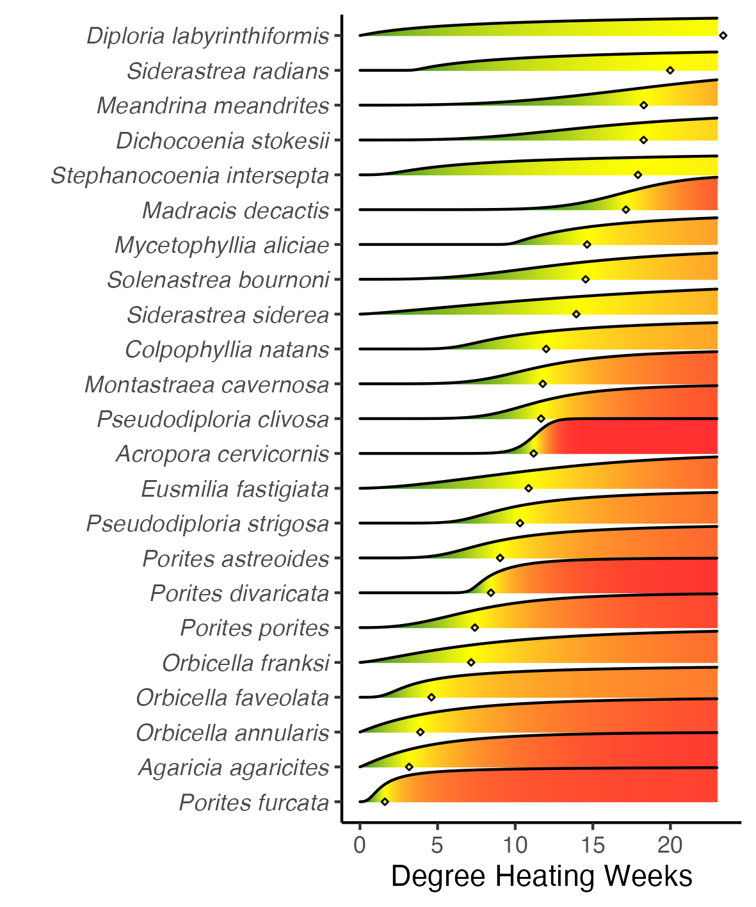
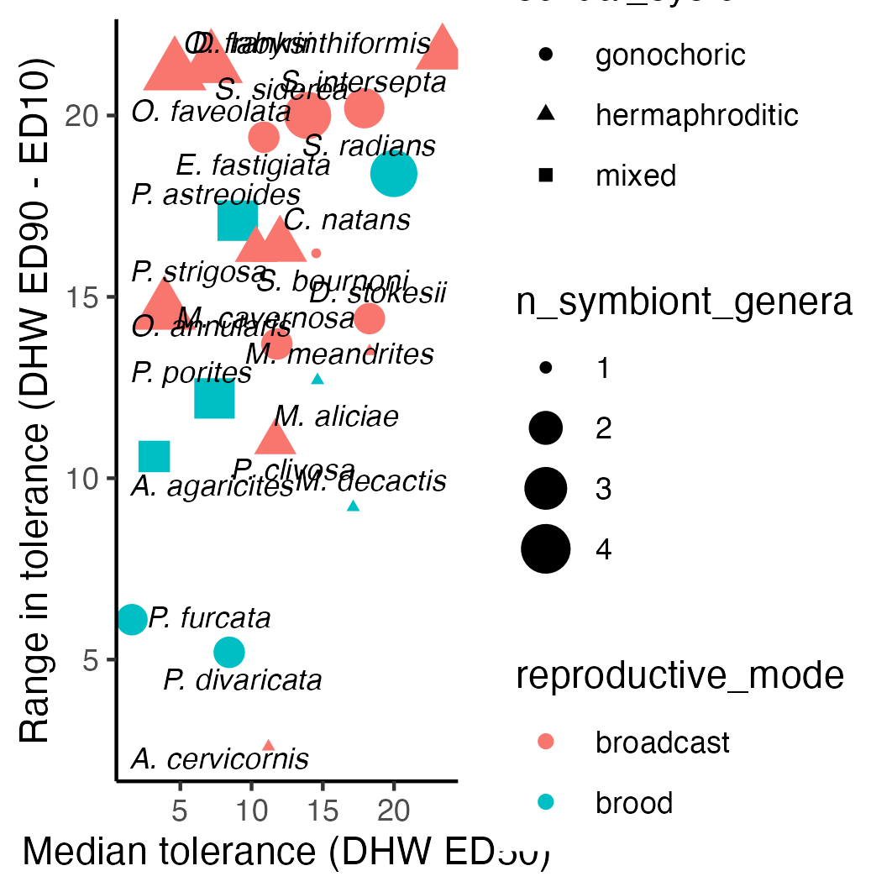
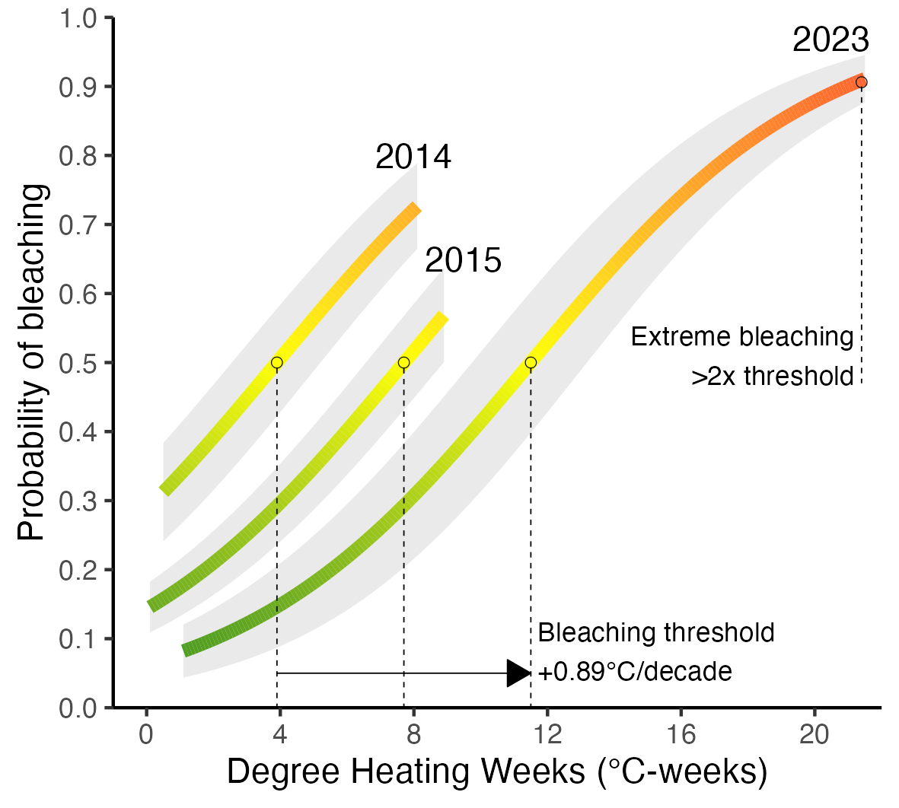

```{r setup, include=FALSE}
knitr::opts_chunk$set(echo = TRUE)
```

```{r}
library(sf)
library(sp)
library(gstat)
library(lme4)
library(emmeans)
library(terra)
library(tidyterra)
library(drc)
library(tidyverse)

# Download satellite map for Florida
world <- rnaturalearth::ne_countries(scale = "large", returnclass = "sf")

# Create species labeller
species_names <- c(
  AAGA = "Agaricia agaricities",
  AFRA = "Agaricia fragilis",
  AGAR = "Agaricia sp.",
  AGRA = "Agaricia grahamae",
  AHUM = "Agaricia humilis",
  ALAM = "Agaricia lamarcki",
  ACER = "Acropora cervicornis",
  AGAR = "Agaricia sp.",
  APAL = "Acropora palmata",
  APRO = "Acropora prolifera",
  CNAT = "Colpophyllia natans",
  DCYL = "Dendrogyra cylindrus",
  DLAB = "Diploria labyrinthiformis",
  DSTO = "Dichocoenia stokesii",
  EFAS = "Eusmilia fastigiata",
  FFRA = "Favia fragum",
  HCUC = "Helioseris cucullata",
  ISIN = "Isophyllia sinuosa",
  IRIG = "Isophyllia rigida",
  ISOP = "Isophyllia sp.",
  MADR = "Madracis sp.",
  MANG = "Mussa angulosa",
  MARE = "Manicina areolata",
  MAUR = "Madriacis auretenra",
  MCAV = "Montastraea cavernosa",
  MDEC = "Madracis decactis",
  MFER = "Mycetophyllia ferox",
  MALI = "Mycetophyllia aliciae",
  MLAM = "Mycetophyllia lamarckiana",
  MFOR = "Madracis formosa",
  MJAC = "Meandrina jacksoni",
  MMEA = "Meandrina meandrites",
  MSEN = "Madracis senaria",
  MYCE = "Mycetophyllia sp.",
  OANN = "Orbicella annularis",
  OCUL = "Oculina sp.",
  ODIF = "Oculina diffusa",
  OFAV = "Orbicella faveolata",
  OFRA = "Orbicella franksi",
  PAST = "Porites astreoides",
  PBRA = "Porites branneri",
  PCLI = "Pseudodiploria clivosa",
  PDIV = "Porites divaricata",
  PFUR = "Porites furcata",
  PORI = "Porites sp.",
  PPOR = "Porites porites",
  PSTR = "Pseudodiploria strigosa",
  SBOU = "Solenastrea bournoni",
  SCOL = "Scolymia sp.",
  SHYA = "Solenastrea hyades",
  SIDE = "Siderastrea sp.",
  SINT = "Stephanocoenia intersepta",
  SOLE = "Solenastrea sp.",
  SRAD = "Siderastrea radians",
  SSID = "Siderastrea siderea",
  UNKN = "Unknown"
)

species_names_2l <- gsub(" ", "\n", species_names)
abbrev_names <- as_tibble(species_names) %>%
  separate(value, into = c("genus", "species")) %>%
  mutate(genus = gsub("[a-z]+", ".", genus)) %>%
  unite(genus, species, col = "name", sep = " ")
abbrev_names <- c(abbrev_names$name)
names(abbrev_names) <- names(species_names)
```

# Import all data (2014, 2015, 2022, 2023)
```{r}
# Load all data from 2014, 2015, 2022, and 2023
# QC'd by year
load("output/2014.RData")
df14 <- df14 %>% filter(!Subregion %in% c("Martin", "North Palm Beach"))
load("output/2015.RData")
#load("output/2022.RData")
load("output/2023.RData")
df23 <- df23 %>% rename(Depth = EndDepth, Transect = TransectNum)
all0 <- bind_rows(
  `2014` = df14,
  `2015` = df15,
  #`2022` = df22,
  `2023` = df23,
  .id = "year"
) %>%
  mutate(dhw.bin = cut(dhw, breaks = c(-1, 3, 6, 9, 12, 15, 18, 22)))
```

# Map overall bleaching severity in 2023
```{r}
# Get percent of colonies surveyed that were bleached at each site 
pctbl23 <- df23 %>%
  #filter(Date >= as.Date("2023-08-01"), Date <= as.Date("2023-09-30")) %>%
  group_by(Site, Subregion, Latitude, Longitude, Week2) %>%
  summarize(BL = sum(Bleaching2 > 1),
            NB = sum(Bleaching2 <= 1),
            pctbl = BL / (BL + NB)) %>%
  ungroup()

# Model proportion of bleached colonies in each subregion in each 2-week window of survey
mod <- glm(cbind(BL, NB) ~ Subregion + Week2, family = "binomial", data = pctbl23)

# Predict proportion of bleached colonies in each Subregion at weeks 34-35 (Week2 = "(33,35]" => (August 20-September 2))) = peak of bleaching
## Get these Subregion probabilities at this time on the log-odds scale (NOT type = 'response')
res <- emmeans(mod, specs = c("Subregion"), at = list(Week2 = factor("(33,35]")))

# Get residuals for each Site at the time it was surveyed (e.g., difference from Subregion mean at time surveyed)...
# ...and then add these residuals to the Subregion's predicted bleaching probability for Weeks 34-35 (peak of bleaching)
# ...to get predicted bleaching severity at that site, if it had been surveyed at peak of bleaching
pctbl23.adj <- pctbl23 %>%
  # Get residuals on the 'working' /logit scale
  mutate(resid = residuals(mod, type = "working")) %>%
  # Join site residuals with logit means for Subregion at weeks 34-35
  left_join(as_tibble(res)) %>%
  # Add residuals to logit mean for Subregion weeks 34-35, then convert to probability scale
  mutate(adj = emmean + resid,
         ## Function to convert logit to probability
         adjprob = exp(adj) / (1 + exp(adj)))

# Interpolate percent bleaching for whole reef tract
# https://geobgu.xyz/r/spatial-interpolation-of-point-data.html

# Create SpatialPointsDataFrame of survey sites
sites23 <- pctbl23.adj %>%
  distinct(Site, Longitude, Latitude, adjprob)
spdat <- sp::SpatialPointsDataFrame(
    coords=sites23[,c('Longitude','Latitude')], 
    data=sites23[,c('Site', 'adjprob')], 
    proj4string = CRS("+init=epsg:4326")
)

# Create empty raster to hold interpolated values
samplegrid <- raster::raster(spdat, res = c(0.005, 0.005))
raster::crs(samplegrid) <- raster::crs(spdat) <- sp::CRS("+init=epsg:4326")
# Run interpolation
idw.model <- gstat(formula=spdat$adjprob~1, locations=spdat)
idw.spp <- raster::interpolate(samplegrid, idw.model)

# Clip interpolated raster to just area of hull/polygon surrounding the reef tract
# Create hull/polygon surrounding surveyed sites
pts1 <- st_as_sf(x = sites23, coords = c('Longitude', 'Latitude'))
my_hull <- st_concave_hull(st_union(pts1), ratio = 0.09)
my_hull <- st_buffer(my_hull, dist = 0.015)
my_hull <- my_hull %>% st_set_crs(4326)
idw.spp.reef <- raster::mask(idw.spp, (as_Spatial(my_hull)))

# Convert clipped interpolation to spatraster for plotting
x <- rast(idw.spp.reef)

# PLOT
# Create base map
basemap <- ggplot() +
  # Plot interpolated raster
  #geom_spatraster(data = x) +
  # Plot points for surveyed sites
  # geom_point(data = pctbl23.adj, aes(x = Longitude, y = Latitude, fill = adjprob),
  #            alpha = 0.6, stroke = 0.05, pch = 21) +
  # Plot Florida
  geom_sf(data = world, lwd = 0.1, fill = "gray90") +
  coord_sf(xlim = c(-83.2, -79.8), ylim = c(24.3, 27.3), expand = FALSE) +
  scale_fill_gradient2(high = "firebrick1", mid = "yellow", low = "forestgreen", 
                       midpoint = 0.5, limits = c(0, 1), na.value = NA,
                       labels = scales::label_percent(), name = "Corals\nbleached") +
  theme(text = element_text(size = 10),
        axis.title = element_blank(),
        panel.background = element_rect(fill = "lightsteelblue1"),
        panel.border = element_rect(colour = "black", fill=NA),
        panel.grid = element_blank(),
        legend.position = c(0.2, 0.5),
        legend.background = element_blank())

# Map with interpolated raster
rasterplot <- basemap +
  geom_spatraster(data = x) +
  geom_sf(data = world, lwd = 0.1, fill = "gray90") +
  coord_sf(xlim = c(-83.2, -79.8), ylim = c(24.3, 27.3), expand = FALSE)
```

### Map heat stress accumulation in 2023 (max. DHW)
```{r}
dhw <- read_csv("data/dhw/2023/dhw_processed.csv") %>%
  mutate(across(where(is.character), as_factor)) %>%
  rename(Date = date) %>%
  dplyr::select(Site, Date, dhw)

maxdhw <- dhw %>%
  group_by(Site) %>%
  summarize(maxdhw = max(dhw)) %>%
  right_join(sites23, by = "Site")

# Create SpatialPointsDataFrame of survey sites
dhwdat <- sp::SpatialPointsDataFrame(
    coords=maxdhw[,c('Longitude','Latitude')], 
    data=maxdhw[,c('Site', 'maxdhw')], 
    proj4string = CRS("+init=epsg:4326")
)

# Create empty raster to hold interpolated values
dhwgrid <- raster::raster(dhwdat, res = c(0.005, 0.005))
raster::crs(dhwgrid) <- raster::crs(dhwdat) <- sp::CRS("+init=epsg:4326")
# Run interpolation
dhw.idw.model <- gstat(formula=dhwdat$maxdhw~1, locations=dhwdat)
dhw.idw.spp <- raster::interpolate(dhwgrid, dhw.idw.model)
# Clip
dhw.idw.spp.reef <- raster::mask(dhw.idw.spp, (as_Spatial(my_hull)))

# Convert clipped interpolation to spatraster for plotting
x2 <- rast(dhw.idw.spp.reef)

dhwmap <- basemap +
  geom_spatraster(data = x2) +
  geom_sf(data = world, lwd = 0.1, fill = "gray90") +
  coord_sf(xlim = c(-83.2, -79.8), ylim = c(24.3, 27.3), expand = FALSE) +
  scale_fill_distiller(palette = "Spectral", 
                       limits = c(0, 23), na.value = NA,
                       name = "Max.\nDHW      ")

dhw_bleach <- cowplot::plot_grid(dhwmap, rasterplot, ncol = 2)
ggsave(filename = "output/dhw_bleach.png", plot = dhw_bleach, width = 180, height = 80, units = "mm")
```


### Detailed bleaching maps
```{r}
# Raster plot with rectangles for Subregions
rasterplot_rect <- rasterplot +
  geom_rect(aes(xmin = -83, xmax = -82, ymin = 24.4, ymax = 24.75), fill = NA, color = "black", lwd = 0.05) +
  geom_rect(aes(xmin = -82, xmax = -81, ymin = 24.4, ymax = 24.75), fill = NA, color = "black", lwd = 0.05) +
  geom_rect(aes(xmin = -81, xmax = -80, ymin = 24.65, ymax = 25.65), fill = NA, color = "black", lwd = 0.05) +
  geom_rect(aes(xmin = -80.4, xmax = -79.8, ymin = 25.65, ymax = 26.8), fill = NA, color = "black", lwd = 0.05)

# Raster plot with points for each surveyed site
sitesplot <- rasterplot +
  geom_point(data = pctbl23.adj, aes(x = Longitude, y = Latitude, fill = adjprob),
             alpha = 1, stroke = 0.1, pch = 21)

# Subregion plots
dtmap <- sitesplot + coord_sf(xlim = c(-83, -82), ylim = c(24.4, 24.75), expand = FALSE) + theme(legend.position = "none")
lkmap <- sitesplot + coord_sf(xlim = c(-82, -81), ylim = c(24.4, 24.75), expand = FALSE) + theme(legend.position = "none")
ukmap <- sitesplot + coord_sf(xlim = c(-81, -80), ylim = c(24.65, 25.65), expand = FALSE) + theme(legend.position = "none")
semap <- sitesplot + coord_sf(xlim = c(-80.4, -79.8), ylim = c(25.65, 26.8), expand = FALSE) + theme(legend.position = "none")

# Create and save multipanel plot
maps_multipanel <- gridExtra::arrangeGrob(
  rasterplot_rect, lkmap, dtmap, ukmap, semap, 
  layout_matrix = matrix(c(1,1,1,1,2,3,2,3,4,4,4,4,5,5), nrow=2))
ggsave(filename = "output/2023_bleaching_maps_multipanel.png", 
       plot = maps_multipanel, width = 16, height = 4, unit = "in")
```


# Variation in bleaching susceptibility in 2023 by species

```{r bleaching_by_species}
## Ways of modeling species-level bleaching susceptibility vs. dhw
# 1. GLMER (+random effects, -no constraining at 0 DHW, -no ED50)
# 2. DRC (+constrain at 0 DHW, +ED50 stats, -no random effects)
## Get results of both and compare
# 1. Plot curves
# 2. Plot heatmaps

# Get subsetted dataset of corals observed >100 times
df23.abund <- df23 %>%
  group_by(Species) %>%
  filter(n() > 100)
df23f <- df23.abund %>%
  group_by(Site, Subregion, Week2, Species, dhw) %>%
  summarize(BL = sum(Bleaching2 > 1),
            NB = sum(Bleaching2 <= 1),
            pctNB = NB / (NB + BL),
            n = n()) %>%
  drop_na() %>%
  droplevels()

#### GLMER
m2 <- glmer(cbind(NB, BL) ~ Species * dhw + Week2 + (1|Subregion), family = "binomial", data = df23f,
            nAGQ = 0, control = glmerControl(optimizer = "nloptwrap"), verbose = TRUE)
res2 <- emmeans(m2, specs = c("Species", "dhw"), rg.limit = 20000, type = "response",
               at = list(Week2 = factor("(33,35]"), dhw = seq(0, 23, 0.1)))
glmer.res <- as.tibble(res2)
glmer.ord <- glmer.res %>%
  group_by(Species) %>%
  slice(which.min(abs(prob - 0.5))) %>%
  ungroup() %>%
  mutate(Species = fct_reorder(Species, dhw))

#### DRC (tried 3par, 4par, and 5par -- all work, just slight diffs. )
# More pars = less estimable standard errors on ED50... depends how important ED50 inference is
m3 <- drm(pctNB ~ dhw, data = df23f, curveid = Species, weights = n, type = "binomial",
         logDose = NULL, fct = LL.5(
           names = c("hill","c", "max", "ED50", "f"),
           ## Max parameter is fixed to 1
           fixed = c(NA, NA, 1, NA, NA)),
    # Hill parameter must be positive (must decrease with incr. dhw)
    lowerl = c(rep(0, 22), rep(-Inf, 22), rep(0, 22), rep(-Inf, 22)),
    control = drmc(relTol = 1e-7))
nd <- expand.grid(Species = levels(df23f$Species), dhw = seq(0, 23, 0.1))
pred <- predict(m3, newdata = nd)
drc.res <- as_tibble(bind_cols(nd, prob = pred))
drc.ord <- ED(m3, 0.5, type = "absolute") %>%
  as_tibble() %>%
  mutate(Species = levels(df23f$Species),
         Species = fct_reorder(Species, Estimate))

# Combine GLMER and DRC results for comparison
allres <- bind_rows(
  glmer = glmer.res,
  drc = drc.res,
  .id = "method"
)
# Plot as response curves
ggplot(allres, aes(x = dhw, y = prob)) +
         geom_line(aes(linetype = method)) +
         facet_wrap(~Species)


# Plot as heatmap
glmer.heatmap <- glmer.res %>%
  mutate(Species = factor(Species, levels = levels(glmer.ord$Species))) %>%
  ggplot(aes(x = dhw, y = Species)) +
  geom_tile(aes(fill = prob)) +
  scale_fill_gradient2(high = "forestgreen", mid = "yellow", low = "firebrick1", 
                       limits = c(0, 1), midpoint = 0.5) +
  geom_point(data = glmer.ord, aes(x = dhw), pch = 5) +
  labs(x = "Degree Heating Weeks", y = "", fill = "Proportion\nof colonies\nPB or worse") +
  theme(legend.position = "none")


drc.heatmap <- drc.res %>%
  mutate(Species = factor(Species, levels = levels(drc.ord$Species))) %>%
  ggplot(aes(x = dhw, y = Species)) +
  geom_tile(aes(fill = prob)) +
  scale_fill_gradient2(high = "forestgreen", mid = "yellow", low = "firebrick1", 
                       limits = c(0, 1), midpoint = 0.5) +
  geom_point(data = drc.ord, aes(x = Estimate), pch = 5) +
  labs(x = "Degree Heating Weeks", y = "", fill = "Proportion\nof colonies\nPB or worse") +
  theme(legend.position = "none")

bleaching_heatmaps <- cowplot::plot_grid(glmer.heatmap, drc.heatmap, ncol = 2)
ggsave(filename = "output/bleaching_heatmaps.png", plot = bleaching_heatmaps, width = 200, height = 70, units = "mm")

# Stats on ED50s
# compParm(m3, "ED50", operator = "-")

# Pretty plot drc heatmap
drc.heatmap +
  # geom_errorbar(data = drc.ord, aes(x = Estimate, xmin = Estimate - `Std. Error`, 
  #                                   xmax = Estimate + `Std. Error`)) +
  scale_x_continuous(expand = c(0, 0)) +
  theme(panel.background = element_blank(),
        legend.position = "right") +
  labs(y = "Coral species", fill = "P(not bleached)")

# # # Sanity check barplot
# ggplot(df23.abund, aes(x = cut(dhw, breaks = seq(0,21,3)), fill = Bleaching3)) +
#   geom_bar(position = "fill") +
#   geom_text(stat = "count", aes(label = after_stat(count)), vjust = "inward", position = "fill", size = 2) +
#   facet_wrap(~Species, scales = "free_y")


# Try as ggridges

drc.res.ridges <- drc.res %>%
  mutate(Species = factor(Species, levels = levels(drc.ord$Species))) %>%
  ggplot(aes(x = dhw, y = Species)) +
  geom_ridgeline_gradient(aes(height = (1 - prob), fill = prob)) +
  scale_y_discrete(labels = species_names[as.character(drc.ord$Species)]) +
  scale_fill_gradient2(high = "forestgreen", mid = "yellow", low = "firebrick1", 
                       limits = c(0, 1), midpoint = 0.5) +
  geom_point(data = drc.ord, aes(x = Estimate), pch = 5, size = 0.5) +
  theme_classic() +
  theme(legend.position = "none",
        axis.text.y = element_text(face = "italic")) +
  labs(x = "Degree Heating Weeks", y = "")
ggsave(filename = "output/bleaching_ridges.png", plot = drc.res.ridges,
       width = 120, height = 120, units = "mm")
```


```{r within_spp_bleaching_variability}
# Distance from 10% to 75% bleaching (90% to 25% not bleached) by Species
span <- drc.res %>%
  group_by(Species) %>%
  slice(which.min(abs(prob - 0.90)),
        which.min(abs(prob - 0.10))) %>%
  summarize(min = min(dhw), max = max(dhw)) %>%
  mutate(span = max - min) %>%
  arrange(-span)

pbleach <- drc.res %>%
  filter(dhw == 23) %>%
  mutate(pbleach = 1 - prob)

medrangeplot <- drc.ord %>%
  left_join(span) %>%
  ggplot(aes(x = Estimate, y = span)) +
  geom_point() +
  ggrepel::geom_text_repel(aes(label = abbrev_names[as.character(Species)]),
                           fontface = "italic", size = 3, lineheight = 0.75) +
  labs(x = "Median tolerance (DHW ED50)",
       y = "Range in tolerance (DHW ED75 - ED10)") +
  theme_classic()

ggsave(filename = "output/medrangeplot.png", plot = medrangeplot, width = 120, height = 120, units = "mm")

cowplot::plot_grid(drc.res.ridges, medrangeplot, ncol = 2, rel_widths = c(0.6, 0.4))
```


# Overall bleaching susceptibility in 2023 vs. 2014 and 2015

```{r aggregate_subset_data}
# Aggregate Agaricia spp. other than AAGA, Mycetophyllia spp., Isophyllia spp., Oculina spp., Solenastrea spp., Scolymia spp.
all0 <- all0 %>%
  mutate(Species = case_when(Species %in% c("AFRA", "AGAR", "AGRA", "AHUM", "ALAM") ~ "AGAR",
                             Species %in% c("MALI", "MLAM", "MYCE", "MFER") ~ "MYCE",  #, "MFER"
                             Species %in% c("IRIG", "ISIN", "ISOP") ~ "ISOP",
                             Species %in% c("OCUL", "ODIF") ~ "OCUL",
                             Species %in% c("SHYA", "SBOU") ~ "SOLE",
                             Species %in% c("SCOL", "SCUB", "SLAC", "SWEL") ~ "SCOL",
                             TRUE ~ Species)) %>%
  drop_na(Species)

# Keep only those species observed at least 20 times per year
spp_to_include <- all0 %>%
  count(Species, year) %>%
  group_by(Species) %>%
  dplyr::filter(min(n) >= 20)  # 20 is a good cutoff

allf <- all0 %>%
  filter(Species %in% spp_to_include$Species)

## Group data at species+site-level to fit group-level models instead of subject-level models -- fits faster
allg <- allf %>%
  group_by(year, Week2, Subregion, Site, dhw, dhw.bin, Species) %>%
  summarize(BL = sum(Bleaching2 > 1),
            NB = sum(Bleaching2 <= 1)) %>%
  ungroup()
```

```{r bleaching_by_dhw.bin_across_years}
# Model differences in bleaching severity between years with DHW as continuous predictor
dhw.mod <- glmer(cbind(BL, NB) ~ dhw + year + year:Week2 + (dhw+year|Species) + (year|Subregion),  
                     family = "binomial", data = allg, verbose = TRUE,
                     nAGQ=0, control=glmerControl(optimizer = "nloptwrap"))
# Best formula: cbind(BL, NB) ~ dhw + year + year:Week2 + (dhw+year|Species) + (year|Subregion)
#### Or DHW + year may be better.....DHW * Year or DHW + YEAR???
#### relevant reading: https://stats.oarc.ucla.edu/stata/seminars/deciphering-interactions-in-logistic-regression/#:~:text=If%20the%20differences%20are%20not,or%20odds%20ratios%20or%20probability%3F
anova(dhw.mod)

# Function to get DHW's that cause 50% bleaching for each year
ed50s.fun <- function(dhw.mod) {
  dhw.res <- emmeans(dhw.mod, specs = c("dhw", "year", "Week2"), type = "response",
                     at = list(dhw = seq(0, 23, 0.1), Week2 = c("(36,38]", "(33,35]")), 
                     rg.limit = 20000)
  dhw.res2 <- subset(dhw.res,
                     (year == "2014" & Week2 == "(36,38]") |
                     (year == "2015" & Week2 == "(36,38]") |
                     (year == "2023" & Week2 == "(33,35]"))
  bleach50 <- as.tibble(dhw.res2) %>%
    group_by(year) %>%
    slice(which.min(abs(prob - 0.5))) %>%
    pull(dhw)
  diff2015 <- bleach50[2]-bleach50[1]
  diff2023 <- bleach50[3]-bleach50[1]
  res <- c(bleach50, diff2015, diff2023)
  res <- setNames(res, c("2014", "2015", "2023", "2015-2014", "2023-2014"))
  return(res)
}

# Get point estimates for ED50s (DHW's that cause 50% bleaching)
bleach50 <- ed50s.fun(dhw.mod)
bleach50

# Bootstrap the calculation of ED50
## re.form = NA: does not account for random effects (conf interval), re.form = NULL: does (prediction interval)
## https://stackoverflow.com/questions/67098467/on-the-predict-mermod-function-arguments
boot.out <- bootMer(dhw.mod, FUN = ed50s.fun, nsim = 48, seed = 123, re.form = NULL,
                    parallel = "multicore", ncpus = 8)
## Get confidence intervals from Bootstrap
lower <- apply(boot.out$t, 2, function(x) as.numeric(quantile(x, probs=.025, na.rm=TRUE)))
upper <- apply(boot.out$t, 2, function(x) as.numeric(quantile(x, probs=.975, na.rm=TRUE)))

ed50conf <- tibble(
  year = names(bleach50), 
  ed50 = bleach50,
  lower = lower,
  upper = upper)


# For plotting, Get emmeans for just the specific 2-week windows of interest in each year (corresp. to max. bleaching), And select just the range of peak DHWs experienced across sites in each year
dhw.res <- emmeans(dhw.mod, specs = c("dhw", "year", "Week2"), type = "response",
                   at = list(dhw = seq(0, 23, 0.1)), rg.limit = 20000)
dhw.res2 <- subset(dhw.res,
  (year == "2014" & Week2 == "(36,38]" & dhw <= 8.11 & dhw > 0.97) |
  (year == "2015" & Week2 == "(36,38]" & dhw <= 8.9 & dhw > 0) |
  (year == "2022" & Week2 == "(37,39]" & dhw <= 8.07 & dhw > 0) |
  (year == "2023" & Week2 == "(33,35]" & dhw <= 22.1 & dhw > 1.53) 
)

# Plot
dhw.bleach.plot <- ggplot(as.tibble(dhw.res2), aes(x = dhw, y = prob, group = year)) +
  #geom_point() +
  geom_ribbon(aes(ymin = prob - SE, ymax = prob + SE), lwd = 0, alpha = 0.1) +
  geom_line(aes(color = prob), lwd = 2) +
  scale_y_continuous(limits = c(0, 1), expand = c(0, 0), breaks = seq(0, 1, 0.1)) +
  scale_color_gradient2(low = "forestgreen", mid = "yellow", high = "firebrick1", 
                        limits = c(0, 1), midpoint = 0.5) +
  theme_classic() +
  theme(legend.position = "none") +
  labs(x = "DHWs", y = "Probability of bleaching")

dhw.bleach.plot +
  geom_errorbar(data = slice(ed50conf, 1:3), 
                aes(x = ed50, y = 0.5, xmin = lower, xmax = upper), width = 0.03)

# Save plot
ggsave(filename = "output/dhw_bleach_allyears.png", plot = dhw.bleach.plot, width = 90, height = 70, units = "mm")
```


```{r change_degC_thresh}
# Backcalculate change in ed50s (DHW) to change in tolerance (°C) 
degC <- ed50conf %>%
  mutate(ed50.degC = ed50 * 0.07770643,
         lower.degC = lower * 0.07770643,
         upper.degC = upper * 0.07770643)

degC %>% slice(1:3) %>%
  ggplot(aes(x = as.numeric(as.character(year)), y = ed50.degC)) + 
  geom_point() + 
  geom_errorbar(aes(ymin = lower.degC, ymax = upper.degC)) +
  geom_smooth(method = "lm", se = FALSE)

mod <- degC %>%
  slice(1:3) %>%
  lm(ed50.degC ~ as.numeric(as.character(year)), data = .)
summary(mod)
anova(mod)
# 0.05535°C/year = 0.5°C/decade
```

## Species-specific bleaching severity by DHWs in 2023 vs. 2014 and 2015

```{r species_bleaching_by_year_dhw}
# Model differences in bleaching severity between years with DHW as continuous predictor instead of bins
dhw.sp.mod <- glmer(
  cbind(BL, NB) ~ Species + dhw + Species:dhw + year + Species:year + year:Week2 + (year|Subregion),  
  family = "binomial", data = allg, verbose = TRUE,
  nAGQ=0, control=glmerControl(optimizer = "nloptwrap"))

# Best formula: cbind(BL, NB) ~ dhw * year + year:Week2 + (dhw+year|Species) + (year|Subregion)
#### Or DHW + year may be better.....DHW * Year or DHW + YEAR???
#### relevant reading: https://stats.oarc.ucla.edu/stata/seminars/deciphering-interactions-in-logistic-regression/#:~:text=If%20the%20differences%20are%20not,or%20odds%20ratios%20or%20probability%3F
anova(dhw.sp.mod)


# Get emmeans for just the specific 2-week windows of interest in each year (corresp. to max. bleaching)
# And select just the range of peak DHWs experienced across sites in each year
dhw.sp.res <- emmeans(dhw.sp.mod, specs = c("Species", "dhw", "year", "Week2"), type = "response",
                   at = list(dhw = seq(0, 23, 0.1), Week2 = c("(36,38]", "(33,35]")), rg.limit = 200000, level = 0.84)
dhw.sp.res2 <- subset(dhw.sp.res,
  (year == "2014" & Week2 == "(36,38]" & dhw <= 8.11 & dhw > 0.97) |
  (year == "2015" & Week2 == "(36,38]" & dhw <= 8.9 & dhw > 0) |
  (year == "2022" & Week2 == "(37,39]" & dhw <= 8.07 & dhw > 0) |
  (year == "2023" & Week2 == "(33,35]" & dhw <= 22.1 & dhw > 1.53) 
)
dhw.sp.res22 <- subset(dhw.sp.res,
  (year == "2014" & Week2 == "(36,38]") |
  (year == "2015" & Week2 == "(36,38]") |
  (year == "2022" & Week2 == "(37,39]") |
  (year == "2023" & Week2 == "(33,35]") 
)

# Plot
(dhw.sp.bleach.plot <- ggplot(as.tibble(dhw.sp.res2), aes(x = dhw, y = prob, group = year)) +
  facet_wrap(~Species) +
  geom_ribbon(aes(ymin = prob - SE, ymax = prob + SE), lwd = 0, alpha = 0.4) +
  geom_line(aes(color = year), lwd = 1) +
  geom_hline(aes(yintercept = 0.5), lty = 2) +
  scale_y_continuous(limits = c(0, 1), expand = c(0, 0), breaks = seq(0, 1, 0.1)) +
  # scale_color_gradient2(low = "forestgreen", mid = "yellow", high = "firebrick1", 
  #                       limits = c(0, 1), midpoint = 0.5) +
  theme_classic() +
  #theme(legend.position = "none") +
  labs(x = "DHWs", y = "Probability of bleaching"))


# # Sanity check by species
# myspp <- allf %>%
#   filter(Species == "CNAT") %>%
#   mutate(dhw.bin = cut(dhw, breaks = seq(0, 20, 2))) #%>%
# 
# ggplot(myspp, aes(x = dhw.bin, fill = Bleaching2 > 1)) +
#   geom_bar(position = "stack") +
#   facet_wrap(~year)

# GET SIG DIFFS!
## Find where dhw[year==2014&asymp.LCL>0.5] < dhw[year==2023&asymp.UCL<0.5]
sigspp <- as.tibble(dhw.sp.res22) %>%
  group_by(Species) %>%
  summarize(higher2014 = min(dhw[year==2014 & asymp.LCL > 0.5]),
            lower2023 = max(dhw[year==2023 & asymp.UCL < 0.5])) %>%
  filter(higher2014 < lower2023)
  

# Get yearly DHW diffs to 50% bleaching -- convert to °C
spp_thresh <- as.tibble(dhw.sp.res22) %>%
  group_by(Species, year) %>%
  slice(which.min(abs(prob - 0.5))) %>%
  group_by(Species) %>%
  # Filter out species AAGA/PFUR/PDIV? No.
  #filter(sum((abs(prob - 0.5)) < 0.02) > 1) %>%
  ungroup() %>%
  dplyr::select(year, Species, dhw) %>%
  group_by(Species) %>%
  mutate(diffC = (dhw - dhw[year == "2014"]) * 0.07770643,
         lower = (dhw - dhw[year == "2014"]) * 0.07527467,
         upper = (dhw - dhw[year == "2014"]) * 0.08013819)

# ggplot(spp_thresh, aes(y = diffC, x = as.numeric(as.character(year)), color = Species)) +
#   geom_point() +
#   geom_line()

spp_thresh %>%
  ungroup() %>%
  filter(year == "2023") %>%
  mutate(Species = fct_reorder(Species, diffC)) %>%
  ggplot(aes(x = Species, y = diffC)) +
  geom_point() +
  geom_errorbar(aes(ymin = lower, ymax = upper))
```


```{r bleachthresh_vs_density}
densres <- readRDS("output/density.rds")

bleach_dens <- right_join(as.tibble(densres), spp_thresh, by = c("Species", "year"))

bleach_dens %>%
  ggplot(aes(x = rate, y = diffC)) +
  geom_errorbar(aes(xmin = rate - SE, xmax = rate + SE), lwd = 0.2) +
  geom_point(aes(shape = year, color = year), size = 3) +
  #geom_errorbar(aes(ymin = prob - SE.y, ymax = prob + SE.y)) +
  geom_path(arrow = arrow(length = unit(2, "mm"), type = "closed")) +
  #geom_smooth(method = "lm", se = FALSE) +
  facet_wrap(~Species, scales = "free_x") +
  labs(x = "Density (colonies/10m^2)", y = "Change in heat tolerance (°C) from 2014")

net <- bleach_dens %>%
  group_by(Species) %>%
  summarize(netthresh = diffC[year == "2023"],
            netdens = rate[year == "2023"] - rate[year == "2014"],
            logratiodens = log(rate[year == "2023"]/rate[year == "2014"]))

ggplot(net, aes(x = logratiodens, y = netthresh)) + geom_label(aes(label = Species)) +
  geom_smooth(method = "lm", se = FALSE) +
  labs(x = "Change in density (log(2023/2014))", y = "Change in heat tolerance (2014-2023, °C)")

mod <- lm(netthresh ~ logratiodens, data = net)
anova(mod)
```


# Size diffs

## 2023 and possibly 2014 and 2015

```{r}
# Model bleaching severity by Width, species, and dhw. 
# There are some corals with Width < 4 -- these were included because Height should have been at least 4. In these cases change Width to 4.
df23.abund <- df23.abund %>%
  mutate(Width2 = case_when(Width >= 4 ~ Width,
                            Width < 4 ~ 4)) %>%
  droplevels()

# mod <- glm(Bleaching2 > 1 ~ Width2 * Species, family = "binomial", data = df23.abund)
# summary(emtrends(mod, specs = "Species", var = "Width2"), infer = TRUE) %>% arrange(p.value)
# nd <- expand.grid(Width2 = seq(4,200,1), Species = levels(df23.abund$Species))
# pred <- predict(mod, newdata = nd, re.form = NA, type = "response")
# bind_cols(nd, pred) %>%
#   ggplot(aes(x = Width2, y = ...3)) +
#   geom_line() +
#   facet_wrap(~Species)

# Fit model
mod <- glmer(Bleaching2 > 1 ~ Species * Width2 * dhw + Week2 + (1|Subregion), 
             family = "binomial", data = df23.abund,
             nAGQ = 0, control = glmerControl(optimizer = "nloptwrap"), verbose = TRUE)
#plot(mod, which = 1)
summary(mod)

# Test if significant effect of width for each species at DHW = 15
res <- emtrends(mod, specs = c("Species", "dhw"), var = "Width2", at = list(dhw = 15))

# Get significant species
sig <- as.tibble(summary(res, infer = TRUE)) %>%
  filter(p.value < 0.05)

# Get fitted values for bleaching probability as a function of size for significant species
pred <- as.tibble(emmeans(mod, specs = c("Width2", "dhw"), by = "Species", 
                          at = list(Width2 = seq(4,500,1), dhw = 15), 
                          type = "response", rg.limit = 100000)) %>%
  filter(Species %in% sig$Species) %>%
  left_join(dplyr::select(sig, dhw, Species, asymp.LCL), by = c("dhw", "Species"))
# Get actual observed size ranges for these species
actual <- filter(df23.abund) %>%
  drop_na(Species) %>%
  group_by(Species) %>%
  summarize(min = min(Width2, na.rm = T), max = max(Width2, na.rm = T)) %>%
  mutate(ad = map(max, ~expand_grid(Width2 = seq(4, ., 1)))) %>%
  unnest(ad)
pred2 <- pred %>%
  semi_join(actual, by = c("Species", "Width2"))
  
# Get species full names for plotting
mynames <- pred2 %>%
  left_join(tibble(name = abbrev_names, Species = names(abbrev_names))) %>%
  group_by(Species, name) %>%
  summarize(maxw = max(Width2)) %>%
  distinct(Species, name, maxw)
# Plot fitted probabilities within the range of observed Widths for each significant species
(sizeplot <- ggplot(pred2, aes(x = Width2, y = response, group = Species)) +
  coord_trans(x = "log") +
  scale_x_continuous(breaks = c(4, 16, 64, 256), expand = expansion(mult = c(0.05, 0.1))) +
  facet_wrap(~Species, scales = "free_x", labeller = labeller(Species = abbrev_names)) +
  geom_line(aes(color = response)) +
  scale_color_gradient2(low = "forestgreen", mid = "yellow", high = "firebrick1", 
                        limits = c(0, 1), midpoint = 0.5) +
  geom_ribbon(aes(ymin = asymp.LCL.x, ymax = asymp.UCL), alpha = 0.1, lwd = 0) +
  geom_text(data = mynames, aes(label = name, x = maxw), y = 0, hjust = 1, vjust = 0, size = 3, fontface = "italic") +
  #geom_errorbar(aes(ymin = response - SE, ymax = response + SE)) +
  ylim(0, 1) +
  labs(x = "Colony width (cm)", y = "Probability of bleaching at 10 DHWs") +
  theme_classic() +
  theme(legend.position = "none",
        strip.text = element_blank(),
        strip.background = element_blank()))

ggsave(filename = "output/sizeplot.png", plot = sizeplot,
       width = 120, height = 100, units = "mm")


# Ridges?
ggplot(pred2, aes(x = log(Width2), y = Species)) +
  #coord_trans(x = "log") +
  scale_x_continuous(breaks = log(c(4, 16, 64, 256))) +
  geom_ridgeline_gradient(aes(height = response, fill = response), alpha = 0.5) +
  scale_fill_gradient2(low = "forestgreen", mid = "yellow", high = "firebrick1", 
                        limits = c(0, 1), midpoint = 0.5) +
  theme_classic()

# Sanity checks for size effects
# Plot actual proportions binned by size class a confirmation
# filter(df23.abund) %>%
#   filter(Species %in% sig$Species) %>%
#   group_by(Species) %>%
#   mutate(Width.bin = cut(log(Width), breaks = 5)) %>%
#   ggplot(aes(x = Width.bin, fill = Bleaching2 > 1)) +
#   geom_bar(position = "fill") +
#   facet_wrap(~Species, scales = "free")

# sanity check on dlab size effect
# dlab <- df23.abund %>%
#   filter(Species == "DLAB")
# ggplot(dlab, aes(x = (Width2 > 25), fill = (Bleaching2 > 1))) +
#   geom_bar(position = "stack") +
#   facet_wrap(~Subregion)

# filter(df23.abund) %>%
#   filter(Species %in% sig$Species) %>%
#   ggplot(aes(x = Bleaching2 > 1, y = Width2)) +
#   geom_jitter(width = 0.1, alpha = 0.1) +
#   geom_violin(draw_quantiles = 0.5, alpha = 0.5) +
#   facet_wrap(~Species, scales = "free_y") +
#   #scale_y_continuous(trans = "log10") +
#   coord_trans(y = "log2")
```


# Not to include?

## Bleaching by subregion across years

```{r regional_bleaching_vs_dhw_by_year_modeledalltogether, eval = FALSE}
# Model bleaching severity by subregion across years
### (This replicates what was done individually by year and then combined -- use THIS.)

subregion.mod <- glmer(cbind(BL, NB) ~ Subregion * year * Week2 + (1|Species),
                       family = "binomial", data = allg)

# Get fitted values across dhw
subregion.res <- emmeans(subregion.mod, specs = c("Subregion", "year", "Week2"), 
                         rg.limit = 20000, type = "response")

# Get emmeans for just the specific 2-week windows of interest in each year (corresp. to max. bleaching)
subregion.res2 <- subset(subregion.res,
  (year == "2014" & Week2 == "(36,38]") |
  (year == "2015" & Week2 == "(36,38]") |
  (year == "2023" & Week2 == "(33,35]")
)

as.tibble(subregion.res2) %>%
  ggplot(aes(x =))

regional <- bind_rows(
  `2014` = regional14,
  `2015` = regional15,
  `2023` = regional23,
  .id = "year"
)

as.tibble(subregion.res2) %>%
  left_join(regional, by = c("Subregion", "year")) %>%
  ggplot(aes(x = maxDHW, y = prob.y, shape = year, group = year, color = Subregion)) +
  geom_point(aes(color = Subregion, shape = year), size = 3) +
  geom_smooth(aes(group = year), method = "loess", span = 1.1, se = FALSE)

# This is good, but probably makes more sense to look at bleaching as a function of DHW across years. This is of more general interest than "Subregions"...
```

## Old code....

```{r, eval = F}
# Trying to get overall bleaching (avg across species) but emmeans are nonEst
m <- glm(cbind(BL, NB) ~ year * dhw.bin * Species, family = "binomial", data = allg)
res <- emmeans(m, specs = c("dhw.bin", "year"), type = "response", rg.limit = 15000)
as.tibble(res) %>%
  ggplot(aes(x = dhw.bin, y = prob, color = year, group = year)) +
  geom_point() +
  geom_line()

# Will it work if species is a random factor instead of fixed? YES!!!
library(lme4)
m <- glmer(cbind(BL, NB) ~ year * dhw.bin + (dhw.bin+year|Species), 
           family = "binomial", data = allg)
res <- emmeans(m, specs = c("dhw.bin", "year"), type = "response", rg.limit = 15000)
as.tibble(res) %>%
  ggplot(aes(x = dhw.bin, y = prob, color = year, group = year)) +
  geom_point() +
  geom_ribbon(aes(ymin = asymp.LCL, ymax = asymp.UCL), lwd = 0, alpha = 0.2) +
  geom_line()

### NEW: try with Week2 to be able to adjust for that
dhw.bin.mod <- glmer(cbind(BL, NB) ~ dhw.bin * year * Week2 + (dhw.bin+year|Species),
                       family = "binomial", data = allg)
dhw.bin.res <- emmeans(dhw.bin.mod, specs = c("dhw.bin", "year", "Week2"), 
                       rg.limit = 20000, type = "response")
# Get emmeans for just the specific 2-week windows of interest in each year (corresp. to max. bleaching)
dhw.bin.res2 <- subset(dhw.bin.res,
  (year == "2014" & Week2 == "(36,38]") |
  (year == "2015" & Week2 == "(36,38]") |
  (year == "2023" & Week2 == "(33,35]")
)
as.tibble(dhw.bin.res2) %>%
  ggplot(aes(x = dhw.bin, y = prob, color = year, group = year)) +
  geom_point() +
  geom_ribbon(aes(ymin = asymp.LCL, ymax = asymp.UCL), lwd = 0, alpha = 0.2) +
  geom_line()

```


```{r}
# Maps of site performance for each year
```


```{r, eval = F}
# Try random forests to find outlier sites or individuals?
load("output/2014.RData")
load("output/2015.RData")
load("output/2023.RData")
df23 <- df23 %>% rename(Depth = EndDepth)
all <- bind_rows(
  `2014` = df14,
  `2015` = df15,
  `2023` = df23,
  .id = "year"
)
library(randomForest)
data <- all %>%
  filter(Species %in% c("CNAT", "DLAB", "MCAV", "OANN", "OFAV", "PAST", "PSTR", "SSID")) %>%
  mutate(Bleaching4 = factor(case_when(Bleaching3 %in% c("Healthy", "Pale") ~ "Healthy",
                                Bleaching3 %in% c("Partially Bleached", "Bleached", "Dead") ~ "Bleached"))) %>%
  droplevels() %>%
  drop_na(year, Species, Depth, dhw) %>%
  group_by(Species) %>%
  filter(n() > 500) %>%
  droplevels()

# Run random forest classification with species, depth, and dhw as predictors
rf <- randomForest(Bleaching4~year+Species+Depth+dhw+Width, 
                   data = data, ntree = 5, do.trace = TRUE, proximity=TRUE)
print(rf)
rf$confusion

str(rf)

# Get rf model predictions for Bleaching4
data <- data %>%
  mutate(pred = rf$predicted)

# How accurate were predictions for each species?
data %>%
  drop_na(pred) %>%
  group_by(Species) %>%
  count(acc = pred == Bleaching4) %>%
  ggplot(aes(x = Species, y = n, fill = acc)) +
  geom_col(position= "fill")

# Can you get confidence?
str(rf)
score(rf)

data %>%
  drop_na(pred) %>%
  ggplot(aes(x = Species, fill = Bleaching4:pred)) +
  geom_bar(position = "fill")
  
  

# Which corals were predicted to be bleached, but were actually healthy?
outhealthy <- data %>%
  filter(pred == "Bleached", Bleaching4 == "Healthy") 

ggplot(outhealthy, aes(x = Longitude, y = Latitude)) +
  geom_point(color = "red", alpha = 0.005, pch = 20)

outhealthy %>%
  filter(Species == "OFAV") %>%
  ggplot(aes(x = Longitude, y = Latitude)) +
  geom_point(aes(color = Species))
```

```{r, eval = FALSE}
# Bleaching vs. dhw for each coral species by year -- binned dhw
# Data are from modeling data for each year separately, using the Week2 period at the peak of each year's bleaching
# Results are nearly (completely?) identical to a singular model fit with year and year:Week2... so use that because it also allows posthoc testing 
sppbleachprob14 <- readRDS(file = "output/sppbleachprob14.rds")
sppbleachprob15 <- readRDS(file = "output/sppbleachprob15.rds")
sppbleachprob23 <- readRDS(file = "output/sppbleachprob23.rds")

sppbleachprob <- bind_rows(`2014` = sppbleachprob14,
                           `2015` = sppbleachprob15,
                           `2023` = sppbleachprob23,
                           .id = "year")

sppbleachprob %>%
  ggplot(aes(x = dhw.bin, y = response, color = year, group = year)) +
  geom_point(position = position_dodge(width = 0.25), size = 0.5) +
  geom_line(position = position_dodge(width = 0.25)) +
  geom_errorbar(aes(ymin = response - SE, ymax = response + SE), width = 0.1,
                position = position_dodge(width = 0.25)) +
  facet_wrap(~Species) +
  ylim(0,1)
```


```{r, eval = F }
# I don't like this
# Overall Bleaching vs. dhw (all corals) by year
bleachprob14 <- readRDS(file = "output/bleachprob14.rds")
bleachprob15 <- readRDS(file = "output/bleachprob15.rds")
bleachprob23 <- readRDS(file = "output/bleachprob23.rds")

bleachprob <- bind_rows(`2014` = bleachprob14,
                        `2015` = bleachprob15,
                        `2023` = bleachprob23,
                        .id = "year")

ggplot(bleachprob, aes(x = dhw, y = response, color = year, group = year)) +
  geom_line() +
  geom_ribbon(aes(ymin = asymp.LCL, ymax = asymp.UCL), lwd = 0, alpha = 0.3) +
  scale_y_continuous(limits = c(0, 1))

# This is more or less the same thing as the breakdown by region above, but I think the regional one is more interesting

# What about doing this by dhw bins?
```

```{r regional_bleaching_vs_dhw_by_year, eval = FALSE}
# This was superseded by modeling this all together for all years instead of each year separately.
# Overall pct. bleaching vs. dhw (all corals) by Subregion for each year
## Subregion averages
load(file = "output/regional23.RData")
load(file = "output/regional14.RData")
load(file = "output/regional15.RData")

df <- bind_rows(`2014` = regional14, `2015` = regional15, `2023` = regional23, .id = "year")

ggplot(df, aes(x = maxDHW, y = prob)) +
  geom_point(aes(color = Subregion, shape = year), size = 3) +
  geom_smooth(aes(group = year), method = "loess", span = 1.1, se = FALSE)

## Why not do this for all sites? Probably would be too all over the place.
```


```{r, eval = F}

###trying to plot "adjusted" bleaching levels for each site -- adjusted for date surveyed
# Can we adjust pctbl for survey date and plot everything? (e.g., Marquesas were in Oct...)
df23.g <- df23 %>%
  group_by(Site, Subregion, Latitude, Longitude, Date, Week2, dhw) %>%
  summarize(BL = sum(Bleaching2 > 1),
            NB = sum(Bleaching2 <= 1))
mod <- glm(cbind(BL, NB) ~ dhw + Week2, family = "binomial", data = df23.g)
plot(mod, which = 1)

df23.g <- df23.g %>%
  ungroup() %>%
  mutate(resid = residuals(mod, type = "response")) %>%
  mutate(adj = (BL/(BL+NB)+resid))

hi <- broom::augment(mod, type.predict = "response") %>%
  mutate(resid2 = residuals(mod, type = "response"),
         adj = .fitted + resid2)

newdat <- tibble(
  Site = df23.g$Site,
  Subregion = df23.g$Subregion,
  pctbl = df23.g$BL / (df23.g$BL + df23.g$NB),
  dhw = df23.g$dhw,
  Longitude = df23.g$Longitude,
  Latitude = df23.g$Latitude,
  Week2 = factor("(33,35]")
)
newdat <- bind_cols(
  newdat,
  fit = predict(mod, type = "response", newdata = newdat)
)

# test <- df23.g %>%
#   mutate(.fitted = predict(mod, type = "response", newdata = newdat),
#          .resid = residuals(mod, type = "response"),
#          actual = BL / (BL + NB),
#          adj = .fitted + .resid)
# View(test)

ggplot(newdat) +
  geom_point(aes(x = Longitude, y = Latitude, fill = fit), 
             alpha = 0.5, stroke = 0.1, pch = 21) +
  scale_fill_gradient2(high = "red", mid = NA, low = "blue", midpoint = 0.5,
                       limits = c(0, 1))

hist(newdat$pctbl)

mod <- glm(cbind(BL, NB) ~ Subregion + Week2, family = "binomial", data = df23.g)
res <- emmeans(mod, specs = c("Subregion"), at = list(Week2 = factor("(33,35]")), type = "response")
test <- as.tibble(res) %>%
  right_join(df23.g) %>%
  mutate(resid = residuals(mod, type = "response"),
         actual = (BL/(BL+NB)),
         adj = actual + resid)

ggplot(test) +
  geom_point(aes(x = Longitude, y = Latitude, fill = actual), 
             alpha = 0.5, stroke = 0.1, pch = 21) +
  scale_fill_gradient2(high = "red", mid = NA, low = "blue", midpoint = 0.5,
                       limits = c(0, 1))
hist(test$adj)
```


```{r, eval = F}
### TRYING TO GET LD50 OR SOMETHING BETTER

spp50.2 <- spp50[spp50.thresh$ind, ]
spp50.2 <- subset(spp50, spp50.thresh$ind)

as.tibble(spp50.2) %>%
  arrange(dhw) %>%
  mutate(Species = fct_reorder(Species, dhw)) %>%
  ggplot(aes(y = Species, x = dhw)) +
  geom_point()


LD <- MASS::dose.p(m2, p = 0.5)

dose.p.glmm <-  function(obj, cf = c(1, 4), p = 0.5) {
  f <- family(obj)
  eta <- f$linkfun(p)
  b <- fixef(obj)[cf]
  x.p <- (eta - b[1L])/b[2L]
  names(x.p) <- paste("p = ", format(p), ":", sep = "")
  pd <- -cbind(1, x.p)/b[2L]
    SE <- sqrt(((pd %*% vcov(obj)[cf, cf]) * pd) %*% c(1, 1))
  res <- structure(x.p, SE = matrix(SE), p = p)
  class(res) <- "glm.dose"
  res
}

dose.p.glmm(m2)
fixef(m2)

library(medrc)
df23f <- df23.abund %>%
  group_by(Site, Subregion, Week2, Species, dhw) %>%
  summarize(BL = sum(Bleaching2 > 1),
            NB = sum(Bleaching2 <= 1),
            pctNB = NB / (NB + BL),
            n = n())

m <- medrm(pctNB ~ dhw, data = df23f, 
           curveid = b + d + e ~ Species,
           random = b + d + e ~ 1|Subregion,
           fct = LL.3(), start = coefs)

lmm <- lm(pctNB ~ dhw, data = df23f)
coefs <- coef(lmm)

sm <- metadrm(pctNB ~ dhw,
              data = df23f,
              fct = LL.3(),
              ind = Species,
              cid2 = Subregion,
              struct = "UN")

ggplot(df23f, aes(x = dhw, y = pctNB)) +
  geom_point() +
  facet_wrap(~Species)
```
