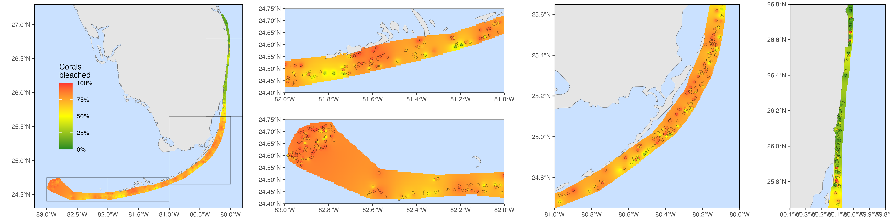

```{r setup, include=FALSE}
knitr::opts_chunk$set(echo = TRUE)
```

```{r}
library(sf)
library(sp)
library(gstat)
library(lme4)
library(emmeans)
library(tidyverse)
library(terra)
library(tidyterra)
# Download satellite map for Florida
world <- rnaturalearth::ne_countries(scale = "large", returnclass = "sf")
```

# Import all data (2014, 2015, 2023)
```{r}
# Load all data from 2014, 2015, and 2023
# QC'd by year
load("output/2014.RData")
load("output/2015.RData")
load("output/2023.RData")
df23 <- df23 %>% rename(Depth = EndDepth, Transect = TransectNum)
all0 <- bind_rows(
  `2014` = df14,
  `2015` = df15,
  `2023` = df23,
  .id = "year"
) %>%
  mutate(dhw.bin = cut(dhw, breaks = seq(0, 21, 3)))

# Aggregate Agaricia spp. other than AAGA, Mycetophyllia spp., Isophyllia spp., Oculina spp., Solenastrea spp., Scolymia spp.
all0 <- all0 %>%
  mutate(Species = case_when(Species %in% c("AFRA", "AGAR", "AGRA", "AHUM", "ALAM") ~ "AGAR",
                             Species %in% c("MALI", "MLAM", "MYCE") ~ "MYCE",  #, "MFER"
                             Species %in% c("IRIG", "ISIN", "ISOP") ~ "ISOP",
                             Species %in% c("OCUL", "ODIF") ~ "OCUL",
                             Species %in% c("SHYA", "SBOU") ~ "SOLE",
                             #Species %in% c("SCOL", "SCUB", "SLAC", "SWEL") ~ "SCOL",
                             TRUE ~ Species)) %>%
  drop_na(Species)

# Keep only those species observed at least 10 times per year
# Filter1 -- working well but too strict?
# spps <- all0 %>%
#   count(Species, year) %>%
#   group_by(Species) %>%
#   summarize(minn = min(n), nyear = n()) %>%
#   filter(minn >= 10)
# allf <- all0 %>%
#   filter(Species %in% spps$Species)
# Try alternate filter -- bad results
# allf <- all0 %>%
#   group_by(Species, year) %>%
#   filter(n() >= 10) %>%         # Species must have been counted at least 10 times within a year
#   group_by(Species) %>%
#   filter(n_distinct(year) == 3) %>%     # Species must have been counted (at least 10 times) in at least 2 years
#   ungroup()
# Try another alternate filter using dhw.bins
allf <- all0 %>%
  group_by(Species, year, dhw.bin) %>%
  filter(n() > 3)

## Group data at species+site-level to fit group-level models instead of subject-level models -- fits faster
allg <- allf %>%
  group_by(year, Week2, Subregion, Site, dhw.bin, Species) %>%
  summarize(BL = sum(Bleaching2 > 1),
            NB = sum(Bleaching2 <= 1)) %>%
  ungroup()
```

# Map overall bleaching severity in 2023
```{r}
# Get percent of colonies surveyed that were bleached at each site 
pctbl23 <- df23 %>%
  #filter(Date >= as.Date("2023-08-01"), Date <= as.Date("2023-09-30")) %>%
  group_by(Site, Subregion, Latitude, Longitude, Week2) %>%
  summarize(BL = sum(Bleaching2 > 1),
            NB = sum(Bleaching2 <= 1),
            pctbl = BL / (BL + NB)) %>%
  ungroup()

# Model proportion of bleached colonies in each subregion in each 2-week window of survey
mod <- glm(cbind(BL, NB) ~ Subregion + Week2, family = "binomial", data = pctbl23)

# Predict proportion of bleached colonies in each Subregion at weeks 34-35 (Week2 = "(33,35]" => (August 20-September 2))) = peak of bleaching
## Get these Subregion probabilities at this time on the log-odds scale (NOT type = 'response')
res <- emmeans(mod, specs = c("Subregion"), at = list(Week2 = factor("(33,35]")))

# Get residuals for each Site at the time it was surveyed (e.g., difference from Subregion mean at time surveyed)...
# ...and then add these residuals to the Subregion's predicted bleaching probability for Weeks 34-35 (peak of bleaching)
# ...to get predicted bleaching severity at that site, if it had been surveyed at peak of bleaching
pctbl23.adj <- pctbl23 %>%
  # Get residuals on the 'working' /logit scale
  mutate(resid = residuals(mod, type = "working")) %>%
  # Join site residuals with logit means for Subregion at weeks 34-35
  left_join(as_tibble(res)) %>%
  # Add residuals to logit mean for Subregion weeks 34-35, then convert to probability scale
  mutate(adj = emmean + resid,
         ## Function to convert logit to probability
         adjprob = exp(adj) / (1 + exp(adj)))

# Interpolate percent bleaching for whole reef tract
# https://geobgu.xyz/r/spatial-interpolation-of-point-data.html

# Create SpatialPointsDataFrame of survey sites
sites23 <- pctbl23.adj %>%
  distinct(Site, Longitude, Latitude, adjprob)
spdat <- sp::SpatialPointsDataFrame(
    coords=sites23[,c('Longitude','Latitude')], 
    data=sites23[,c('Site', 'adjprob')], 
    proj4string = CRS("+init=epsg:4326")
)

# Create empty raster to hold interpolated values
samplegrid <- raster::raster(spdat, res = c(0.005, 0.005))
raster::crs(samplegrid) <- raster::crs(spdat) <- sp::CRS("+init=epsg:4326")
# Run interpolation
idw.model <- gstat(formula=spdat$adjprob~1, locations=spdat)
idw.spp <- raster::interpolate(samplegrid, idw.model)

# Clip interpolated raster to just area of hull/polygon surrounding the reef tract
# Create hull/polygon surrounding surveyed sites
pts1 <- st_as_sf(x = sites23, coords = c('Longitude', 'Latitude'))
my_hull <- st_concave_hull(st_union(pts1), ratio = 0.09)
my_hull <- st_buffer(my_hull, dist = 0.015)
my_hull <- my_hull %>% st_set_crs(4326)
idw.spp.reef <- raster::mask(idw.spp, (as_Spatial(my_hull)))

# Convert clipped interpolation to spatraster for plotting
x <- rast(idw.spp.reef)

# PLOT
# Create base map
basemap <- ggplot() +
  # Plot interpolated raster
  #geom_spatraster(data = x) +
  # Plot points for surveyed sites
  # geom_point(data = pctbl23.adj, aes(x = Longitude, y = Latitude, fill = adjprob),
  #            alpha = 0.6, stroke = 0.05, pch = 21) +
  # Plot Florida
  geom_sf(data = world, lwd = 0.1, fill = "gray90") +
  coord_sf(xlim = c(-83.2, -79.8), ylim = c(24.3, 27.3), expand = FALSE) +
  scale_fill_gradient2(high = "firebrick1", mid = "yellow", low = "forestgreen", 
                       midpoint = 0.5, limits = c(0, 1), na.value = NA,
                       labels = scales::label_percent(), name = "Corals\nbleached") +
  theme(text = element_text(size = 10),
        axis.title = element_blank(),
        panel.background = element_rect(fill = "lightsteelblue1"),
        panel.border = element_rect(colour = "black", fill=NA),
        panel.grid = element_blank(),
        legend.position = c(0.2, 0.5),
        legend.background = element_blank())

# Map with interpolated raster
rasterplot <- basemap +
  geom_spatraster(data = x) +
  geom_sf(data = world, lwd = 0.1, fill = "gray90") +
  coord_sf(xlim = c(-83.2, -79.8), ylim = c(24.3, 27.3), expand = FALSE)
```

# Map heat stress accumulation in 2023 (max. DHW)
```{r}
dhw <- read_csv("data/dhw/2023/dhw_processed.csv") %>%
  mutate(across(where(is.character), as_factor)) %>%
  rename(Date = date) %>%
  dplyr::select(Site, Date, dhw)

maxdhw <- dhw %>%
  group_by(Site) %>%
  summarize(maxdhw = max(dhw)) %>%
  right_join(sites23, by = "Site")

# Create SpatialPointsDataFrame of survey sites
dhwdat <- sp::SpatialPointsDataFrame(
    coords=maxdhw[,c('Longitude','Latitude')], 
    data=maxdhw[,c('Site', 'maxdhw')], 
    proj4string = CRS("+init=epsg:4326")
)

# Create empty raster to hold interpolated values
dhwgrid <- raster::raster(dhwdat, res = c(0.005, 0.005))
raster::crs(dhwgrid) <- raster::crs(dhwdat) <- sp::CRS("+init=epsg:4326")
# Run interpolation
dhw.idw.model <- gstat(formula=dhwdat$maxdhw~1, locations=dhwdat)
dhw.idw.spp <- raster::interpolate(dhwgrid, dhw.idw.model)
# Clip
dhw.idw.spp.reef <- raster::mask(dhw.idw.spp, (as_Spatial(my_hull)))

# Convert clipped interpolation to spatraster for plotting
x2 <- rast(dhw.idw.spp.reef)

dhwmap <- basemap +
  geom_spatraster(data = x2) +
  geom_sf(data = world, lwd = 0.1, fill = "gray90") +
  coord_sf(xlim = c(-83.2, -79.8), ylim = c(24.3, 27.3), expand = FALSE) +
  scale_fill_distiller(palette = "Spectral", 
                       limits = c(0, 23), na.value = NA,
                       name = "Max.\nDHW      ")

dhw_bleach <- cowplot::plot_grid(dhwmap, rasterplot, ncol = 2)
ggsave(filename = "output/dhw_bleach.png", plot = dhw_bleach, width = 180, height = 80, units = "mm")
```

# Detailed bleaching maps
```{r}
# Raster plot with rectangles for Subregions
rasterplot_rect <- rasterplot +
  geom_rect(aes(xmin = -83, xmax = -82, ymin = 24.4, ymax = 24.75), fill = NA, color = "black", lwd = 0.05) +
  geom_rect(aes(xmin = -82, xmax = -81, ymin = 24.4, ymax = 24.75), fill = NA, color = "black", lwd = 0.05) +
  geom_rect(aes(xmin = -81, xmax = -80, ymin = 24.65, ymax = 25.65), fill = NA, color = "black", lwd = 0.05) +
  geom_rect(aes(xmin = -80.4, xmax = -79.8, ymin = 25.65, ymax = 26.8), fill = NA, color = "black", lwd = 0.05)

# Raster plot with points for each surveyed site
sitesplot <- rasterplot +
  geom_point(data = pctbl23.adj, aes(x = Longitude, y = Latitude, fill = adjprob),
             alpha = 1, stroke = 0.1, pch = 21)

# Subregion plots
dtmap <- sitesplot + coord_sf(xlim = c(-83, -82), ylim = c(24.4, 24.75), expand = FALSE) + theme(legend.position = "none")
lkmap <- sitesplot + coord_sf(xlim = c(-82, -81), ylim = c(24.4, 24.75), expand = FALSE) + theme(legend.position = "none")
ukmap <- sitesplot + coord_sf(xlim = c(-81, -80), ylim = c(24.65, 25.65), expand = FALSE) + theme(legend.position = "none")
semap <- sitesplot + coord_sf(xlim = c(-80.4, -79.8), ylim = c(25.65, 26.8), expand = FALSE) + theme(legend.position = "none")

# Create and save multipanel plot
maps_multipanel <- gridExtra::arrangeGrob(
  rasterplot_rect, lkmap, dtmap, ukmap, semap, 
  layout_matrix = matrix(c(1,1,1,1,2,3,2,3,4,4,4,4,5,5), nrow=2))
ggsave(filename = "output/2023_bleaching_maps_multipanel.png", 
       plot = maps_multipanel, width = 16, height = 4, unit = "in")
```


# Species differences in bleaching severity in 2023

### Species differences in bleaching with increasing DHWs
```{r bleaching_by_species}
# Probability of each bleaching level by species as a function of DHW (ordinal regression)
#https://tdunn.ca/posts/2020-03-15-ordinal-regression-in-r-part-1/

df23.abund <- df23 %>%
  group_by(Species) %>%
  filter(n() > 100)
  
# Species-specific bleaching susceptibility w/increasing DHW
## Plot raw data/bleaching categoties by binned.dhw
ggplot(df23.abund, aes(x = cut(dhw, breaks = seq(0,21,3)), fill = Bleaching3)) +
  geom_bar(position = "fill") +
  geom_text(stat = "count", aes(label = after_stat(count)), vjust = "inward", position = "fill", size = 2) +
  facet_wrap(~Species, scales = "free_y")

## Include only species with ≥3 individuals in ≥70% of dhw bins
incl_spp <- df23.abund %>%
  count(Species, cut(dhw, breaks = seq(0,21,3))) %>%
  group_by(Species) %>%
  filter((sum(n >= 3) >= 2)) %>%
  distinct(Species)

df23.abund.ss <- filter(df23.abund, Species %in% incl_spp$Species) %>%
  mutate(dhw.bin = cut(dhw, breaks = seq(0,21,3)))

# Fit regression for PB or worse
m <- glmer(Bleaching2 > 1 ~ Species * dhw.bin + Week2 + (1|Subregion), family = "binomial", data = df23.abund.ss,
           nAGQ = 0, control = glmerControl(optimizer = "nloptwrap"), verbose = TRUE)

# Get fitted values across dhw [normalize to Aug13-26 window of bleaching rates]
res <- emmeans(m, specs = c("Species", "dhw.bin"), rg.limit = 20000, type = "response",
               at = list(Week2 = factor("(33,35]")))

as.tibble(res) %>%
  #filter(Species %in% sig$Species) %>%
  ggplot(aes(x = dhw.bin, y = response)) +
  geom_point() +
  facet_wrap(~Species)

#### Try with actual dhw values
m2 <- glmer(Bleaching2 > 1 ~ Species * dhw + Week2 + (1|Subregion), family = "binomial", data = df23.abund.ss,
            nAGQ = 0, control = glmerControl(optimizer = "nloptwrap"), verbose = TRUE)
res2 <- emmeans(m2, specs = c("Species", "dhw"), rg.limit = 20000, type = "response",
               at = list(Week2 = factor("(33,35]"), dhw = seq(0, 23, 1)))
as.tibble(res2) %>%
  #filter(Species %in% sig$Species) %>%
  ggplot(aes(x = dhw, y = response)) +
  geom_point() +
  facet_wrap(~Species)

as.tibble(res2) %>%
  #filter(Species %in% sig$Species) %>%
  ggplot(aes(x = dhw, y = response, color = Species, group = Species)) +
  geom_line()

# Get dhw to 50% of colonies bleached
spp50 <- emmeans(m2, specs = c("Species", "dhw"), rg.limit = 20000, type = "response",
                 at = list(Week2 = factor("(33,35]"), dhw = seq(0, 23, 1)))
spp50.thresh <- as.tibble(spp50) %>%
  mutate(ind = row_number()) %>%
  group_by(Species) %>%
  slice(which.min(abs(response - 0.5))) %>%
  ungroup() %>%
  mutate(Species = fct_reorder(Species, dhw))
spp25.thresh <- as.tibble(spp50) %>%
  mutate(ind = row_number()) %>%
  group_by(Species) %>%
  slice(which.min(abs(response - 0.25)))
spp75.thresh <- as.tibble(spp50) %>%
  mutate(ind = row_number()) %>%
  group_by(Species) %>%
  slice(which.min(abs(response - 0.75)))

as.tibble(spp50) %>%
  mutate(Species = factor(Species, levels = levels(spp50.thresh$Species))) %>%
  ggplot(aes(x = dhw, y = Species)) +
  geom_tile(aes(fill = response)) +
  scale_fill_gradient2(low = "#91cf60", mid = "#ffffbf", high = "#fc8d59", 
                       limits = c(0, 1), midpoint = 0.5) +
  geom_point(data = spp50.thresh, pch = 5) +
  labs(x = "Degree Heating Weeks", y = "", fill = "Proportion\nof colonies\nPB or worse")


```


# Glimmers of hope

### Overall bleaching severity by DHWs in 2023 vs. 2014 and 2015

```{r bleaching_by_dhw.bin_across_years}
# Will it work if species is a random factor instead of fixed? YES!!!
# overall.bleach.mod <- glmer(cbind(BL, NB) ~ year * dhw.bin + (dhw.bin+year|Species), 
#            family = "binomial", data = allg)
# overall.bleach.res <- emmeans(overall.bleach.mod, specs = c("dhw.bin", "year"), 
#                               type = "response", rg.limit = 15000)
# as.tibble(overall.bleach.res) %>%
#   ggplot(aes(x = dhw.bin, y = prob, color = year, group = year)) +
#   geom_point() +
#   geom_ribbon(aes(ymin = asymp.LCL, ymax = asymp.UCL), lwd = 0, alpha = 0.2) +
#   geom_line()

### NEW: try with Week2 to be able to adjust for that
# dhw.bin.mod <- glmer(cbind(BL, NB) ~ dhw.bin * year * Week2 + (dhw.bin+year|Species),
#                        family = "binomial", data = allg)
## ^^ above model formulation has nonEst for 2023 0-3 and 6-9 DHW. Why?
# dhw.bin.mod <- glmer(cbind(BL, NB) ~ dhw.bin * year + year:Week2 + (1|Species),
#                        family = "binomial", data = allg)
###^^ This model works
dhw.bin.mod <- glmer(cbind(BL, NB) ~ dhw.bin * year + year:Week2 + (dhw.bin+year|Species),  
                     family = "binomial", data = allg, verbose = TRUE,
                     nAGQ=0, control=glmerControl(optimizer = "nloptwrap"))
#^^^ but is this one ^^ better? ???: YES
##change dhw.bin+year to dhw.bin*year in random slopes???: doesn't change much, takes longer to fit
dhw.bin.res <- emmeans(dhw.bin.mod, specs = c("dhw.bin", "year", "Week2"), 
                       rg.limit = 20000, type = "response")
# THIS IS IT ^^^
# Get emmeans for just the specific 2-week windows of interest in each year (corresp. to max. bleaching)
dhw.bin.res2 <- subset(dhw.bin.res,
  (year == "2014" & Week2 == "(36,38]") |
  (year == "2015" & Week2 == "(36,38]") |
  (year == "2023" & Week2 == "(33,35]")
)
as.tibble(dhw.bin.res2) %>%
  ggplot(aes(x = dhw.bin, y = prob, color = year, group = year)) +
  geom_point() +
  geom_ribbon(aes(ymin = asymp.LCL, ymax = asymp.UCL), lwd = 0, alpha = 0.2) +
  geom_line() +
  scale_y_continuous(limits = c(0, 1), expand = c(0, 0), breaks = seq(0, 1, 0.1)) +
  theme(legend.position = c(0.8, 0.25)) +
  labs(x = "DHWs", y = "Probability of bleaching")
# THIS IS IT ^^^

```

## Species-specific bleaching severity by DHWs in 2023 vs. 2014 and 2015

```{r SPECIES_diffs_by_dhwbin_by_year}
# Fit a singular model for bleaching susceptibility by Species, DHW.bin, and year, to look at how bleaching susceptibility differs by year

# Fit regression for PB or worse
dhw.bin.sp.mod <- glm(cbind(BL, NB) ~ year * Species * dhw.bin + year:Week2, family = "binomial", data = allg)
# Get fitted values across dhw
dhw.bin.sp.res <- emmeans(dhw.bin.sp.mod, specs = c("Species", "dhw.bin", "year", "Week2"), 
               rg.limit = 20000, type = "response")

# Get emmeans for just the specific 2-week windows of interest in each year (corresp. to max. bleaching)
dhw.bin.sp.res2 <- subset(dhw.bin.sp.res,
  (year == "2014" & Week2 == "(36,38]") |
  (year == "2015" & Week2 == "(36,38]") |
  (year == "2023" & Week2 == "(33,35]")
)
mybleach <- as.tibble(dhw.bin.sp.res2)
# Plot
allplots <- as.tibble(dhw.bin.sp.res2) %>%
  ggplot(aes(x = dhw.bin, y = prob, color = year, group = year)) +
  geom_point(position = position_dodge(width = 0.25), size = 0.5) +
  geom_line(position = position_dodge(width = 0.25)) +
  geom_errorbar(aes(ymin = prob - SE, ymax = prob + SE), width = 0.1,
                position = position_dodge(width = 0.25)) +
  facet_wrap(~Species) +
  ylim(0,1)
allplots

# For some reason the output is better when MFOR and SCUB are present in the data? Not sure why.
# MYCE (aggregated) was coming out as significant before but now it's not. something about adding MFER to the aggregation?
### Yes, it's MFER... when included with MYCE, MYCE has no sig diffs, but quite sig without the added MFER? MFER is all bleached, and all 

# Statistically compare years for each Species and dhw.bin level (only look at 3-6 and 6-9 dhw, where we have data from all years)
dhw.bin.sp.res3 <- subset(dhw.bin.sp.res2, dhw.bin %in% c("(3,6]", "(6,9]"))
dhw.bin.sp.tests <- rbind(pairs(dhw.bin.sp.res3, specs = "year", by = c("Species", "dhw.bin")), adjust = "fdr")
dhw.bin.sp.sig <- as.tibble(dhw.bin.sp.tests) %>%
  filter(p.value < 0.05)

dhw.bin.sp.sigres <- as.tibble(dhw.bin.sp.res2) %>%
  filter(Species %in% dhw.bin.sp.sig$Species)

# Plot just species with sig diffs btw years
allplots %+% dhw.bin.sp.sigres


# Sanity checks
# ## Simple proportions as a santiy check
# all0 %>%
#   drop_na(dhw.bin) %>%
#   group_by(year, Species, dhw.bin) %>%
#   summarize(pctbl = sum(Bleaching2 > 1) / n()) %>%
#   ggplot(aes(x = dhw.bin, y = pctbl, color = year, group = year)) +
#   geom_point() +
#   geom_line() +
#   facet_wrap(~Species)
# 
# # MYCE sanity check
# all0 %>% filter(Species == "MYCE") %>%
#   ggplot(aes(x = dhw.bin, fill = Bleaching3)) +
#   geom_bar(position = "stack") +
#   facet_wrap(~year)
```


```{r}
# Look at changes in avg coral density --- correlate w/changes in bleaching?
# Need zero-inflated Poisson regression?
dens <- all0 %>%
  ungroup() %>%
  # Count number of colonies of each species per transect
  count(year, Species, Site, Transect, Subregion) %>%
  # Add zeros for all species not counted on a transect
  complete(Species, nesting(year, Site, Transect, Subregion), fill = list(n = 0)) %>%
  # Filter transect 3 and 4 data -- only select species recorded 
  filter(Transect %in% c(1, 2) |
         Transect %in% c(3, 4) & Species %in% c("CNAT", "DSTO", "DLAB", "MMEA", "MANG",
                                                "MALI", "MFER", "MLAM", "PCLI", "PSTR")) %>%
  # SUBSET FOR FASTER MODELING
  group_by(Species, year) %>%
  filter(sum(n>0) > 10)
  
# ggplot(dens, aes(x = n)) +
#   geom_histogram() +
#   facet_wrap(~Species, scales = "free")

# library(pscl)
# m1 <- zeroinfl(n ~ Species + year | persons, data = zinb)

mod_1 <- glmer(n ~ Species * year + (Species|Subregion), data = dens, family = "poisson",
               verbose = TRUE, nAGQ=0, control=glmerControl(optCtrl=list(maxfun=100))) 
anova(mod_1)

res <- emmeans(mod_1, specs = c("Species", "year"), type = "response")

as.tibble(res) %>%
  ggplot(aes(x = year, y = rate)) +
  geom_point() + #aes(color = Subregion)
  geom_errorbar(aes(ymin = rate - SE, ymax = rate + SE)) +
  geom_line(aes(group = 1)) + #aes(group = Subregion, color = Subregion
  facet_wrap(~Species, scales = "free_y")

mydens <- as.tibble(res)
```

```{r}
# Get bleaching at 6-9 DHW
mybleach69 <- filter(mybleach, dhw.bin == "(6,9]")
myfun <- full_join(mydens, mybleach69, by = c("Species", "year"))

# any sig change over years in bleaching at 6-9dhw?
res3 <- subset(res2, dhw.bin %in% c("(6,9]"))
out <- rbind(pairs(res3, specs = "year", by = c("Species"), adjust = "fdr"))
sigbleach <- as.tibble(out) %>% filter(p.value < 0.05)

# any sig change over years in density?
outt <- rbind(pairs(res, specs = "year", by = "Species", adjust = "fdr"))
sigdens <- as.tibble(outt) %>% filter(p.value < 0.05)

# Plot species that had sig change in bleach OR sig change in dens
myfun %>%
  filter(Species %in% dhw.bin.sp.sig$Species) %>% # # | Species %in% sigdens$Species) %>%
  ggplot(aes(x = rate, y = prob)) +
  geom_point(aes(shape = year, color = year), size = 3) +
  geom_errorbar(aes(xmin = rate - SE.x, xmax = rate + SE.x)) +
  geom_errorbar(aes(ymin = prob - SE.y, ymax = prob + SE.y)) +
  geom_path(arrow = arrow(length = unit(1, "mm"))) +
  #geom_smooth(method = "lm", se = FALSE) +
  facet_wrap(~Species, scales = "free")
```


# Size diffs

## 2023 and possibly 2014 and 2015

```{r}

```


# Not to include?

## Bleaching by subregion across years

```{r regional_bleaching_vs_dhw_by_year_modeledalltogether}
# Model bleaching severity by subregion across years
### (This replicates what was done individually by year and then combined -- use THIS.)

subregion.mod <- glmer(cbind(BL, NB) ~ Subregion * year * Week2 + (1|Species),
                       family = "binomial", data = allg)

# Get fitted values across dhw
subregion.res <- emmeans(subregion.mod, specs = c("Subregion", "year", "Week2"), 
                         rg.limit = 20000, type = "response")

# Get emmeans for just the specific 2-week windows of interest in each year (corresp. to max. bleaching)
subregion.res2 <- subset(subregion.res,
  (year == "2014" & Week2 == "(36,38]") |
  (year == "2015" & Week2 == "(36,38]") |
  (year == "2023" & Week2 == "(33,35]")
)

as.tibble(subregion.res2) %>%
  ggplot(aes(x =))

regional <- bind_rows(
  `2014` = regional14,
  `2015` = regional15,
  `2023` = regional23,
  .id = "year"
)

as.tibble(subregion.res2) %>%
  left_join(regional, by = c("Subregion", "year")) %>%
  ggplot(aes(x = maxDHW, y = prob.y, shape = year, group = year, color = Subregion)) +
  geom_point(aes(color = Subregion, shape = year), size = 3) +
  geom_smooth(aes(group = year), method = "loess", span = 1.1, se = FALSE)

# This is good, but probably makes more sense to look at bleaching as a function of DHW across years. This is of more general interest than "Subregions"...
```

## Old code....

```{r, eval = F}
# Trying to get overall bleaching (avg across species) but emmeans are nonEst
m <- glm(cbind(BL, NB) ~ year * dhw.bin * Species, family = "binomial", data = allg)
res <- emmeans(m, specs = c("dhw.bin", "year"), type = "response", rg.limit = 15000)
as.tibble(res) %>%
  ggplot(aes(x = dhw.bin, y = prob, color = year, group = year)) +
  geom_point() +
  geom_line()

# Will it work if species is a random factor instead of fixed? YES!!!
library(lme4)
m <- glmer(cbind(BL, NB) ~ year * dhw.bin + (dhw.bin+year|Species), 
           family = "binomial", data = allg)
res <- emmeans(m, specs = c("dhw.bin", "year"), type = "response", rg.limit = 15000)
as.tibble(res) %>%
  ggplot(aes(x = dhw.bin, y = prob, color = year, group = year)) +
  geom_point() +
  geom_ribbon(aes(ymin = asymp.LCL, ymax = asymp.UCL), lwd = 0, alpha = 0.2) +
  geom_line()

### NEW: try with Week2 to be able to adjust for that
dhw.bin.mod <- glmer(cbind(BL, NB) ~ dhw.bin * year * Week2 + (dhw.bin+year|Species),
                       family = "binomial", data = allg)
dhw.bin.res <- emmeans(dhw.bin.mod, specs = c("dhw.bin", "year", "Week2"), 
                       rg.limit = 20000, type = "response")
# Get emmeans for just the specific 2-week windows of interest in each year (corresp. to max. bleaching)
dhw.bin.res2 <- subset(dhw.bin.res,
  (year == "2014" & Week2 == "(36,38]") |
  (year == "2015" & Week2 == "(36,38]") |
  (year == "2023" & Week2 == "(33,35]")
)
as.tibble(dhw.bin.res2) %>%
  ggplot(aes(x = dhw.bin, y = prob, color = year, group = year)) +
  geom_point() +
  geom_ribbon(aes(ymin = asymp.LCL, ymax = asymp.UCL), lwd = 0, alpha = 0.2) +
  geom_line()

```


```{r}
# Maps of site performance for each year
```


```{r, eval = F}
# Try random forests to find outlier sites or individuals?
load("output/2014.RData")
load("output/2015.RData")
load("output/2023.RData")
df23 <- df23 %>% rename(Depth = EndDepth)
all <- bind_rows(
  `2014` = df14,
  `2015` = df15,
  `2023` = df23,
  .id = "year"
)
library(randomForest)
data <- all %>%
  filter(Species %in% c("CNAT", "DLAB", "MCAV", "OANN", "OFAV", "PAST", "PSTR", "SSID")) %>%
  mutate(Bleaching4 = factor(case_when(Bleaching3 %in% c("Healthy", "Pale") ~ "Healthy",
                                Bleaching3 %in% c("Partially Bleached", "Bleached", "Dead") ~ "Bleached"))) %>%
  droplevels() %>%
  drop_na(year, Species, Depth, dhw) %>%
  group_by(Species) %>%
  filter(n() > 500) %>%
  droplevels()

# Run random forest classification with species, depth, and dhw as predictors
rf <- randomForest(Bleaching4~year+Species+Depth+dhw+Width, 
                   data = data, ntree = 5, do.trace = TRUE, proximity=TRUE)
print(rf)
rf$confusion

str(rf)

# Get rf model predictions for Bleaching4
data <- data %>%
  mutate(pred = rf$predicted)

# How accurate were predictions for each species?
data %>%
  drop_na(pred) %>%
  group_by(Species) %>%
  count(acc = pred == Bleaching4) %>%
  ggplot(aes(x = Species, y = n, fill = acc)) +
  geom_col(position= "fill")

# Can you get confidence?
str(rf)
score(rf)

data %>%
  drop_na(pred) %>%
  ggplot(aes(x = Species, fill = Bleaching4:pred)) +
  geom_bar(position = "fill")
  
  

# Which corals were predicted to be bleached, but were actually healthy?
outhealthy <- data %>%
  filter(pred == "Bleached", Bleaching4 == "Healthy") 

ggplot(outhealthy, aes(x = Longitude, y = Latitude)) +
  geom_point(color = "red", alpha = 0.005, pch = 20)

outhealthy %>%
  filter(Species == "OFAV") %>%
  ggplot(aes(x = Longitude, y = Latitude)) +
  geom_point(aes(color = Species))
```

```{r, eval = FALSE}
# Bleaching vs. dhw for each coral species by year -- binned dhw
# Data are from modeling data for each year separately, using the Week2 period at the peak of each year's bleaching
# Results are nearly (completely?) identical to a singular model fit with year and year:Week2... so use that because it also allows posthoc testing 
sppbleachprob14 <- readRDS(file = "output/sppbleachprob14.rds")
sppbleachprob15 <- readRDS(file = "output/sppbleachprob15.rds")
sppbleachprob23 <- readRDS(file = "output/sppbleachprob23.rds")

sppbleachprob <- bind_rows(`2014` = sppbleachprob14,
                           `2015` = sppbleachprob15,
                           `2023` = sppbleachprob23,
                           .id = "year")

sppbleachprob %>%
  ggplot(aes(x = dhw.bin, y = response, color = year, group = year)) +
  geom_point(position = position_dodge(width = 0.25), size = 0.5) +
  geom_line(position = position_dodge(width = 0.25)) +
  geom_errorbar(aes(ymin = response - SE, ymax = response + SE), width = 0.1,
                position = position_dodge(width = 0.25)) +
  facet_wrap(~Species) +
  ylim(0,1)
```


```{r, eval = F }
# I don't like this
# Overall Bleaching vs. dhw (all corals) by year
bleachprob14 <- readRDS(file = "output/bleachprob14.rds")
bleachprob15 <- readRDS(file = "output/bleachprob15.rds")
bleachprob23 <- readRDS(file = "output/bleachprob23.rds")

bleachprob <- bind_rows(`2014` = bleachprob14,
                        `2015` = bleachprob15,
                        `2023` = bleachprob23,
                        .id = "year")

ggplot(bleachprob, aes(x = dhw, y = response, color = year, group = year)) +
  geom_line() +
  geom_ribbon(aes(ymin = asymp.LCL, ymax = asymp.UCL), lwd = 0, alpha = 0.3) +
  scale_y_continuous(limits = c(0, 1))

# This is more or less the same thing as the breakdown by region above, but I think the regional one is more interesting

# What about doing this by dhw bins?
```

```{r regional_bleaching_vs_dhw_by_year, eval = FALSE}
# This was superseded by modeling this all together for all years instead of each year separately.
# Overall pct. bleaching vs. dhw (all corals) by Subregion for each year
## Subregion averages
load(file = "output/regional23.RData")
load(file = "output/regional14.RData")
load(file = "output/regional15.RData")

df <- bind_rows(`2014` = regional14, `2015` = regional15, `2023` = regional23, .id = "year")

ggplot(df, aes(x = maxDHW, y = prob)) +
  geom_point(aes(color = Subregion, shape = year), size = 3) +
  geom_smooth(aes(group = year), method = "loess", span = 1.1, se = FALSE)

## Why not do this for all sites? Probably would be too all over the place.
```


```{r, eval = F}

###trying to plot "adjusted" bleaching levels for each site -- adjusted for date surveyed
# Can we adjust pctbl for survey date and plot everything? (e.g., Marquesas were in Oct...)
df23.g <- df23 %>%
  group_by(Site, Subregion, Latitude, Longitude, Date, Week2, dhw) %>%
  summarize(BL = sum(Bleaching2 > 1),
            NB = sum(Bleaching2 <= 1))
mod <- glm(cbind(BL, NB) ~ dhw + Week2, family = "binomial", data = df23.g)
plot(mod, which = 1)

df23.g <- df23.g %>%
  ungroup() %>%
  mutate(resid = residuals(mod, type = "response")) %>%
  mutate(adj = (BL/(BL+NB)+resid))

hi <- broom::augment(mod, type.predict = "response") %>%
  mutate(resid2 = residuals(mod, type = "response"),
         adj = .fitted + resid2)

newdat <- tibble(
  Site = df23.g$Site,
  Subregion = df23.g$Subregion,
  pctbl = df23.g$BL / (df23.g$BL + df23.g$NB),
  dhw = df23.g$dhw,
  Longitude = df23.g$Longitude,
  Latitude = df23.g$Latitude,
  Week2 = factor("(33,35]")
)
newdat <- bind_cols(
  newdat,
  fit = predict(mod, type = "response", newdata = newdat)
)

# test <- df23.g %>%
#   mutate(.fitted = predict(mod, type = "response", newdata = newdat),
#          .resid = residuals(mod, type = "response"),
#          actual = BL / (BL + NB),
#          adj = .fitted + .resid)
# View(test)

ggplot(newdat) +
  geom_point(aes(x = Longitude, y = Latitude, fill = fit), 
             alpha = 0.5, stroke = 0.1, pch = 21) +
  scale_fill_gradient2(high = "red", mid = NA, low = "blue", midpoint = 0.5,
                       limits = c(0, 1))

hist(newdat$pctbl)

mod <- glm(cbind(BL, NB) ~ Subregion + Week2, family = "binomial", data = df23.g)
res <- emmeans(mod, specs = c("Subregion"), at = list(Week2 = factor("(33,35]")), type = "response")
test <- as.tibble(res) %>%
  right_join(df23.g) %>%
  mutate(resid = residuals(mod, type = "response"),
         actual = (BL/(BL+NB)),
         adj = actual + resid)

ggplot(test) +
  geom_point(aes(x = Longitude, y = Latitude, fill = actual), 
             alpha = 0.5, stroke = 0.1, pch = 21) +
  scale_fill_gradient2(high = "red", mid = NA, low = "blue", midpoint = 0.5,
                       limits = c(0, 1))
hist(test$adj)
```


```{r, eval = F}
### TRYING TO GET LD50 OR SOMETHING BETTER

spp50.2 <- spp50[spp50.thresh$ind, ]
spp50.2 <- subset(spp50, spp50.thresh$ind)

as.tibble(spp50.2) %>%
  arrange(dhw) %>%
  mutate(Species = fct_reorder(Species, dhw)) %>%
  ggplot(aes(y = Species, x = dhw)) +
  geom_point()


LD <- MASS::dose.p(m2, p = 0.5)

dose.p.glmm <-  function(obj, cf = c(1, 4), p = 0.5) {
  f <- family(obj)
  eta <- f$linkfun(p)
  b <- fixef(obj)[cf]
  x.p <- (eta - b[1L])/b[2L]
  names(x.p) <- paste("p = ", format(p), ":", sep = "")
  pd <- -cbind(1, x.p)/b[2L]
    SE <- sqrt(((pd %*% vcov(obj)[cf, cf]) * pd) %*% c(1, 1))
  res <- structure(x.p, SE = matrix(SE), p = p)
  class(res) <- "glm.dose"
  res
}

dose.p.glmm(m2)
fixef(m2)

library(medrc)
df23f <- df23.abund %>%
  group_by(Site, Subregion, Week2, Species, dhw) %>%
  summarize(BL = sum(Bleaching2 > 1),
            NB = sum(Bleaching2 <= 1),
            pctNB = NB / (NB + BL),
            n = n())

m <- medrm(pctNB ~ dhw, data = df23f, 
           curveid = b + d + e ~ Species,
           random = b + d + e ~ 1|Subregion,
           fct = LL.3(), start = coefs)

lmm <- lm(pctNB ~ dhw, data = df23f)
coefs <- coef(lmm)

sm <- metadrm(pctNB ~ dhw,
              data = df23f,
              fct = LL.3(),
              ind = Species,
              cid2 = Subregion,
              struct = "UN")

ggplot(df23f, aes(x = dhw, y = pctNB)) +
  geom_point() +
  facet_wrap(~Species)
```
